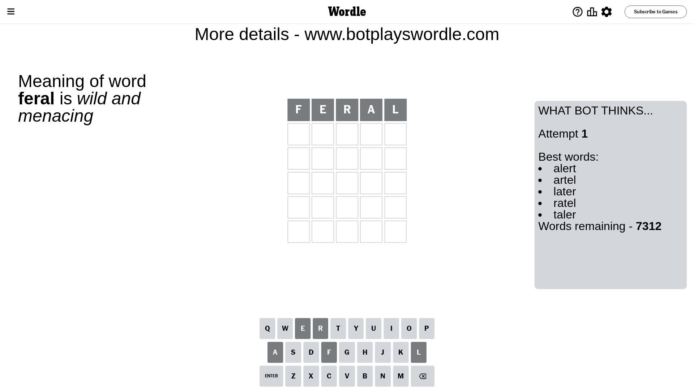
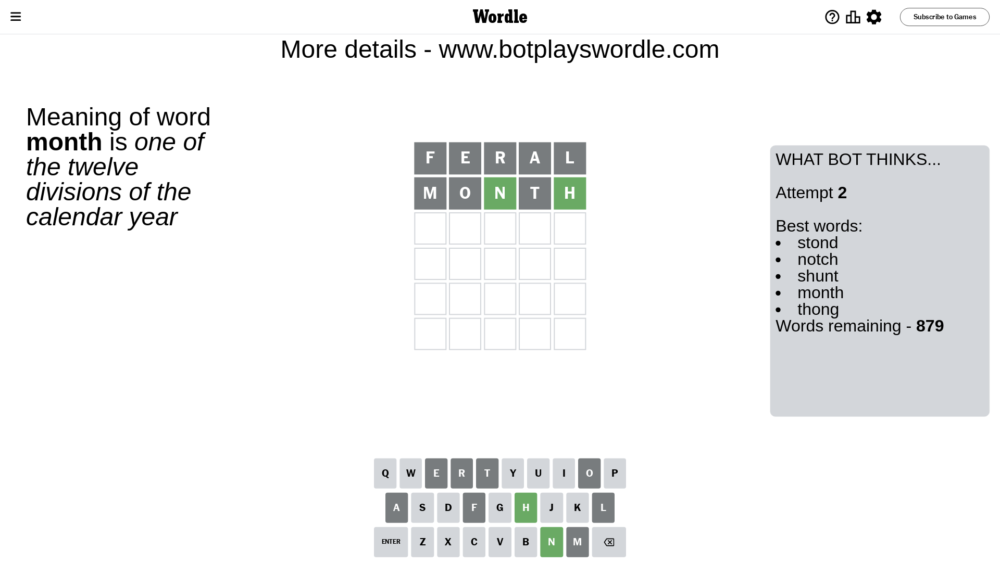
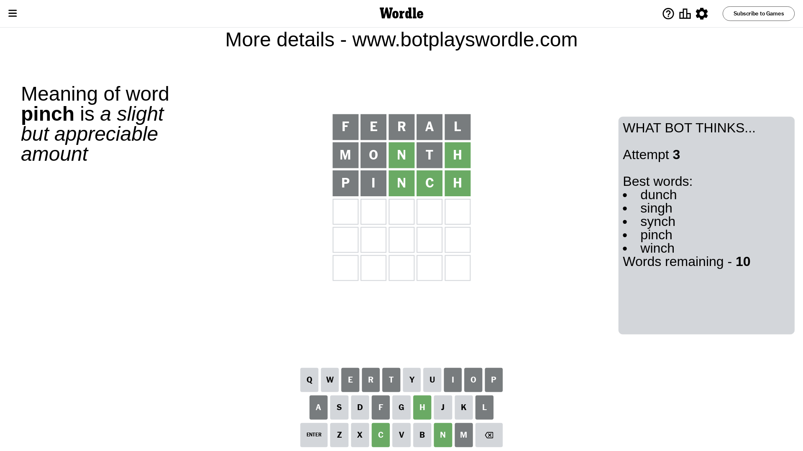
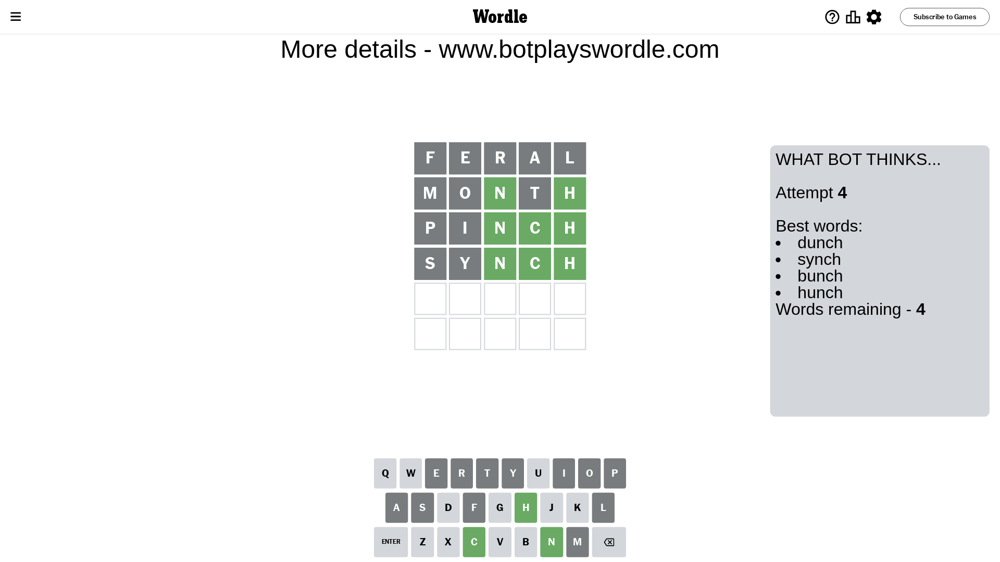
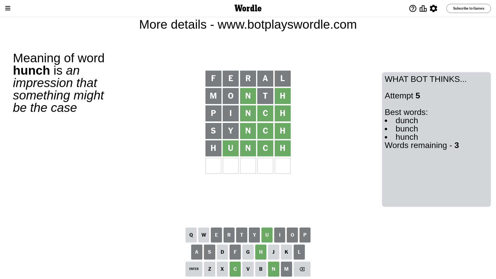
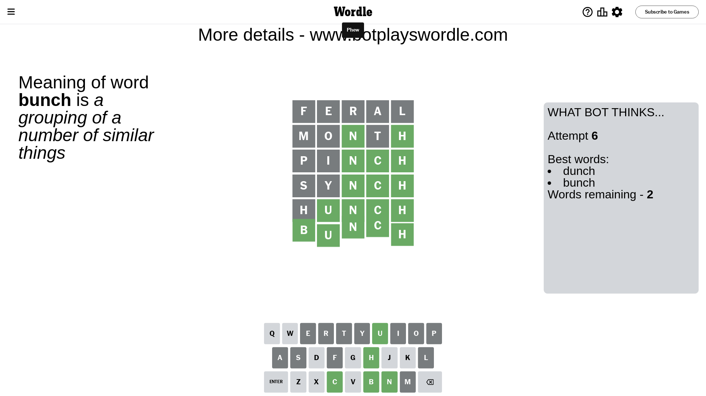

# Wordle for October 5, 2023 - \#838

## Attempt 1

This is the first attempt and we'll choose a random word to start with.

Let's start with word `feral`

Attempt for `feral` gives us 0 correct letters, 0 present letters and 5 wrong letters.

If we look into details, we can see that:

Letter `f` is not present in the word and we will not use it any more

Letter `e` is not present in the word and we will not use it any more

Letter `r` is not present in the word and we will not use it any more

Letter `a` is not present in the word and we will not use it any more

Letter `l` is not present in the word and we will not use it any more

Some letters are missing (like `f`, `e`, `r`, `a`, `l`) but it's also important piece of information

So far we don't know any of the letters!

That was a great guess that limited number of remaining words

## Attempt 2

Right now we have 879 words to choose from and best of them seem to be `[stond notch shunt month thong]`

So far we know that possible letters are:

At position 1: `[b c d g h i j k m n o p q s t u v w x y z]`

At position 2: `[b c d g h i j k m n o p q s t u v w x y z]`

At position 3: `[b c d g h i j k m n o p q s t u v w x y z]`

At position 4: `[b c d g h i j k m n o p q s t u v w x y z]`

At position 5: `[b c d g h i j k m n o p q s t u v w x y z]`

Next guess is `month`, let's see what it gives us

Attempt for `month` gives us 2 correct letters, 0 present letters and 3 wrong letters.

If we look into details, we can see that:

Letter `m` is not present in the word and we will not use it any more

Letter `o` is not present in the word and we will not use it any more

Letter `n` should be at position 3

Letter `t` is not present in the word and we will not use it any more

Letter `h` should be at position 5

We got information about the correct letters and it should make next attempt easier

Some letters are missing (like `m`, `o`, `t`) but it's also important piece of information

Word should contain letters `[n h]`

That was a great guess that limited number of remaining words

## Attempt 3

Right now we have 10 words to choose from and best of them seem to be `[dunch singh synch pinch winch]`

So far we know that possible letters are:

At position 1: `[b c d g h i j k n p q s u v w x y z]`

At position 2: `[b c d g h i j k n p q s u v w x y z]`

At position 3: `[n]`

At position 4: `[b c d g h i j k n p q s u v w x y z]`

At position 5: `[h]`

Next guess is `pinch`, let's see what it gives us

Attempt for `pinch` gives us 3 correct letters, 0 present letters and 2 wrong letters.

If we look into details, we can see that:

Letter `p` is not present in the word and we will not use it any more

Letter `i` is not present in the word and we will not use it any more

Letter `c` should be at position 4

We got information about the correct letters and it should make next attempt easier

Some letters are missing (like `p`, `i`) but it's also important piece of information

Word should contain letters `[n h c]`

Could be a better guess

## Attempt 4

Right now we have 4 words to choose from and best of them seem to be `[dunch synch bunch hunch]`

So far we know that possible letters are:

At position 1: `[b c d g h j k n q s u v w x y z]`

At position 2: `[b c d g h j k n q s u v w x y z]`

At position 3: `[n]`

At position 4: `[c]`

At position 5: `[h]`

Next guess is `synch`, let's see what it gives us

Attempt for `synch` gives us 3 correct letters, 0 present letters and 2 wrong letters.

If we look into details, we can see that:

Letter `s` is not present in the word and we will not use it any more

Letter `y` is not present in the word and we will not use it any more

Some letters are missing (like `s`, `y`) but it's also important piece of information

Word should contain letters `[n h c]`

This was a waste, almost no valuable information...

## Attempt 5

Right now we have 3 words to choose from and best of them seem to be `[dunch bunch hunch]`

So far we know that possible letters are:

At position 1: `[b c d g h j k n q u v w x z]`

At position 2: `[b c d g h j k n q u v w x z]`

At position 3: `[n]`

At position 4: `[c]`

At position 5: `[h]`

Next guess is `hunch`, let's see what it gives us

Attempt for `hunch` gives us 4 correct letters, 0 present letters and 1 wrong letters.

If we look into details, we can see that:

Letter `h` is not present in the word and we will not use it any more

Letter `u` should be at position 2

We got information about the correct letters and it should make next attempt easier

Some letters are missing (like `h`) but it's also important piece of information

Word should contain letters `[n h c u]`

This was a waste, almost no valuable information...

## Attempt 6

Right now we have 2 words to choose from and best of them seem to be `[dunch bunch]`

So far we know that possible letters are:

At position 1: `[b c d g j k n q u v w x z]`

At position 2: `[u]`

At position 3: `[n]`

At position 4: `[c]`

At position 5: `[h]`

Next guess is `bunch`, let's see what it gives us

That's the correct answer! The word is `bunch`!

## Conclusion

Today's word is `bunch` and it took 6 attempts to guess it

