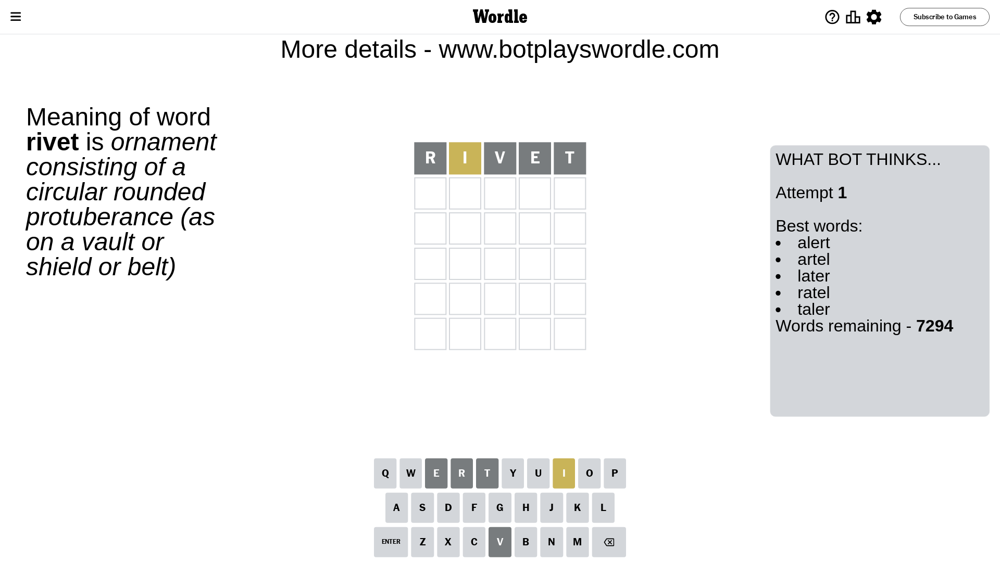
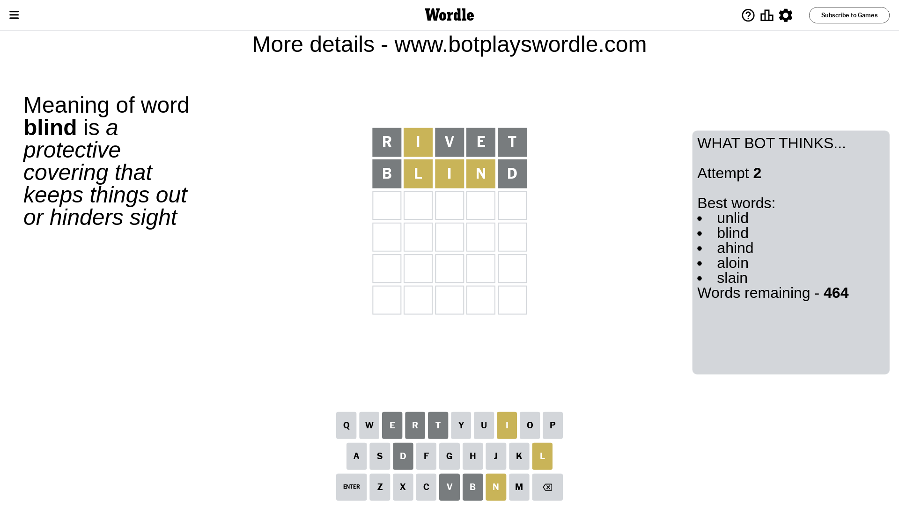
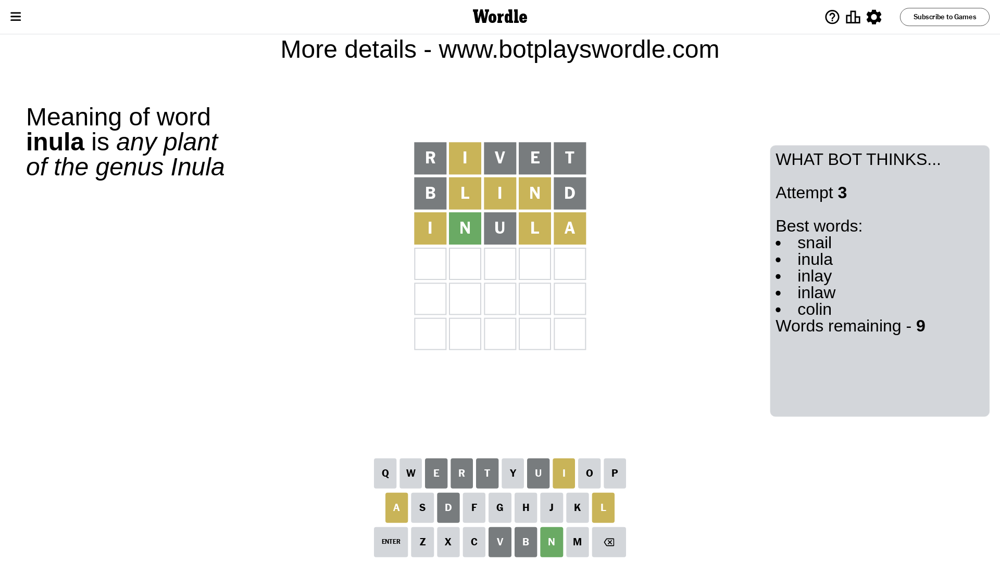
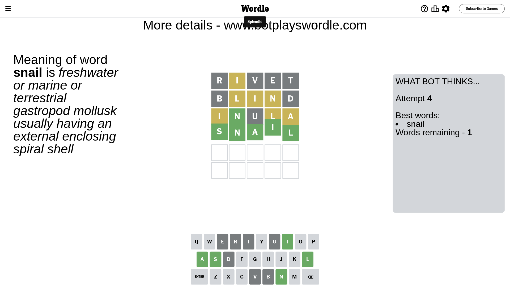

# Wordle for October 10, 2023 - \#843

## Attempt 1

This is the first attempt and we'll choose a random word to start with.

Let's start with word `rivet`

Attempt for `rivet` gives us 0 correct letters, 1 present letters and 4 wrong letters.

If we look into details, we can see that:

Letter `r` is not present in the word and we will not use it any more

Letter `i` is on a different spot - this means that it cannot be at position 2

Letter `v` is not present in the word and we will not use it any more

Letter `e` is not present in the word and we will not use it any more

Letter `t` is not present in the word and we will not use it any more

Some letters are missing (like `r`, `v`, `e`, `t`) but it's also important piece of information

Word should contain letters `[i]`

That was a great guess that limited number of remaining words

## Attempt 2

Right now we have 464 words to choose from and best of them seem to be `[unlid blind ahind aloin slain]`

So far we know that possible letters are:

At position 1: `[a b c d f g h i j k l m n o p q s u w x y z]`

At position 2: `[a b c d f g h j k l m n o p q s u w x y z]`

At position 3: `[a b c d f g h i j k l m n o p q s u w x y z]`

At position 4: `[a b c d f g h i j k l m n o p q s u w x y z]`

At position 5: `[a b c d f g h i j k l m n o p q s u w x y z]`

Next guess is `blind`, let's see what it gives us

Attempt for `blind` gives us 0 correct letters, 3 present letters and 2 wrong letters.

If we look into details, we can see that:

Letter `b` is not present in the word and we will not use it any more

Letter `l` is on a different spot - this means that it cannot be at position 2

Letter `i` is on a different spot - this means that it cannot be at position 3

Letter `n` is on a different spot - this means that it cannot be at position 4

Letter `d` is not present in the word and we will not use it any more

Some letters are missing (like `b`, `d`) but it's also important piece of information

Word should contain letters `[i l n]`

That was a great guess that limited number of remaining words

## Attempt 3

Right now we have 9 words to choose from and best of them seem to be `[snail inula inlay inlaw colin]`

So far we know that possible letters are:

At position 1: `[a c f g h i j k l m n o p q s u w x y z]`

At position 2: `[a c f g h j k m n o p q s u w x y z]`

At position 3: `[a c f g h j k l m n o p q s u w x y z]`

At position 4: `[a c f g h i j k l m o p q s u w x y z]`

At position 5: `[a c f g h i j k l m n o p q s u w x y z]`

Next guess is `inula`, let's see what it gives us

Attempt for `inula` gives us 1 correct letters, 3 present letters and 1 wrong letters.

If we look into details, we can see that:

Letter `i` is on a different spot - this means that it cannot be at position 1

Letter `n` should be at position 2

Letter `u` is not present in the word and we will not use it any more

Letter `l` is on a different spot - this means that it cannot be at position 4

Letter `a` is on a different spot - this means that it cannot be at position 5

We got information about the correct letters and it should make next attempt easier

Some letters are missing (like `u`) but it's also important piece of information

Word should contain letters `[i l n a]`

That was a great guess that limited number of remaining words

## Attempt 4

Right now we have 1 words to choose from and best of them seem to be `[snail]`

So far we know that possible letters are:

At position 1: `[a c f g h j k l m n o p q s w x y z]`

At position 2: `[n]`

At position 3: `[a c f g h j k l m n o p q s w x y z]`

At position 4: `[a c f g h i j k m o p q s w x y z]`

At position 5: `[c f g h i j k l m n o p q s w x y z]`

It must be `snail`

That's the correct answer! The word is `snail`!

## Conclusion

Today's word is `snail` and it took 4 attempts to guess it

