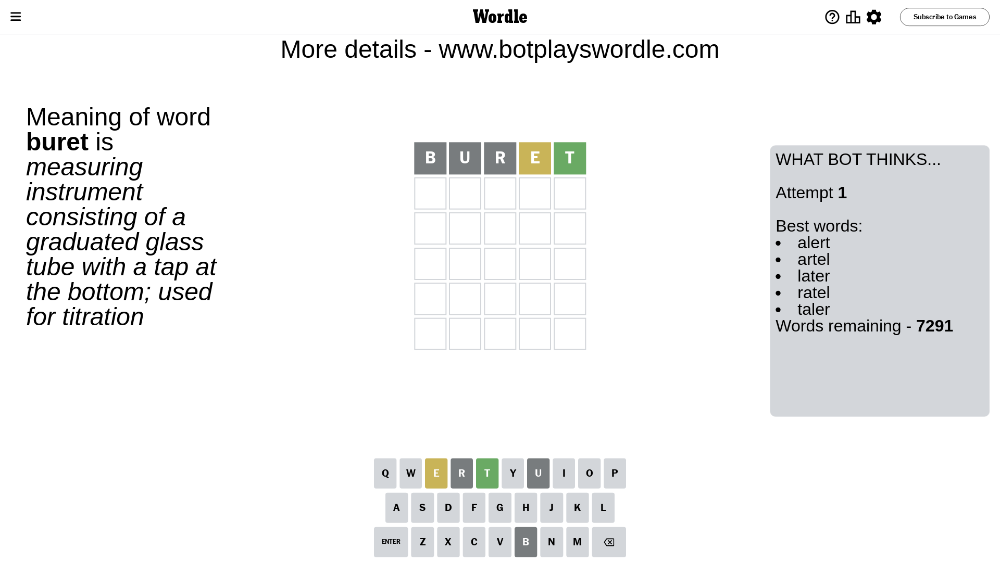
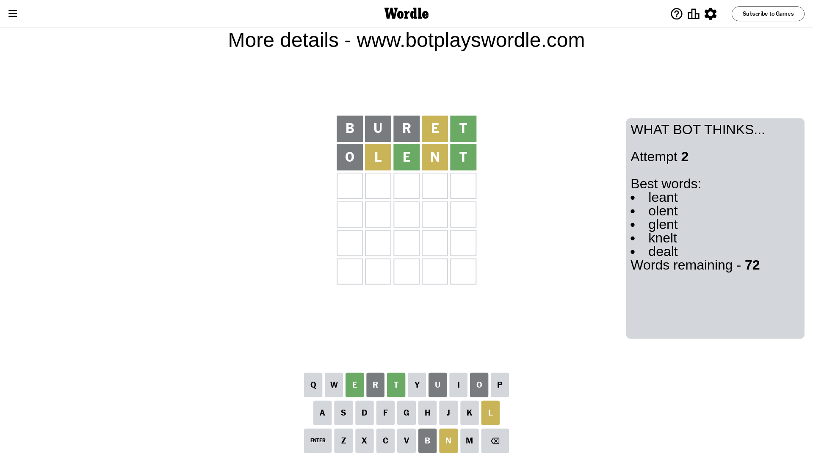
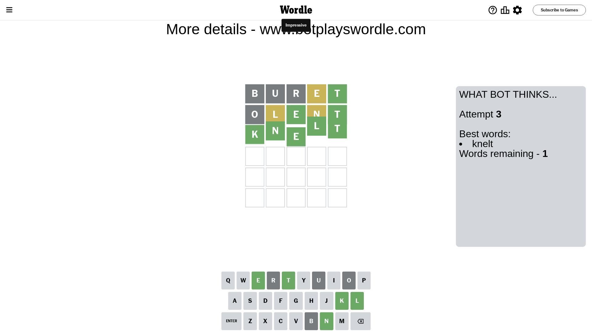

# Wordle for October 12, 2023 - \#845

## Attempt 1

This is the first attempt and we'll choose a random word to start with.

Let's start with word `buret`

Attempt for `buret` gives us 1 correct letters, 1 present letters and 3 wrong letters.

If we look into details, we can see that:

Letter `b` is not present in the word and we will not use it any more

Letter `u` is not present in the word and we will not use it any more

Letter `r` is not present in the word and we will not use it any more

Letter `e` is on a different spot - this means that it cannot be at position 4

Letter `t` should be at position 5

We got information about the correct letters and it should make next attempt easier

Some letters are missing (like `b`, `u`, `r`) but it's also important piece of information

Word should contain letters `[e t]`

That was a great guess that limited number of remaining words

## Attempt 2

Right now we have 72 words to choose from and best of them seem to be `[leant olent glent knelt dealt]`

So far we know that possible letters are:

At position 1: `[a c d e f g h i j k l m n o p q s t v w x y z]`

At position 2: `[a c d e f g h i j k l m n o p q s t v w x y z]`

At position 3: `[a c d e f g h i j k l m n o p q s t v w x y z]`

At position 4: `[a c d f g h i j k l m n o p q s t v w x y z]`

At position 5: `[t]`

Next guess is `olent`, let's see what it gives us

Attempt for `olent` gives us 2 correct letters, 2 present letters and 1 wrong letters.

If we look into details, we can see that:

Letter `o` is not present in the word and we will not use it any more

Letter `l` is on a different spot - this means that it cannot be at position 2

Letter `e` should be at position 3

Letter `n` is on a different spot - this means that it cannot be at position 4

We got information about the correct letters and it should make next attempt easier

Some letters are missing (like `o`) but it's also important piece of information

Word should contain letters `[e t l n]`

That was a great guess that limited number of remaining words

## Attempt 3

Right now we have 1 words to choose from and best of them seem to be `[knelt]`

So far we know that possible letters are:

At position 1: `[a c d e f g h i j k l m n p q s t v w x y z]`

At position 2: `[a c d e f g h i j k m n p q s t v w x y z]`

At position 3: `[e]`

At position 4: `[a c d f g h i j k l m p q s t v w x y z]`

At position 5: `[t]`

It must be `knelt`

That's the correct answer! The word is `knelt`!

## Conclusion

Today's word is `knelt` and it took 3 attempts to guess it

