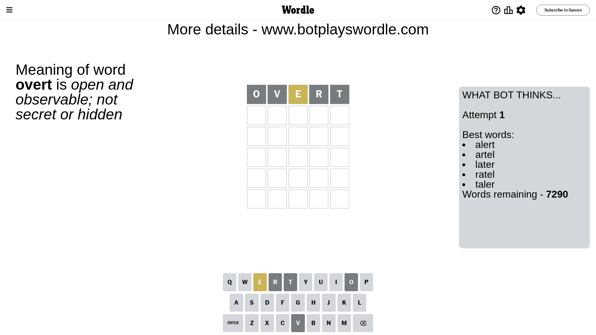
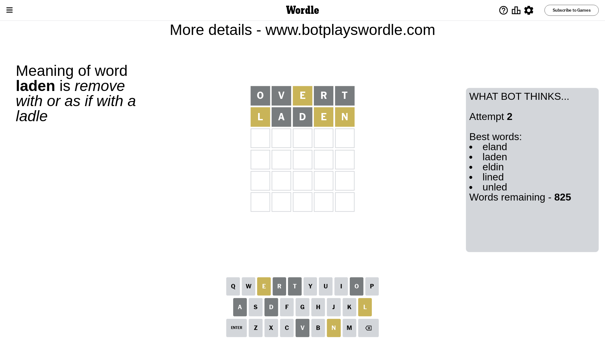
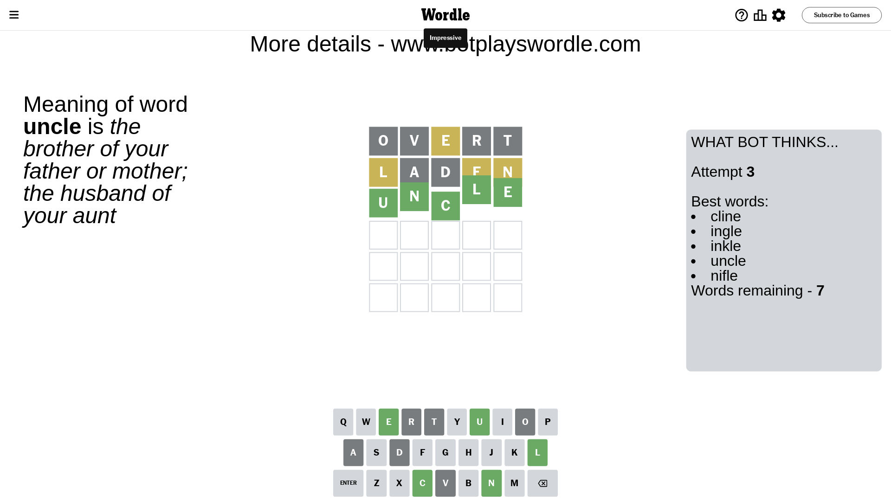

# Wordle for October 13, 2023 - \#846

## Attempt 1

This is the first attempt and we'll choose a random word to start with.

Let's start with word `overt`

Attempt for `overt` gives us 0 correct letters, 1 present letters and 4 wrong letters.

If we look into details, we can see that:

Letter `o` is not present in the word and we will not use it any more

Letter `v` is not present in the word and we will not use it any more

Letter `e` is on a different spot - this means that it cannot be at position 3

Letter `r` is not present in the word and we will not use it any more

Letter `t` is not present in the word and we will not use it any more

Some letters are missing (like `o`, `v`, `r`, `t`) but it's also important piece of information

Word should contain letters `[e]`

That was a great guess that limited number of remaining words

## Attempt 2

Right now we have 825 words to choose from and best of them seem to be `[eland laden eldin lined unled]`

So far we know that possible letters are:

At position 1: `[a b c d e f g h i j k l m n p q s u w x y z]`

At position 2: `[a b c d e f g h i j k l m n p q s u w x y z]`

At position 3: `[a b c d f g h i j k l m n p q s u w x y z]`

At position 4: `[a b c d e f g h i j k l m n p q s u w x y z]`

At position 5: `[a b c d e f g h i j k l m n p q s u w x y z]`

Next guess is `laden`, let's see what it gives us

Attempt for `laden` gives us 0 correct letters, 3 present letters and 2 wrong letters.

If we look into details, we can see that:

Letter `l` is on a different spot - this means that it cannot be at position 1

Letter `a` is not present in the word and we will not use it any more

Letter `d` is not present in the word and we will not use it any more

Letter `e` is on a different spot - this means that it cannot be at position 4

Letter `n` is on a different spot - this means that it cannot be at position 5

Some letters are missing (like `a`, `d`) but it's also important piece of information

Word should contain letters `[e l n]`

That was a great guess that limited number of remaining words

## Attempt 3

Right now we have 7 words to choose from and best of them seem to be `[cline ingle inkle uncle nifle]`

So far we know that possible letters are:

At position 1: `[b c e f g h i j k m n p q s u w x y z]`

At position 2: `[b c e f g h i j k l m n p q s u w x y z]`

At position 3: `[b c f g h i j k l m n p q s u w x y z]`

At position 4: `[b c f g h i j k l m n p q s u w x y z]`

At position 5: `[b c e f g h i j k l m p q s u w x y z]`

Next guess is `uncle`, let's see what it gives us

That's the correct answer! The word is `uncle`!

## Conclusion

Today's word is `uncle` and it took 3 attempts to guess it

