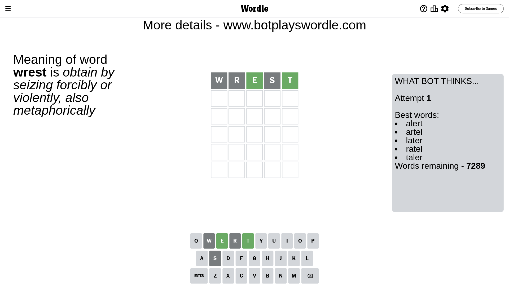
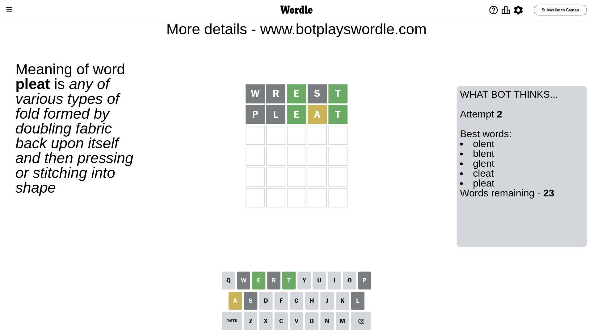
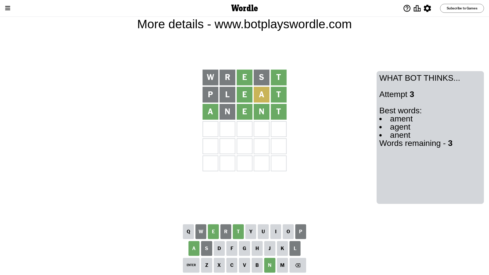
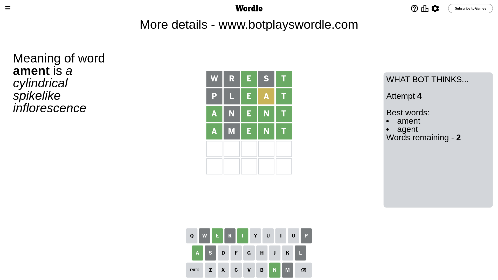
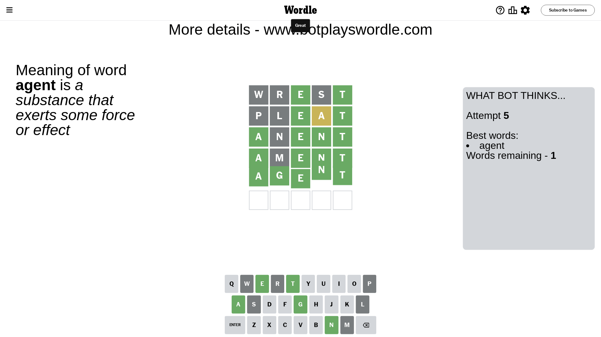

# Wordle for October 14, 2023 - \#847

## Attempt 1

This is the first attempt and we'll choose a random word to start with.

Let's start with word `wrest`

Attempt for `wrest` gives us 2 correct letters, 0 present letters and 3 wrong letters.

If we look into details, we can see that:

Letter `w` is not present in the word and we will not use it any more

Letter `r` is not present in the word and we will not use it any more

Letter `e` should be at position 3

Letter `s` is not present in the word and we will not use it any more

Letter `t` should be at position 5

We got information about the correct letters and it should make next attempt easier

Some letters are missing (like `w`, `r`, `s`) but it's also important piece of information

Word should contain letters `[e t]`

That was a great guess that limited number of remaining words

## Attempt 2

Right now we have 23 words to choose from and best of them seem to be `[olent blent glent cleat pleat]`

So far we know that possible letters are:

At position 1: `[a b c d e f g h i j k l m n o p q t u v x y z]`

At position 2: `[a b c d e f g h i j k l m n o p q t u v x y z]`

At position 3: `[e]`

At position 4: `[a b c d e f g h i j k l m n o p q t u v x y z]`

At position 5: `[t]`

Next guess is `pleat`, let's see what it gives us

Attempt for `pleat` gives us 2 correct letters, 1 present letters and 2 wrong letters.

If we look into details, we can see that:

Letter `p` is not present in the word and we will not use it any more

Letter `l` is not present in the word and we will not use it any more

Letter `a` is on a different spot - this means that it cannot be at position 4

Some letters are missing (like `p`, `l`) but it's also important piece of information

Word should contain letters `[e t a]`

Not a bad guess in general

## Attempt 3

Right now we have 3 words to choose from and best of them seem to be `[ament agent anent]`

So far we know that possible letters are:

At position 1: `[a b c d e f g h i j k m n o q t u v x y z]`

At position 2: `[a b c d e f g h i j k m n o q t u v x y z]`

At position 3: `[e]`

At position 4: `[b c d e f g h i j k m n o q t u v x y z]`

At position 5: `[t]`

Next guess is `anent`, let's see what it gives us

Attempt for `anent` gives us 4 correct letters, 0 present letters and 1 wrong letters.

If we look into details, we can see that:

Letter `a` should be at position 1

Letter `n` is not present in the word and we will not use it any more

Letter `n` should be at position 4

We got information about the correct letters and it should make next attempt easier

Some letters are missing (like `n`) but it's also important piece of information

Word should contain letters `[e t a n]`

This was a waste, almost no valuable information...

## Attempt 4

Right now we have 2 words to choose from and best of them seem to be `[ament agent]`

So far we know that possible letters are:

At position 1: `[a]`

At position 2: `[a b c d e f g h i j k m o q t u v x y z]`

At position 3: `[e]`

At position 4: `[n]`

At position 5: `[t]`

Next guess is `ament`, let's see what it gives us

Attempt for `ament` gives us 4 correct letters, 0 present letters and 1 wrong letters.

If we look into details, we can see that:

Letter `m` is not present in the word and we will not use it any more

Some letters are missing (like `m`) but it's also important piece of information

Word should contain letters `[e t a n]`

This was a waste, almost no valuable information...

## Attempt 5

Right now we have 1 words to choose from and best of them seem to be `[agent]`

So far we know that possible letters are:

At position 1: `[a]`

At position 2: `[a b c d e f g h i j k o q t u v x y z]`

At position 3: `[e]`

At position 4: `[n]`

At position 5: `[t]`

It must be `agent`

That's the correct answer! The word is `agent`!

## Conclusion

Today's word is `agent` and it took 5 attempts to guess it

