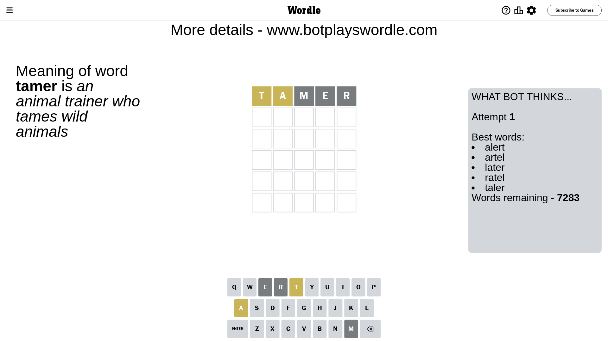
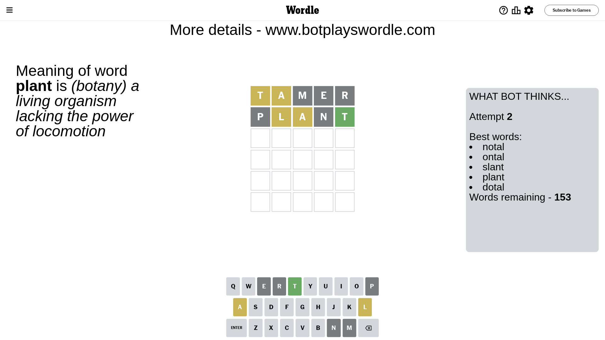
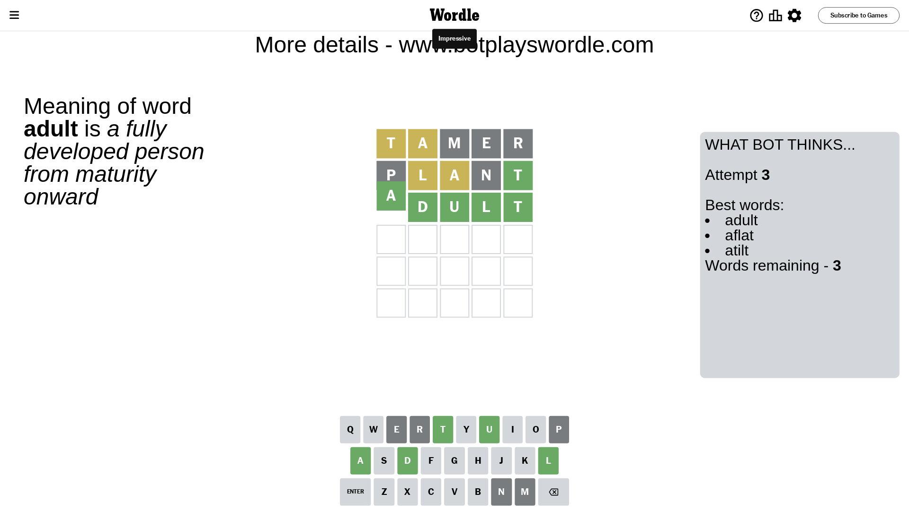

# Wordle for October 17, 2023 - \#850

## Attempt 1

This is the first attempt and we'll choose a random word to start with.

Let's start with word `tamer`

Attempt for `tamer` gives us 0 correct letters, 2 present letters and 3 wrong letters.

If we look into details, we can see that:

Letter `t` is on a different spot - this means that it cannot be at position 1

Letter `a` is on a different spot - this means that it cannot be at position 2

Letter `m` is not present in the word and we will not use it any more

Letter `e` is not present in the word and we will not use it any more

Letter `r` is not present in the word and we will not use it any more

Some letters are missing (like `m`, `e`, `r`) but it's also important piece of information

Word should contain letters `[t a]`

That was a great guess that limited number of remaining words

## Attempt 2

Right now we have 153 words to choose from and best of them seem to be `[notal ontal slant plant dotal]`

So far we know that possible letters are:

At position 1: `[a b c d f g h i j k l n o p q s u v w x y z]`

At position 2: `[b c d f g h i j k l n o p q s t u v w x y z]`

At position 3: `[a b c d f g h i j k l n o p q s t u v w x y z]`

At position 4: `[a b c d f g h i j k l n o p q s t u v w x y z]`

At position 5: `[a b c d f g h i j k l n o p q s t u v w x y z]`

Next guess is `plant`, let's see what it gives us

Attempt for `plant` gives us 1 correct letters, 2 present letters and 2 wrong letters.

If we look into details, we can see that:

Letter `p` is not present in the word and we will not use it any more

Letter `l` is on a different spot - this means that it cannot be at position 2

Letter `a` is on a different spot - this means that it cannot be at position 3

Letter `n` is not present in the word and we will not use it any more

Letter `t` should be at position 5

We got information about the correct letters and it should make next attempt easier

Some letters are missing (like `p`, `n`) but it's also important piece of information

Word should contain letters `[t a l]`

That was a great guess that limited number of remaining words

## Attempt 3

Right now we have 3 words to choose from and best of them seem to be `[adult aflat atilt]`

So far we know that possible letters are:

At position 1: `[a b c d f g h i j k l o q s u v w x y z]`

At position 2: `[b c d f g h i j k o q s t u v w x y z]`

At position 3: `[b c d f g h i j k l o q s t u v w x y z]`

At position 4: `[a b c d f g h i j k l o q s t u v w x y z]`

At position 5: `[t]`

Next guess is `adult`, let's see what it gives us

That's the correct answer! The word is `adult`!

## Conclusion

Today's word is `adult` and it took 3 attempts to guess it

