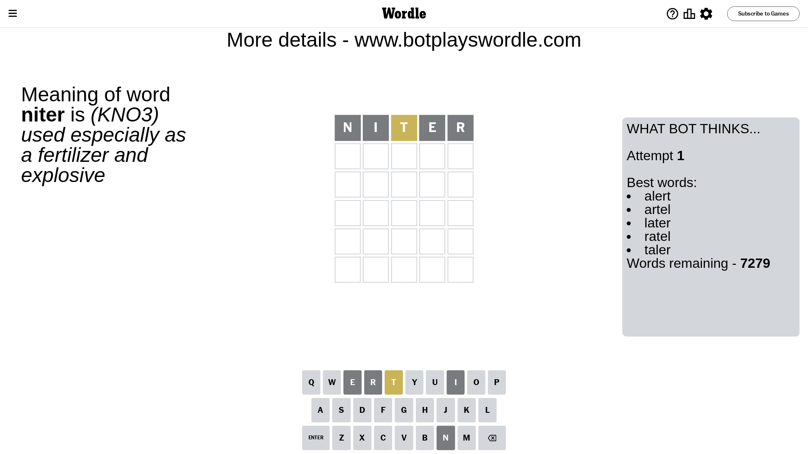
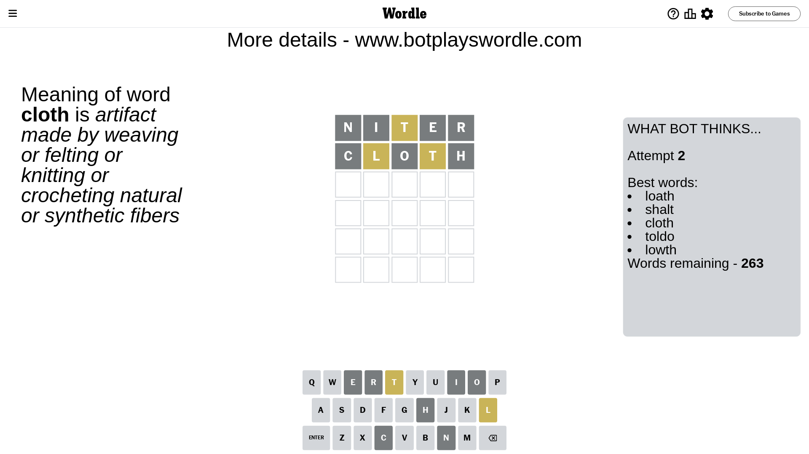
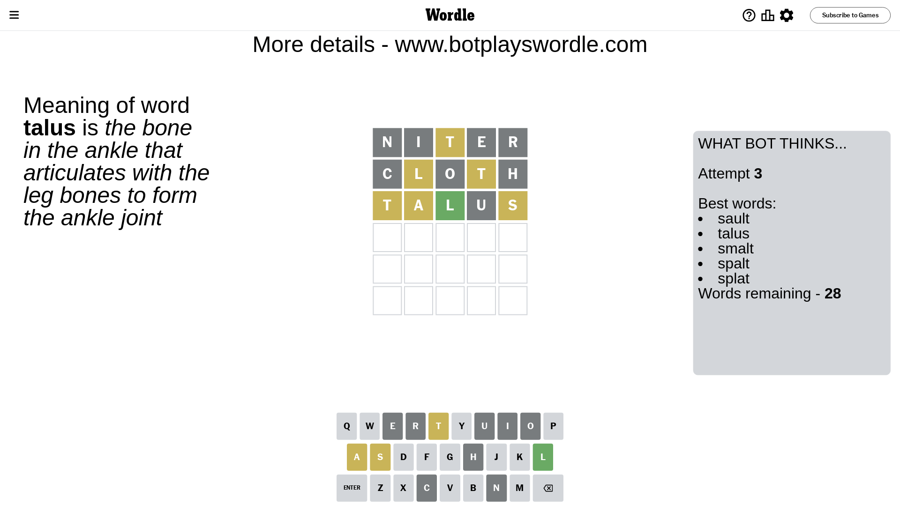
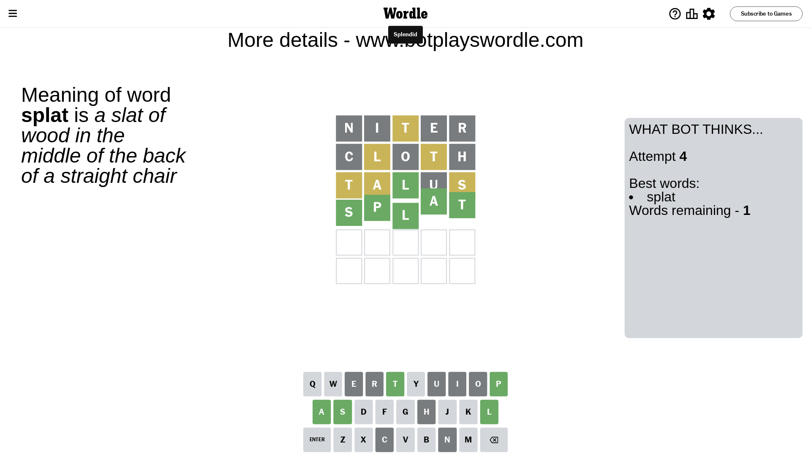

# Wordle for October 19, 2023 - \#852

## Attempt 1

This is the first attempt and we'll choose a random word to start with.

Let's start with word `niter`

Attempt for `niter` gives us 0 correct letters, 1 present letters and 4 wrong letters.

If we look into details, we can see that:

Letter `n` is not present in the word and we will not use it any more

Letter `i` is not present in the word and we will not use it any more

Letter `t` is on a different spot - this means that it cannot be at position 3

Letter `e` is not present in the word and we will not use it any more

Letter `r` is not present in the word and we will not use it any more

Some letters are missing (like `n`, `i`, `e`, `r`) but it's also important piece of information

Word should contain letters `[t]`

That was a great guess that limited number of remaining words

## Attempt 2

Right now we have 263 words to choose from and best of them seem to be `[loath shalt cloth toldo lowth]`

So far we know that possible letters are:

At position 1: `[a b c d f g h j k l m o p q s t u v w x y z]`

At position 2: `[a b c d f g h j k l m o p q s t u v w x y z]`

At position 3: `[a b c d f g h j k l m o p q s u v w x y z]`

At position 4: `[a b c d f g h j k l m o p q s t u v w x y z]`

At position 5: `[a b c d f g h j k l m o p q s t u v w x y z]`

Next guess is `cloth`, let's see what it gives us

Attempt for `cloth` gives us 0 correct letters, 2 present letters and 3 wrong letters.

If we look into details, we can see that:

Letter `c` is not present in the word and we will not use it any more

Letter `l` is on a different spot - this means that it cannot be at position 2

Letter `o` is not present in the word and we will not use it any more

Letter `t` is on a different spot - this means that it cannot be at position 4

Letter `h` is not present in the word and we will not use it any more

Some letters are missing (like `c`, `o`, `h`) but it's also important piece of information

Word should contain letters `[t l]`

That was a great guess that limited number of remaining words

## Attempt 3

Right now we have 28 words to choose from and best of them seem to be `[sault talus smalt spalt splat]`

So far we know that possible letters are:

At position 1: `[a b d f g j k l m p q s t u v w x y z]`

At position 2: `[a b d f g j k m p q s t u v w x y z]`

At position 3: `[a b d f g j k l m p q s u v w x y z]`

At position 4: `[a b d f g j k l m p q s u v w x y z]`

At position 5: `[a b d f g j k l m p q s t u v w x y z]`

Next guess is `talus`, let's see what it gives us

Attempt for `talus` gives us 1 correct letters, 3 present letters and 1 wrong letters.

If we look into details, we can see that:

Letter `t` is on a different spot - this means that it cannot be at position 1

Letter `a` is on a different spot - this means that it cannot be at position 2

Letter `l` should be at position 3

Letter `u` is not present in the word and we will not use it any more

Letter `s` is on a different spot - this means that it cannot be at position 5

We got information about the correct letters and it should make next attempt easier

Some letters are missing (like `u`) but it's also important piece of information

Word should contain letters `[t l a s]`

That was a great guess that limited number of remaining words

## Attempt 4

Right now we have 1 words to choose from and best of them seem to be `[splat]`

So far we know that possible letters are:

At position 1: `[a b d f g j k l m p q s v w x y z]`

At position 2: `[b d f g j k m p q s t v w x y z]`

At position 3: `[l]`

At position 4: `[a b d f g j k l m p q s v w x y z]`

At position 5: `[a b d f g j k l m p q t v w x y z]`

It must be `splat`

That's the correct answer! The word is `splat`!

## Conclusion

Today's word is `splat` and it took 4 attempts to guess it

