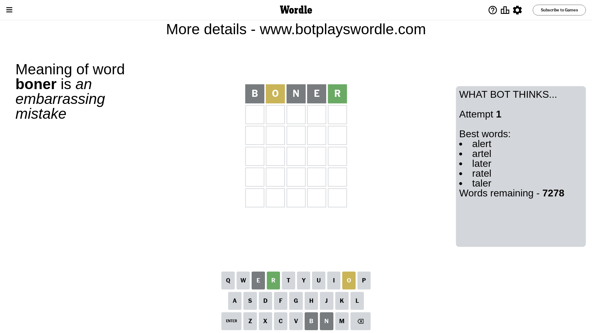
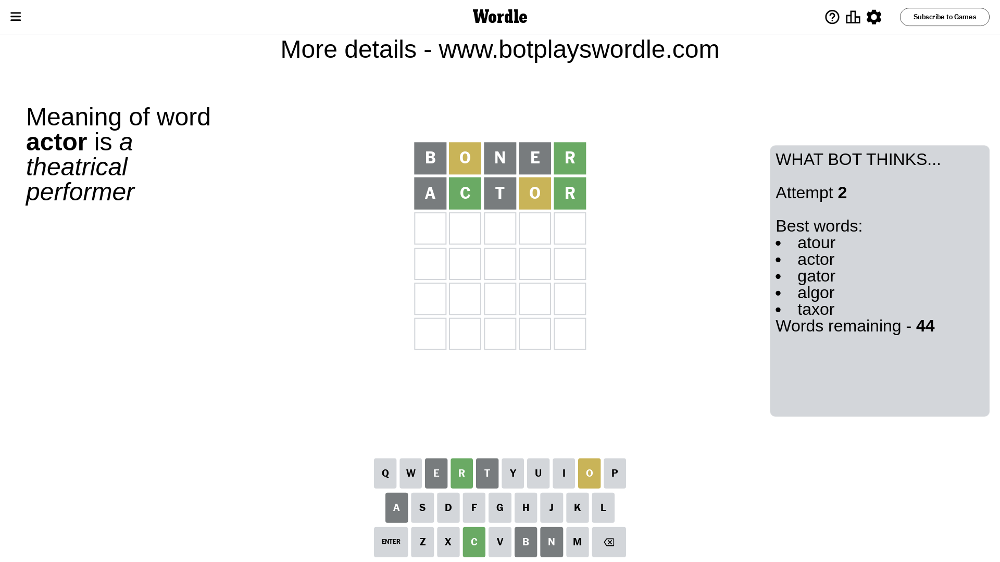
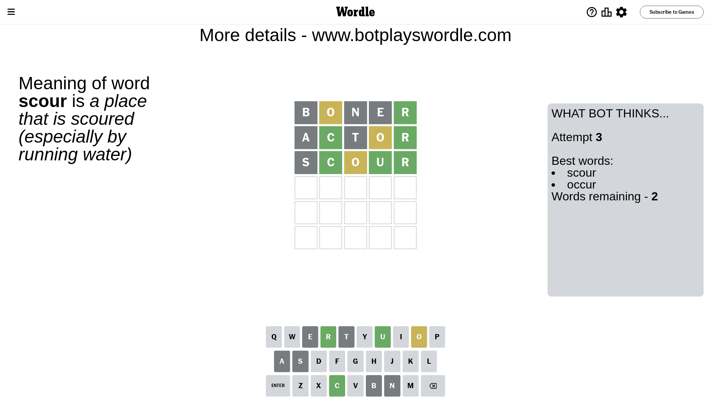
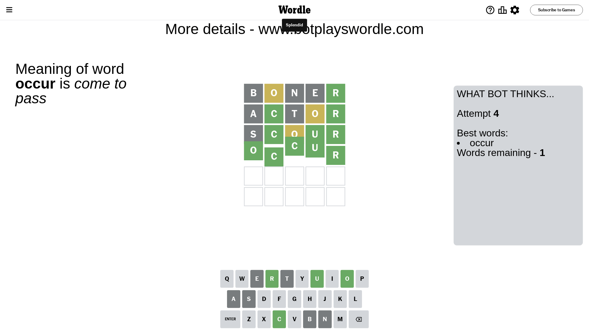

# Wordle for October 20, 2023 - \#853

## Attempt 1

This is the first attempt and we'll choose a random word to start with.

Let's start with word `boner`

Attempt for `boner` gives us 1 correct letters, 1 present letters and 3 wrong letters.

If we look into details, we can see that:

Letter `b` is not present in the word and we will not use it any more

Letter `o` is on a different spot - this means that it cannot be at position 2

Letter `n` is not present in the word and we will not use it any more

Letter `e` is not present in the word and we will not use it any more

Letter `r` should be at position 5

We got information about the correct letters and it should make next attempt easier

Some letters are missing (like `b`, `n`, `e`) but it's also important piece of information

Word should contain letters `[o r]`

That was a great guess that limited number of remaining words

## Attempt 2

Right now we have 44 words to choose from and best of them seem to be `[atour actor gator algor taxor]`

So far we know that possible letters are:

At position 1: `[a c d f g h i j k l m o p q r s t u v w x y z]`

At position 2: `[a c d f g h i j k l m p q r s t u v w x y z]`

At position 3: `[a c d f g h i j k l m o p q r s t u v w x y z]`

At position 4: `[a c d f g h i j k l m o p q r s t u v w x y z]`

At position 5: `[r]`

Next guess is `actor`, let's see what it gives us

Attempt for `actor` gives us 2 correct letters, 1 present letters and 2 wrong letters.

If we look into details, we can see that:

Letter `a` is not present in the word and we will not use it any more

Letter `c` should be at position 2

Letter `t` is not present in the word and we will not use it any more

Letter `o` is on a different spot - this means that it cannot be at position 4

We got information about the correct letters and it should make next attempt easier

Some letters are missing (like `a`, `t`) but it's also important piece of information

Word should contain letters `[o r c]`

That was a great guess that limited number of remaining words

## Attempt 3

Right now we have 2 words to choose from and best of them seem to be `[scour occur]`

So far we know that possible letters are:

At position 1: `[c d f g h i j k l m o p q r s u v w x y z]`

At position 2: `[c]`

At position 3: `[c d f g h i j k l m o p q r s u v w x y z]`

At position 4: `[c d f g h i j k l m p q r s u v w x y z]`

At position 5: `[r]`

Next guess is `scour`, let's see what it gives us

Attempt for `scour` gives us 3 correct letters, 1 present letters and 1 wrong letters.

If we look into details, we can see that:

Letter `s` is not present in the word and we will not use it any more

Letter `o` is on a different spot - this means that it cannot be at position 3

Letter `u` should be at position 4

We got information about the correct letters and it should make next attempt easier

Some letters are missing (like `s`) but it's also important piece of information

Word should contain letters `[o r c u]`

This was a waste, almost no valuable information...

## Attempt 4

Right now we have 1 words to choose from and best of them seem to be `[occur]`

So far we know that possible letters are:

At position 1: `[c d f g h i j k l m o p q r u v w x y z]`

At position 2: `[c]`

At position 3: `[c d f g h i j k l m p q r u v w x y z]`

At position 4: `[u]`

At position 5: `[r]`

It must be `occur`

That's the correct answer! The word is `occur`!

## Conclusion

Today's word is `occur` and it took 4 attempts to guess it

