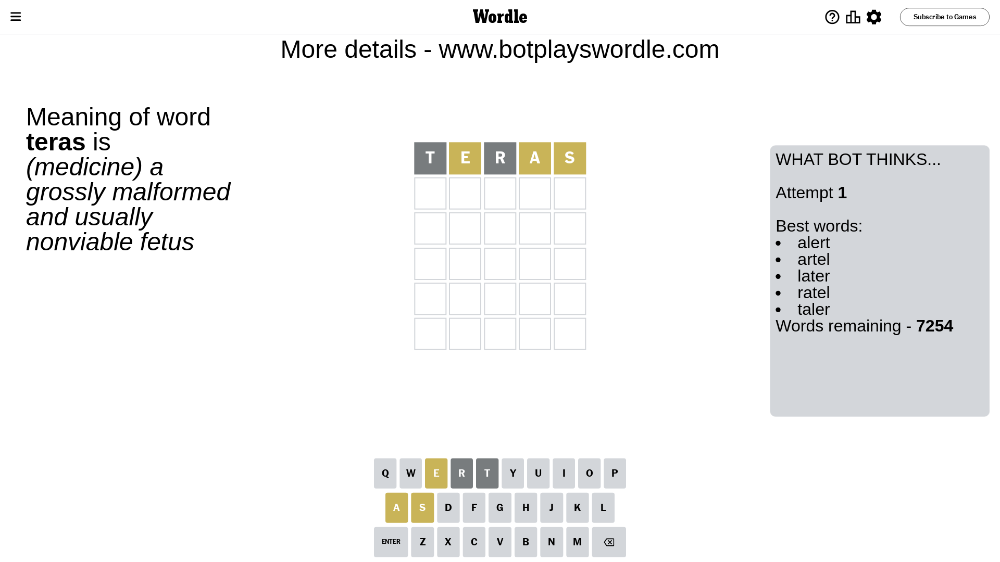
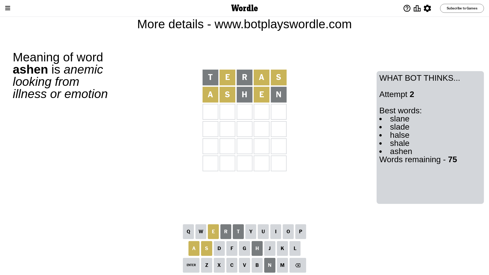
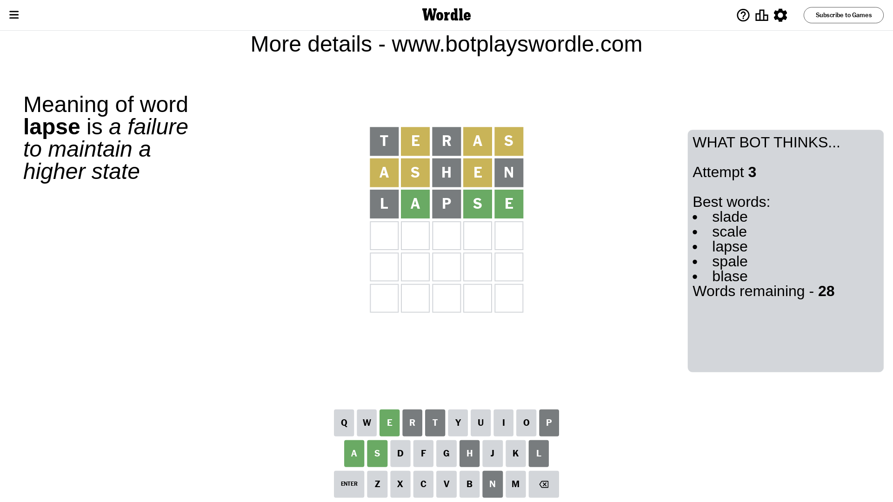
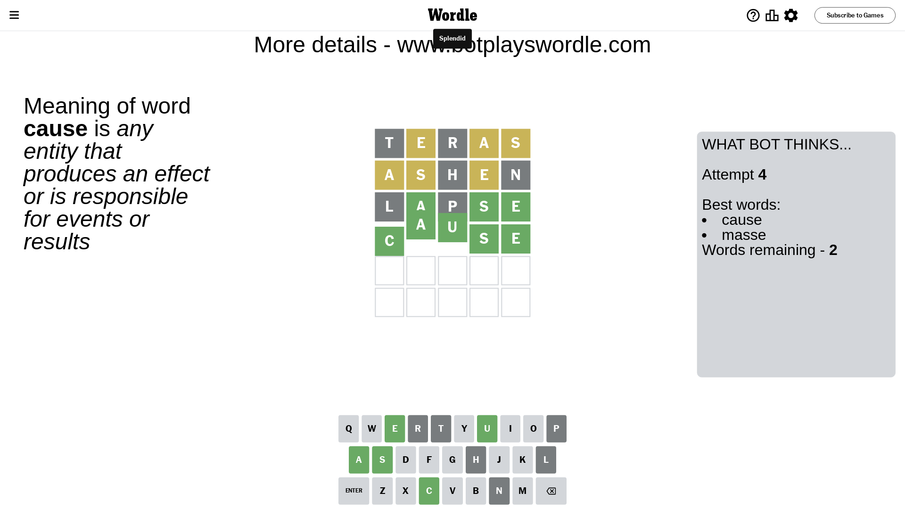

# Wordle for October 24, 2023 - \#857

## Attempt 1

This is the first attempt and we'll choose a random word to start with.

Let's start with word `teras`

Attempt for `teras` gives us 0 correct letters, 3 present letters and 2 wrong letters.

If we look into details, we can see that:

Letter `t` is not present in the word and we will not use it any more

Letter `e` is on a different spot - this means that it cannot be at position 2

Letter `r` is not present in the word and we will not use it any more

Letter `a` is on a different spot - this means that it cannot be at position 4

Letter `s` is on a different spot - this means that it cannot be at position 5

Some letters are missing (like `t`, `r`) but it's also important piece of information

Word should contain letters `[e a s]`

That was a great guess that limited number of remaining words

## Attempt 2

Right now we have 75 words to choose from and best of them seem to be `[slane slade halse shale ashen]`

So far we know that possible letters are:

At position 1: `[a b c d e f g h i j k l m n o p q s u v w x y z]`

At position 2: `[a b c d f g h i j k l m n o p q s u v w x y z]`

At position 3: `[a b c d e f g h i j k l m n o p q s u v w x y z]`

At position 4: `[b c d e f g h i j k l m n o p q s u v w x y z]`

At position 5: `[a b c d e f g h i j k l m n o p q u v w x y z]`

Next guess is `ashen`, let's see what it gives us

Attempt for `ashen` gives us 0 correct letters, 3 present letters and 2 wrong letters.

If we look into details, we can see that:

Letter `a` is on a different spot - this means that it cannot be at position 1

Letter `s` is on a different spot - this means that it cannot be at position 2

Letter `h` is not present in the word and we will not use it any more

Letter `e` is on a different spot - this means that it cannot be at position 4

Letter `n` is not present in the word and we will not use it any more

Some letters are missing (like `h`, `n`) but it's also important piece of information

Word should contain letters `[e a s]`

Could be a better guess

## Attempt 3

Right now we have 28 words to choose from and best of them seem to be `[slade scale lapse spale blase]`

So far we know that possible letters are:

At position 1: `[b c d e f g i j k l m o p q s u v w x y z]`

At position 2: `[a b c d f g i j k l m o p q u v w x y z]`

At position 3: `[a b c d e f g i j k l m o p q s u v w x y z]`

At position 4: `[b c d f g i j k l m o p q s u v w x y z]`

At position 5: `[a b c d e f g i j k l m o p q u v w x y z]`

Next guess is `lapse`, let's see what it gives us

Attempt for `lapse` gives us 3 correct letters, 0 present letters and 2 wrong letters.

If we look into details, we can see that:

Letter `l` is not present in the word and we will not use it any more

Letter `a` should be at position 2

Letter `p` is not present in the word and we will not use it any more

Letter `s` should be at position 4

Letter `e` should be at position 5

We got information about the correct letters and it should make next attempt easier

Some letters are missing (like `l`, `p`) but it's also important piece of information

Word should contain letters `[e a s]`

That was a great guess that limited number of remaining words

## Attempt 4

Right now we have 2 words to choose from and best of them seem to be `[cause masse]`

So far we know that possible letters are:

At position 1: `[b c d e f g i j k m o q s u v w x y z]`

At position 2: `[a]`

At position 3: `[a b c d e f g i j k m o q s u v w x y z]`

At position 4: `[s]`

At position 5: `[e]`

Next guess is `cause`, let's see what it gives us

That's the correct answer! The word is `cause`!

## Conclusion

Today's word is `cause` and it took 4 attempts to guess it

