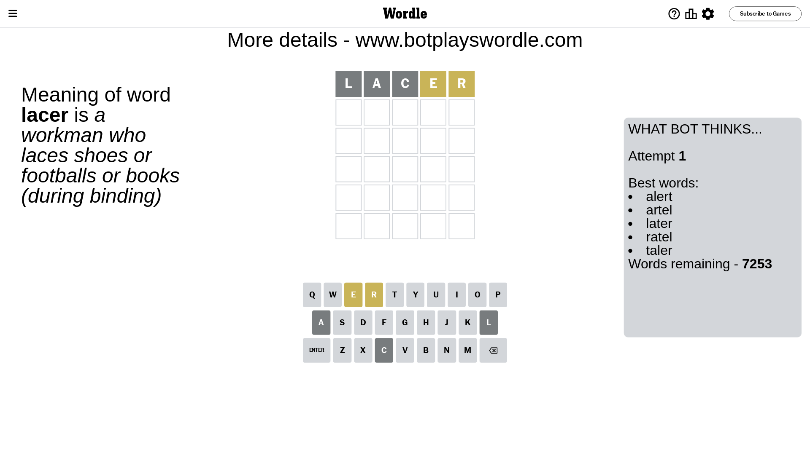

# Wordle for October 25, 2023 - \#858

## Attempt 1

This is the first attempt and we'll choose a random word to start with.

Let's start with word `lacer`

Attempt for `lacer` gives us 0 correct letters, 2 present letters and 3 wrong letters.

If we look into details, we can see that:

Letter `l` is not present in the word and we will not use it any more

Letter `a` is not present in the word and we will not use it any more

Letter `c` is not present in the word and we will not use it any more

Letter `e` is on a different spot - this means that it cannot be at position 4

Letter `r` is on a different spot - this means that it cannot be at position 5

Some letters are missing (like `l`, `a`, `c`) but it's also important piece of information

Word should contain letters `[e r]`

That was a great guess that limited number of remaining words

## Attempt 2

Right now we have 299 words to choose from and best of them seem to be `[trone inert retin trine stern]`

So far we know that possible letters are:

At position 1: `[b d e f g h i j k m n o p q r s t u v w x y z]`

At position 2: `[b d e f g h i j k m n o p q r s t u v w x y z]`

At position 3: `[b d e f g h i j k m n o p q r s t u v w x y z]`

At position 4: `[b d f g h i j k m n o p q r s t u v w x y z]`

At position 5: `[b d e f g h i j k m n o p q s t u v w x y z]`

Next guess is `trine`, let's see what it gives us

Attempt for `trine` gives us 0 correct letters, 3 present letters and 2 wrong letters.

If we look into details, we can see that:

Letter `t` is on a different spot - this means that it cannot be at position 1

Letter `r` is on a different spot - this means that it cannot be at position 2

Letter `i` is not present in the word and we will not use it any more

Letter `n` is not present in the word and we will not use it any more

Letter `e` is on a different spot - this means that it cannot be at position 5

Some letters are missing (like `i`, `n`) but it's also important piece of information

Word should contain letters `[e r t]`

That was a great guess that limited number of remaining words

## Attempt 3

Right now we have 10 words to choose from and best of them seem to be `[berth hertz repot resty overt]`

So far we know that possible letters are:

At position 1: `[b d e f g h j k m o p q r s u v w x y z]`

At position 2: `[b d e f g h j k m o p q s t u v w x y z]`

At position 3: `[b d e f g h j k m o p q r s t u v w x y z]`

At position 4: `[b d f g h j k m o p q r s t u v w x y z]`

At position 5: `[b d f g h j k m o p q s t u v w x y z]`

Next guess is `overt`, let's see what it gives us

Attempt for `overt` gives us 1 correct letters, 2 present letters and 2 wrong letters.

If we look into details, we can see that:

Letter `o` is not present in the word and we will not use it any more

Letter `v` is not present in the word and we will not use it any more

Letter `e` is on a different spot - this means that it cannot be at position 3

Letter `r` should be at position 4

Letter `t` is on a different spot - this means that it cannot be at position 5

We got information about the correct letters and it should make next attempt easier

Some letters are missing (like `o`, `v`) but it's also important piece of information

Word should contain letters `[e r t]`

That was a great guess that limited number of remaining words

## Attempt 4

Right now we have 1 words to choose from and best of them seem to be `[retry]`

So far we know that possible letters are:

At position 1: `[b d e f g h j k m p q r s u w x y z]`

At position 2: `[b d e f g h j k m p q s t u w x y z]`

At position 3: `[b d f g h j k m p q r s t u w x y z]`

At position 4: `[r]`

At position 5: `[b d f g h j k m p q s u w x y z]`

It must be `retry`

That's the correct answer! The word is `retry`!

## Conclusion

Today's word is `retry` and it took 4 attempts to guess it

