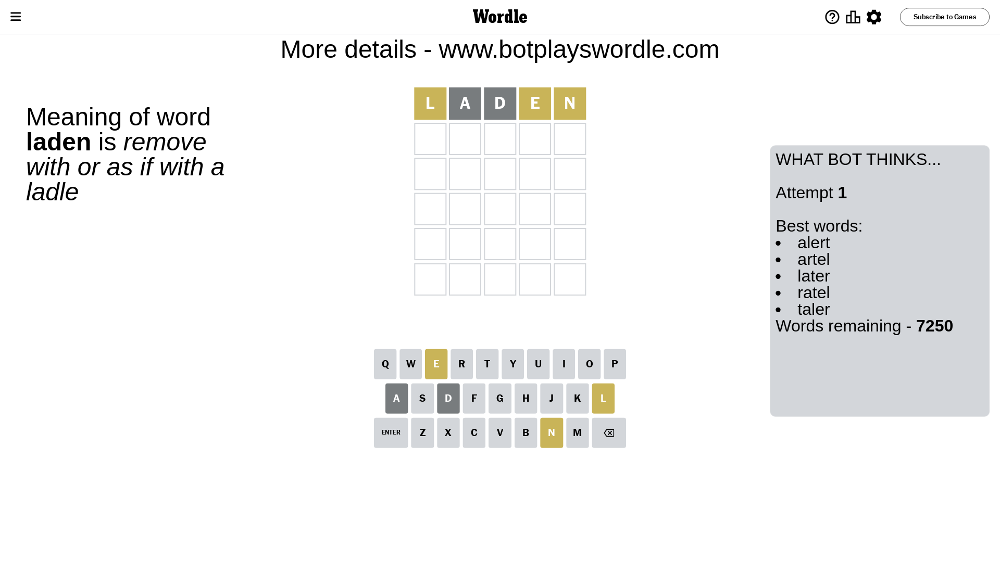
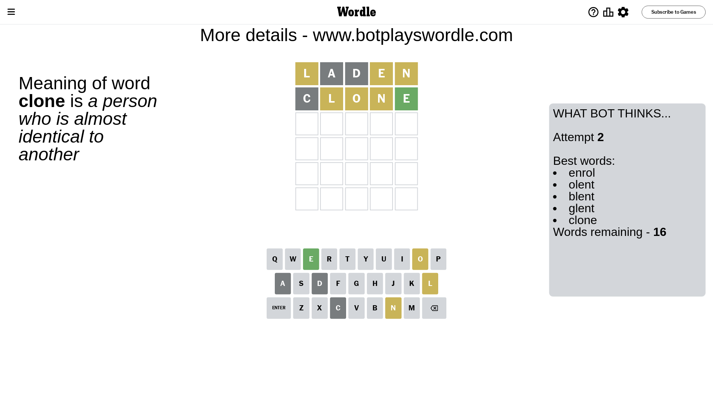
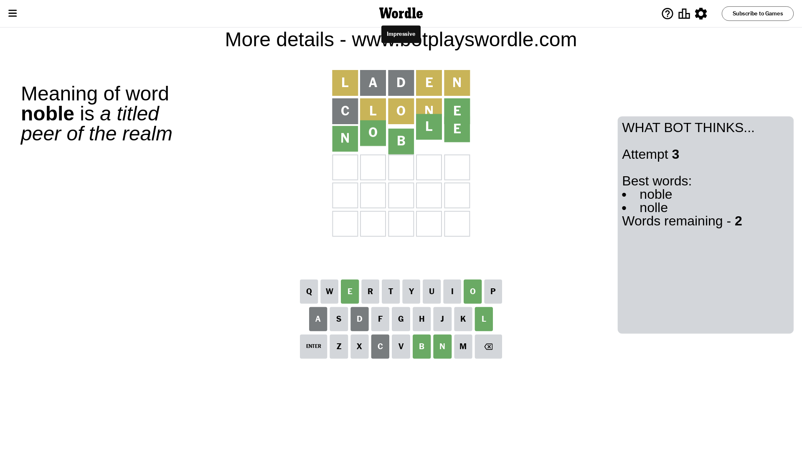

# Wordle for October 27, 2023 - \#860

## Attempt 1

This is the first attempt and we'll choose a random word to start with.

Let's start with word `laden`

Attempt for `laden` gives us 0 correct letters, 3 present letters and 2 wrong letters.

If we look into details, we can see that:

Letter `l` is on a different spot - this means that it cannot be at position 1

Letter `a` is not present in the word and we will not use it any more

Letter `d` is not present in the word and we will not use it any more

Letter `e` is on a different spot - this means that it cannot be at position 4

Letter `n` is on a different spot - this means that it cannot be at position 5

Some letters are missing (like `a`, `d`) but it's also important piece of information

Word should contain letters `[l e n]`

That was a great guess that limited number of remaining words

## Attempt 2

Right now we have 16 words to choose from and best of them seem to be `[enrol olent blent glent clone]`

So far we know that possible letters are:

At position 1: `[b c e f g h i j k m n o p q r s t u v w x y z]`

At position 2: `[b c e f g h i j k l m n o p q r s t u v w x y z]`

At position 3: `[b c e f g h i j k l m n o p q r s t u v w x y z]`

At position 4: `[b c f g h i j k l m n o p q r s t u v w x y z]`

At position 5: `[b c e f g h i j k l m o p q r s t u v w x y z]`

Next guess is `clone`, let's see what it gives us

Attempt for `clone` gives us 1 correct letters, 3 present letters and 1 wrong letters.

If we look into details, we can see that:

Letter `c` is not present in the word and we will not use it any more

Letter `l` is on a different spot - this means that it cannot be at position 2

Letter `o` is on a different spot - this means that it cannot be at position 3

Letter `n` is on a different spot - this means that it cannot be at position 4

Letter `e` should be at position 5

We got information about the correct letters and it should make next attempt easier

Some letters are missing (like `c`) but it's also important piece of information

Word should contain letters `[l e n o]`

Not a bad guess in general

## Attempt 3

Right now we have 2 words to choose from and best of them seem to be `[noble nolle]`

So far we know that possible letters are:

At position 1: `[b e f g h i j k m n o p q r s t u v w x y z]`

At position 2: `[b e f g h i j k m n o p q r s t u v w x y z]`

At position 3: `[b e f g h i j k l m n p q r s t u v w x y z]`

At position 4: `[b f g h i j k l m o p q r s t u v w x y z]`

At position 5: `[e]`

Next guess is `noble`, let's see what it gives us

That's the correct answer! The word is `noble`!

## Conclusion

Today's word is `noble` and it took 3 attempts to guess it

