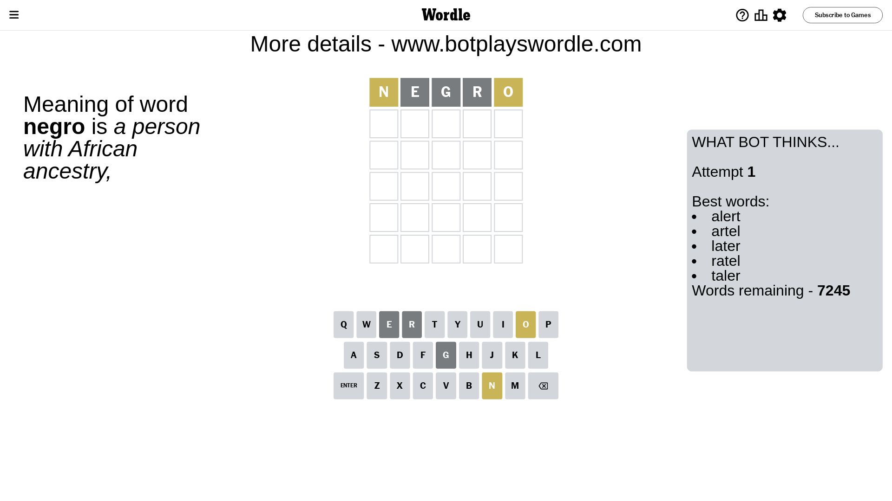
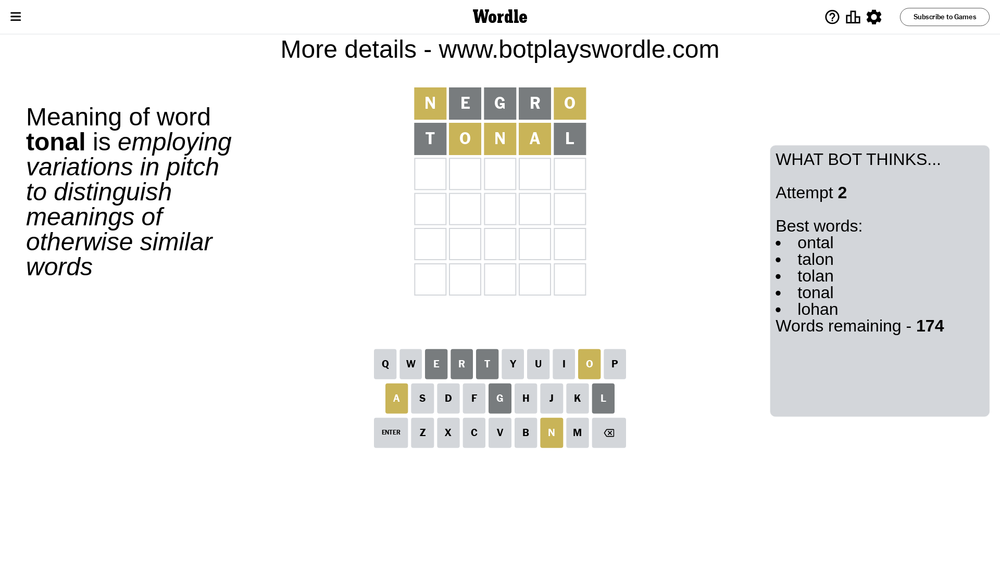
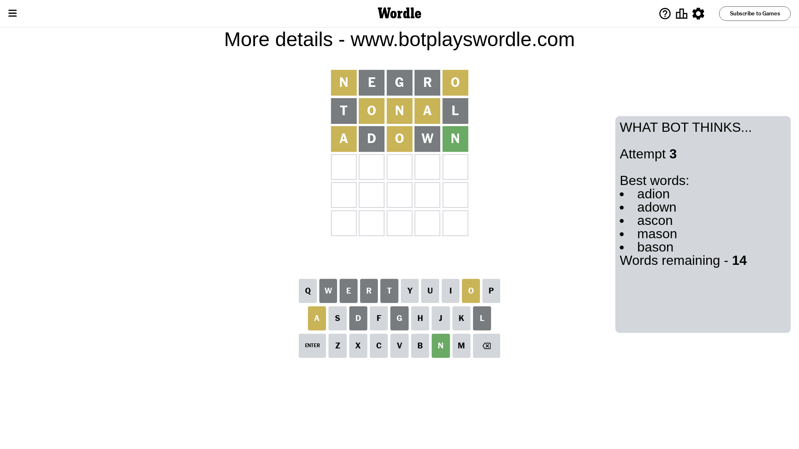
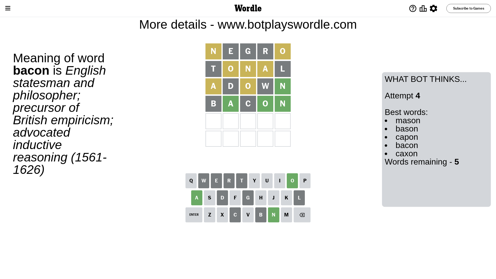
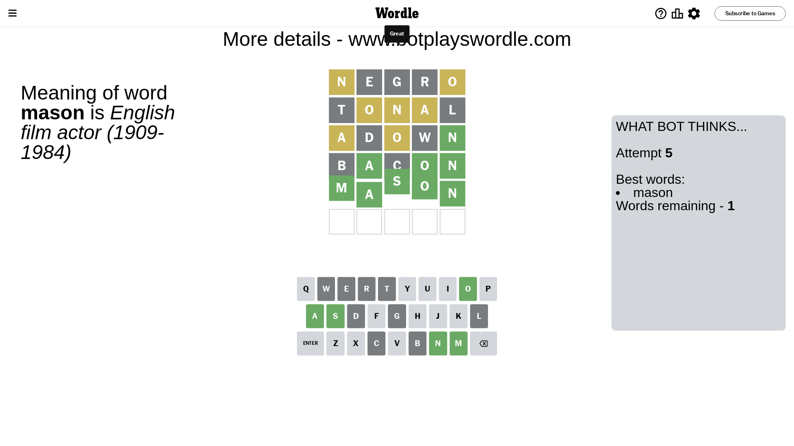

# Wordle for October 28, 2023 - \#861

## Attempt 1

This is the first attempt and we'll choose a random word to start with.

Let's start with word `negro`

Attempt for `negro` gives us 0 correct letters, 2 present letters and 3 wrong letters.

If we look into details, we can see that:

Letter `n` is on a different spot - this means that it cannot be at position 1

Letter `e` is not present in the word and we will not use it any more

Letter `g` is not present in the word and we will not use it any more

Letter `r` is not present in the word and we will not use it any more

Letter `o` is on a different spot - this means that it cannot be at position 5

Some letters are missing (like `e`, `g`, `r`) but it's also important piece of information

Word should contain letters `[n o]`

That was a great guess that limited number of remaining words

## Attempt 2

Right now we have 174 words to choose from and best of them seem to be `[ontal talon tolan tonal lohan]`

So far we know that possible letters are:

At position 1: `[a b c d f h i j k l m o p q s t u v w x y z]`

At position 2: `[a b c d f h i j k l m n o p q s t u v w x y z]`

At position 3: `[a b c d f h i j k l m n o p q s t u v w x y z]`

At position 4: `[a b c d f h i j k l m n o p q s t u v w x y z]`

At position 5: `[a b c d f h i j k l m n p q s t u v w x y z]`

Next guess is `tonal`, let's see what it gives us

Attempt for `tonal` gives us 0 correct letters, 3 present letters and 2 wrong letters.

If we look into details, we can see that:

Letter `t` is not present in the word and we will not use it any more

Letter `o` is on a different spot - this means that it cannot be at position 2

Letter `n` is on a different spot - this means that it cannot be at position 3

Letter `a` is on a different spot - this means that it cannot be at position 4

Letter `l` is not present in the word and we will not use it any more

Some letters are missing (like `t`, `l`) but it's also important piece of information

Word should contain letters `[n o a]`

That was a great guess that limited number of remaining words

## Attempt 3

Right now we have 14 words to choose from and best of them seem to be `[adion adown ascon mason bason]`

So far we know that possible letters are:

At position 1: `[a b c d f h i j k m o p q s u v w x y z]`

At position 2: `[a b c d f h i j k m n p q s u v w x y z]`

At position 3: `[a b c d f h i j k m o p q s u v w x y z]`

At position 4: `[b c d f h i j k m n o p q s u v w x y z]`

At position 5: `[a b c d f h i j k m n p q s u v w x y z]`

Next guess is `adown`, let's see what it gives us

Attempt for `adown` gives us 1 correct letters, 2 present letters and 2 wrong letters.

If we look into details, we can see that:

Letter `a` is on a different spot - this means that it cannot be at position 1

Letter `d` is not present in the word and we will not use it any more

Letter `o` is on a different spot - this means that it cannot be at position 3

Letter `w` is not present in the word and we will not use it any more

Letter `n` should be at position 5

We got information about the correct letters and it should make next attempt easier

Some letters are missing (like `d`, `w`) but it's also important piece of information

Word should contain letters `[n o a]`

Could be a better guess

## Attempt 4

Right now we have 5 words to choose from and best of them seem to be `[mason bason capon bacon caxon]`

So far we know that possible letters are:

At position 1: `[b c f h i j k m o p q s u v x y z]`

At position 2: `[a b c f h i j k m n p q s u v x y z]`

At position 3: `[a b c f h i j k m p q s u v x y z]`

At position 4: `[b c f h i j k m n o p q s u v x y z]`

At position 5: `[n]`

Next guess is `bacon`, let's see what it gives us

Attempt for `bacon` gives us 3 correct letters, 0 present letters and 2 wrong letters.

If we look into details, we can see that:

Letter `b` is not present in the word and we will not use it any more

Letter `a` should be at position 2

Letter `c` is not present in the word and we will not use it any more

Letter `o` should be at position 4

We got information about the correct letters and it should make next attempt easier

Some letters are missing (like `b`, `c`) but it's also important piece of information

Word should contain letters `[n o a]`

Not a bad guess in general

## Attempt 5

Right now we have 1 words to choose from and best of them seem to be `[mason]`

So far we know that possible letters are:

At position 1: `[f h i j k m o p q s u v x y z]`

At position 2: `[a]`

At position 3: `[a f h i j k m p q s u v x y z]`

At position 4: `[o]`

At position 5: `[n]`

It must be `mason`

That's the correct answer! The word is `mason`!

## Conclusion

Today's word is `mason` and it took 5 attempts to guess it

