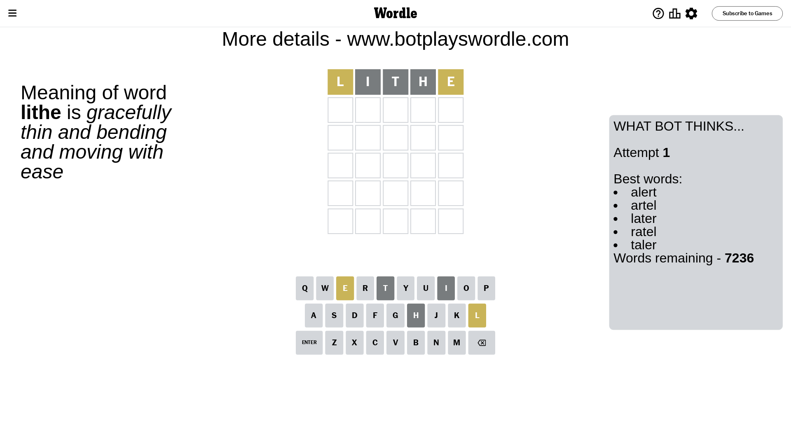
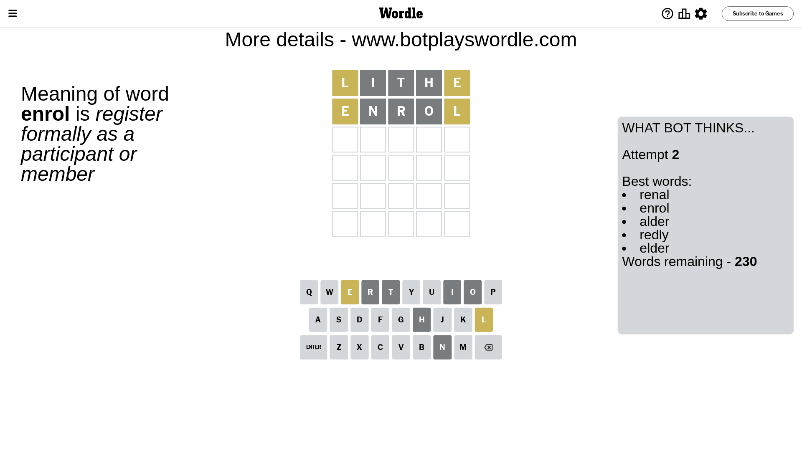
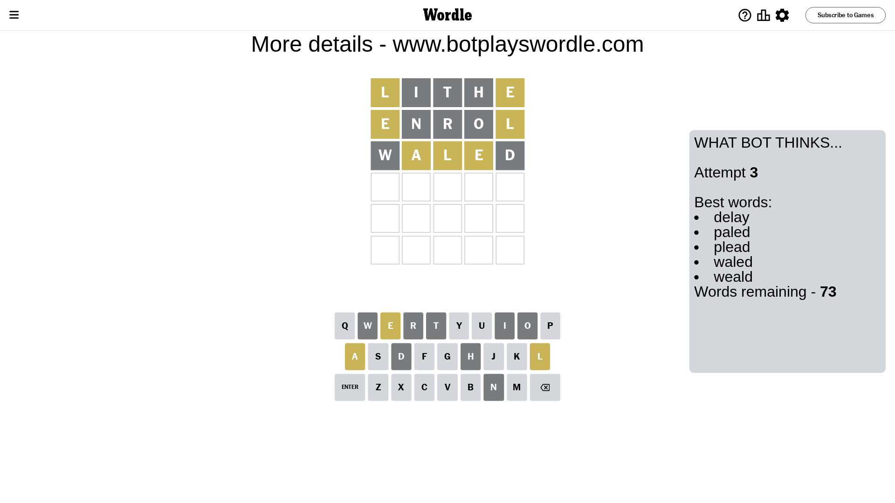
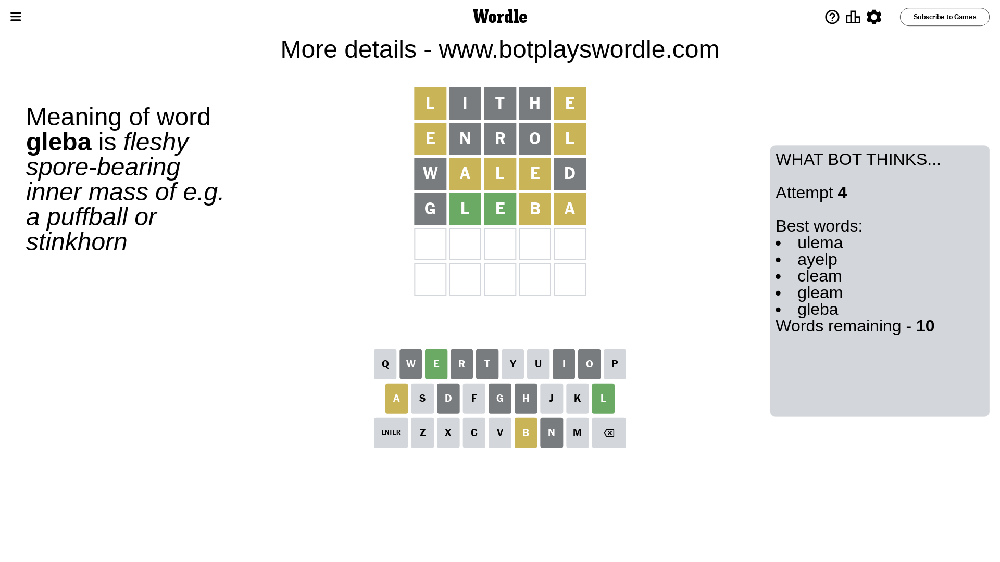
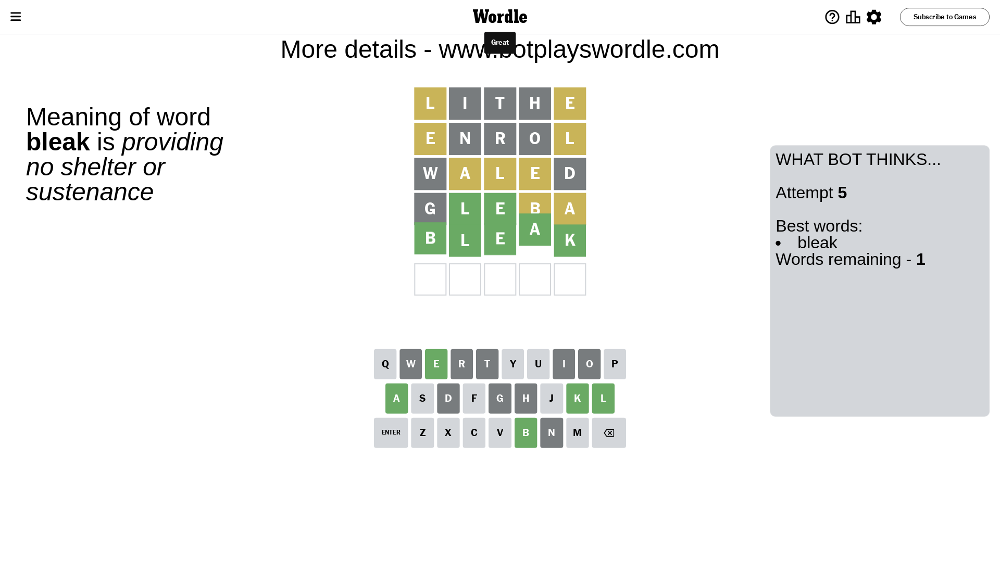

# Wordle for October 31, 2023 - \#864

## Attempt 1

This is the first attempt and we'll choose a random word to start with.

Let's start with word `lithe`

Attempt for `lithe` gives us 0 correct letters, 2 present letters and 3 wrong letters.

If we look into details, we can see that:

Letter `l` is on a different spot - this means that it cannot be at position 1

Letter `i` is not present in the word and we will not use it any more

Letter `t` is not present in the word and we will not use it any more

Letter `h` is not present in the word and we will not use it any more

Letter `e` is on a different spot - this means that it cannot be at position 5

Some letters are missing (like `i`, `t`, `h`) but it's also important piece of information

Word should contain letters `[l e]`

That was a great guess that limited number of remaining words

## Attempt 2

Right now we have 230 words to choose from and best of them seem to be `[renal enrol alder redly elder]`

So far we know that possible letters are:

At position 1: `[a b c d e f g j k m n o p q r s u v w x y z]`

At position 2: `[a b c d e f g j k l m n o p q r s u v w x y z]`

At position 3: `[a b c d e f g j k l m n o p q r s u v w x y z]`

At position 4: `[a b c d e f g j k l m n o p q r s u v w x y z]`

At position 5: `[a b c d f g j k l m n o p q r s u v w x y z]`

Next guess is `enrol`, let's see what it gives us

Attempt for `enrol` gives us 0 correct letters, 2 present letters and 3 wrong letters.

If we look into details, we can see that:

Letter `e` is on a different spot - this means that it cannot be at position 1

Letter `n` is not present in the word and we will not use it any more

Letter `r` is not present in the word and we will not use it any more

Letter `o` is not present in the word and we will not use it any more

Letter `l` is on a different spot - this means that it cannot be at position 5

Some letters are missing (like `n`, `r`, `o`) but it's also important piece of information

Word should contain letters `[l e]`

Could be a better guess

## Attempt 3

Right now we have 73 words to choose from and best of them seem to be `[delay paled plead waled weald]`

So far we know that possible letters are:

At position 1: `[a b c d f g j k m p q s u v w x y z]`

At position 2: `[a b c d e f g j k l m p q s u v w x y z]`

At position 3: `[a b c d e f g j k l m p q s u v w x y z]`

At position 4: `[a b c d e f g j k l m p q s u v w x y z]`

At position 5: `[a b c d f g j k m p q s u v w x y z]`

Next guess is `waled`, let's see what it gives us

Attempt for `waled` gives us 0 correct letters, 3 present letters and 2 wrong letters.

If we look into details, we can see that:

Letter `w` is not present in the word and we will not use it any more

Letter `a` is on a different spot - this means that it cannot be at position 2

Letter `l` is on a different spot - this means that it cannot be at position 3

Letter `e` is on a different spot - this means that it cannot be at position 4

Letter `d` is not present in the word and we will not use it any more

Some letters are missing (like `w`, `d`) but it's also important piece of information

Word should contain letters `[l e a]`

Not a bad guess in general

## Attempt 4

Right now we have 10 words to choose from and best of them seem to be `[ulema ayelp cleam gleam gleba]`

So far we know that possible letters are:

At position 1: `[a b c f g j k m p q s u v x y z]`

At position 2: `[b c e f g j k l m p q s u v x y z]`

At position 3: `[a b c e f g j k m p q s u v x y z]`

At position 4: `[a b c f g j k l m p q s u v x y z]`

At position 5: `[a b c f g j k m p q s u v x y z]`

Next guess is `gleba`, let's see what it gives us

Attempt for `gleba` gives us 2 correct letters, 2 present letters and 1 wrong letters.

If we look into details, we can see that:

Letter `g` is not present in the word and we will not use it any more

Letter `l` should be at position 2

Letter `e` should be at position 3

Letter `b` is on a different spot - this means that it cannot be at position 4

Letter `a` is on a different spot - this means that it cannot be at position 5

We got information about the correct letters and it should make next attempt easier

Some letters are missing (like `g`) but it's also important piece of information

Word should contain letters `[l e a b]`

That was a great guess that limited number of remaining words

## Attempt 5

Right now we have 1 words to choose from and best of them seem to be `[bleak]`

So far we know that possible letters are:

At position 1: `[a b c f j k m p q s u v x y z]`

At position 2: `[l]`

At position 3: `[e]`

At position 4: `[a c f j k l m p q s u v x y z]`

At position 5: `[b c f j k m p q s u v x y z]`

It must be `bleak`

That's the correct answer! The word is `bleak`!

## Conclusion

Today's word is `bleak` and it took 5 attempts to guess it

