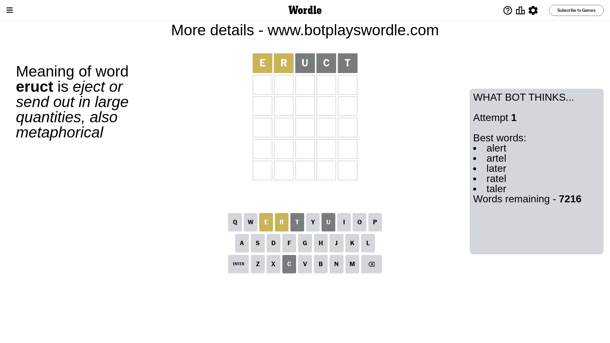
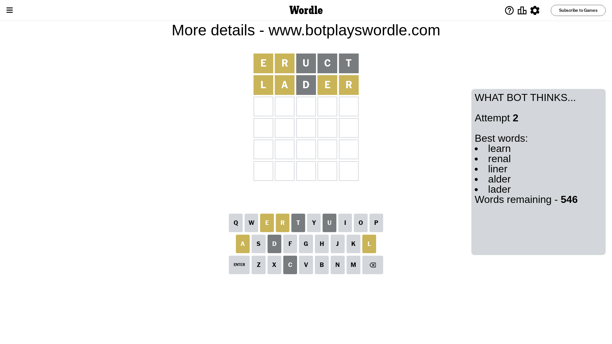
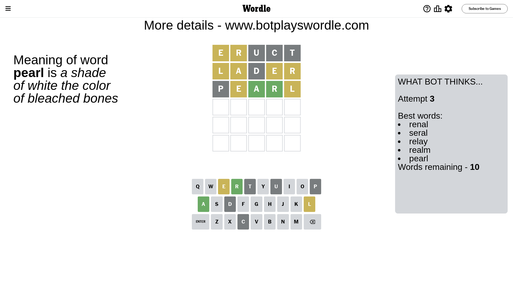
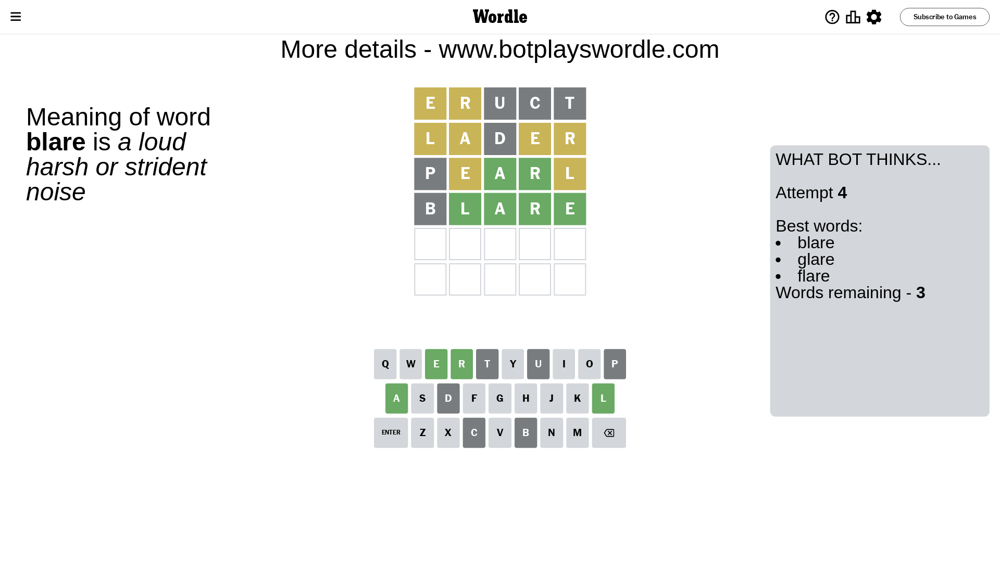
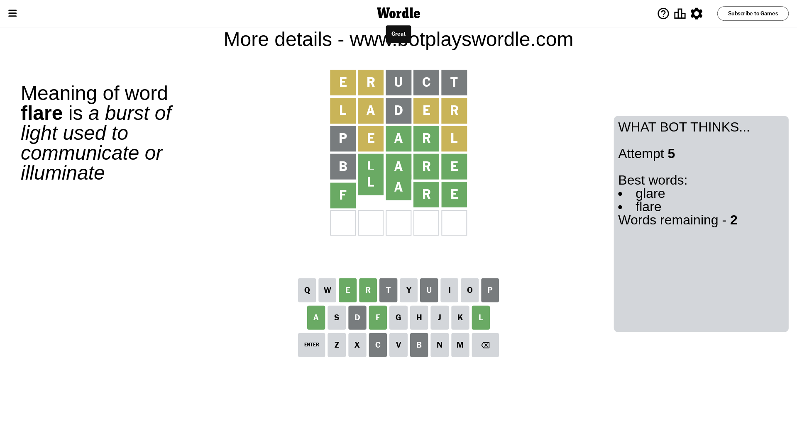

# Wordle for November 5, 2023 - \#869

## Attempt 1

This is the first attempt and we'll choose a random word to start with.

Let's start with word `eruct`

Attempt for `eruct` gives us 0 correct letters, 2 present letters and 3 wrong letters.

If we look into details, we can see that:

Letter `e` is on a different spot - this means that it cannot be at position 1

Letter `r` is on a different spot - this means that it cannot be at position 2

Letter `u` is not present in the word and we will not use it any more

Letter `c` is not present in the word and we will not use it any more

Letter `t` is not present in the word and we will not use it any more

Some letters are missing (like `u`, `c`, `t`) but it's also important piece of information

Word should contain letters `[e r]`

That was a great guess that limited number of remaining words

## Attempt 2

Right now we have 546 words to choose from and best of them seem to be `[learn renal liner alder lader]`

So far we know that possible letters are:

At position 1: `[a b d f g h i j k l m n o p q r s v w x y z]`

At position 2: `[a b d e f g h i j k l m n o p q s v w x y z]`

At position 3: `[a b d e f g h i j k l m n o p q r s v w x y z]`

At position 4: `[a b d e f g h i j k l m n o p q r s v w x y z]`

At position 5: `[a b d e f g h i j k l m n o p q r s v w x y z]`

Next guess is `lader`, let's see what it gives us

Attempt for `lader` gives us 0 correct letters, 4 present letters and 1 wrong letters.

If we look into details, we can see that:

Letter `l` is on a different spot - this means that it cannot be at position 1

Letter `a` is on a different spot - this means that it cannot be at position 2

Letter `d` is not present in the word and we will not use it any more

Letter `e` is on a different spot - this means that it cannot be at position 4

Letter `r` is on a different spot - this means that it cannot be at position 5

Some letters are missing (like `d`) but it's also important piece of information

Word should contain letters `[e r l a]`

That was a great guess that limited number of remaining words

## Attempt 3

Right now we have 10 words to choose from and best of them seem to be `[renal seral relay realm pearl]`

So far we know that possible letters are:

At position 1: `[a b f g h i j k m n o p q r s v w x y z]`

At position 2: `[b e f g h i j k l m n o p q s v w x y z]`

At position 3: `[a b e f g h i j k l m n o p q r s v w x y z]`

At position 4: `[a b f g h i j k l m n o p q r s v w x y z]`

At position 5: `[a b e f g h i j k l m n o p q s v w x y z]`

Next guess is `pearl`, let's see what it gives us

Attempt for `pearl` gives us 2 correct letters, 2 present letters and 1 wrong letters.

If we look into details, we can see that:

Letter `p` is not present in the word and we will not use it any more

Letter `e` is on a different spot - this means that it cannot be at position 2

Letter `a` should be at position 3

Letter `r` should be at position 4

Letter `l` is on a different spot - this means that it cannot be at position 5

We got information about the correct letters and it should make next attempt easier

Some letters are missing (like `p`) but it's also important piece of information

Word should contain letters `[e r l a]`

Could be a better guess

## Attempt 4

Right now we have 3 words to choose from and best of them seem to be `[blare glare flare]`

So far we know that possible letters are:

At position 1: `[a b f g h i j k m n o q r s v w x y z]`

At position 2: `[b f g h i j k l m n o q s v w x y z]`

At position 3: `[a]`

At position 4: `[r]`

At position 5: `[a b e f g h i j k m n o q s v w x y z]`

Next guess is `blare`, let's see what it gives us

Attempt for `blare` gives us 4 correct letters, 0 present letters and 1 wrong letters.

If we look into details, we can see that:

Letter `b` is not present in the word and we will not use it any more

Letter `l` should be at position 2

Letter `e` should be at position 5

We got information about the correct letters and it should make next attempt easier

Some letters are missing (like `b`) but it's also important piece of information

Word should contain letters `[e r l a]`

This was a waste, almost no valuable information...

## Attempt 5

Right now we have 2 words to choose from and best of them seem to be `[glare flare]`

So far we know that possible letters are:

At position 1: `[a f g h i j k m n o q r s v w x y z]`

At position 2: `[l]`

At position 3: `[a]`

At position 4: `[r]`

At position 5: `[e]`

Next guess is `flare`, let's see what it gives us

That's the correct answer! The word is `flare`!

## Conclusion

Today's word is `flare` and it took 5 attempts to guess it

