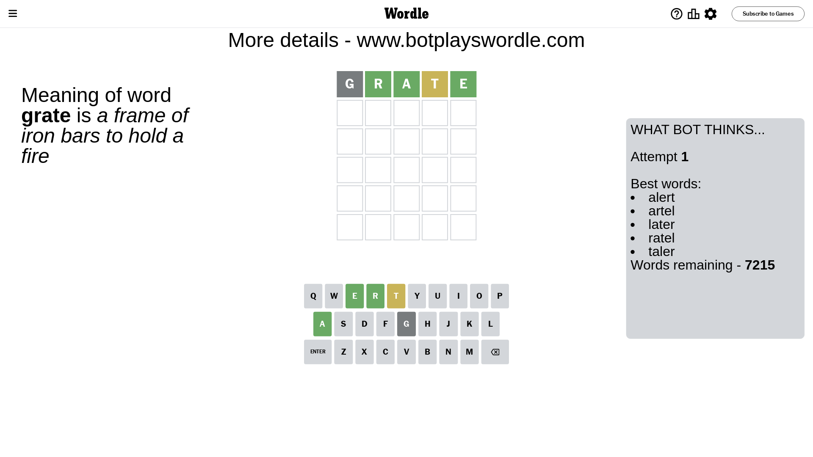
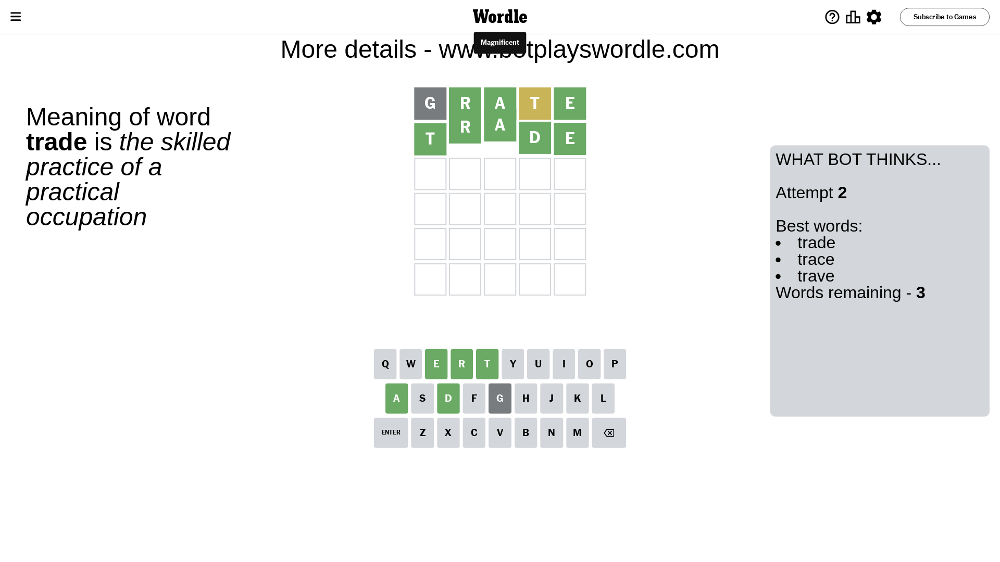

# Wordle for November 6, 2023 - \#870

## Attempt 1

This is the first attempt and we'll choose a random word to start with.

Let's start with word `grate`

Attempt for `grate` gives us 3 correct letters, 1 present letters and 1 wrong letters.

If we look into details, we can see that:

Letter `g` is not present in the word and we will not use it any more

Letter `r` should be at position 2

Letter `a` should be at position 3

Letter `t` is on a different spot - this means that it cannot be at position 4

Letter `e` should be at position 5

We got information about the correct letters and it should make next attempt easier

Some letters are missing (like `g`) but it's also important piece of information

Word should contain letters `[r a t e]`

That was a great guess that limited number of remaining words

## Attempt 2

Right now we have 3 words to choose from and best of them seem to be `[trade trace trave]`

So far we know that possible letters are:

At position 1: `[a b c d e f h i j k l m n o p q r s t u v w x y z]`

At position 2: `[r]`

At position 3: `[a]`

At position 4: `[a b c d e f h i j k l m n o p q r s u v w x y z]`

At position 5: `[e]`

Next guess is `trade`, let's see what it gives us

That's the correct answer! The word is `trade`!

## Conclusion

Today's word is `trade` and it took 2 attempts to guess it

