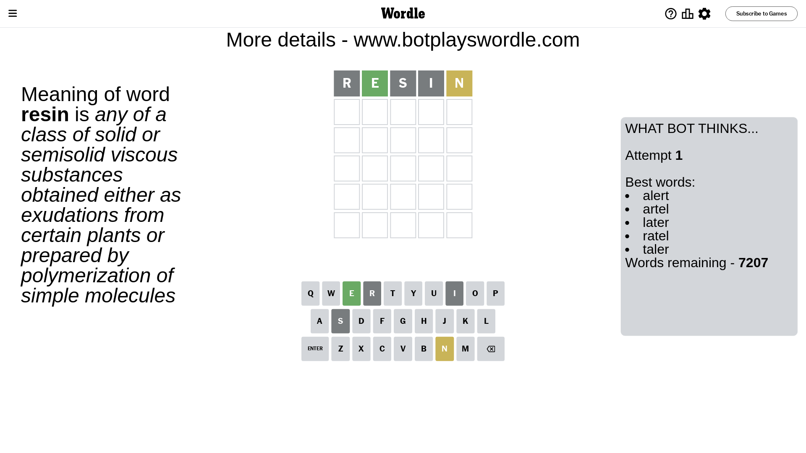
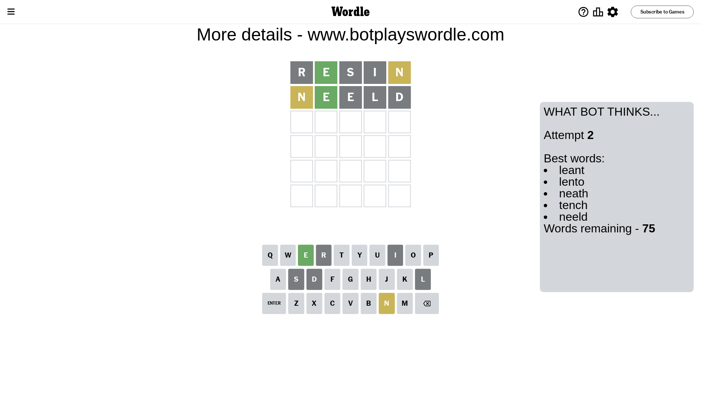
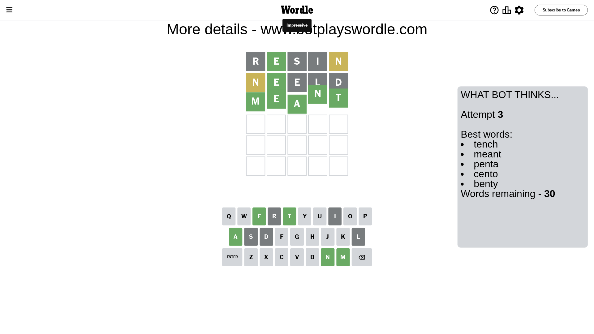

# Wordle for November 12, 2023 - \#876

## Attempt 1

This is the first attempt and we'll choose a random word to start with.

Let's start with word `resin`

Attempt for `resin` gives us 1 correct letters, 1 present letters and 3 wrong letters.

If we look into details, we can see that:

Letter `r` is not present in the word and we will not use it any more

Letter `e` should be at position 2

Letter `s` is not present in the word and we will not use it any more

Letter `i` is not present in the word and we will not use it any more

Letter `n` is on a different spot - this means that it cannot be at position 5

We got information about the correct letters and it should make next attempt easier

Some letters are missing (like `r`, `s`, `i`) but it's also important piece of information

Word should contain letters `[e n]`

That was a great guess that limited number of remaining words

## Attempt 2

Right now we have 75 words to choose from and best of them seem to be `[leant lento neath tench neeld]`

So far we know that possible letters are:

At position 1: `[a b c d e f g h j k l m n o p q t u v w x y z]`

At position 2: `[e]`

At position 3: `[a b c d e f g h j k l m n o p q t u v w x y z]`

At position 4: `[a b c d e f g h j k l m n o p q t u v w x y z]`

At position 5: `[a b c d e f g h j k l m o p q t u v w x y z]`

Next guess is `neeld`, let's see what it gives us

Attempt for `neeld` gives us 1 correct letters, 1 present letters and 3 wrong letters.

If we look into details, we can see that:

Letter `n` is on a different spot - this means that it cannot be at position 1

Letter `e` is not present in the word and we will not use it any more

Letter `l` is not present in the word and we will not use it any more

Letter `d` is not present in the word and we will not use it any more

Some letters are missing (like `e`, `l`, `d`) but it's also important piece of information

Word should contain letters `[e n]`

Could be a better guess

## Attempt 3

Right now we have 30 words to choose from and best of them seem to be `[tench meant penta cento benty]`

So far we know that possible letters are:

At position 1: `[a b c f g h j k m o p q t u v w x y z]`

At position 2: `[e]`

At position 3: `[a b c f g h j k m n o p q t u v w x y z]`

At position 4: `[a b c f g h j k m n o p q t u v w x y z]`

At position 5: `[a b c f g h j k m o p q t u v w x y z]`

Next guess is `meant`, let's see what it gives us

That's the correct answer! The word is `meant`!

To be honest that was a pretty lucky guess, but it worked out well.

## Conclusion

Today's word is `meant` and it took 3 attempts to guess it

