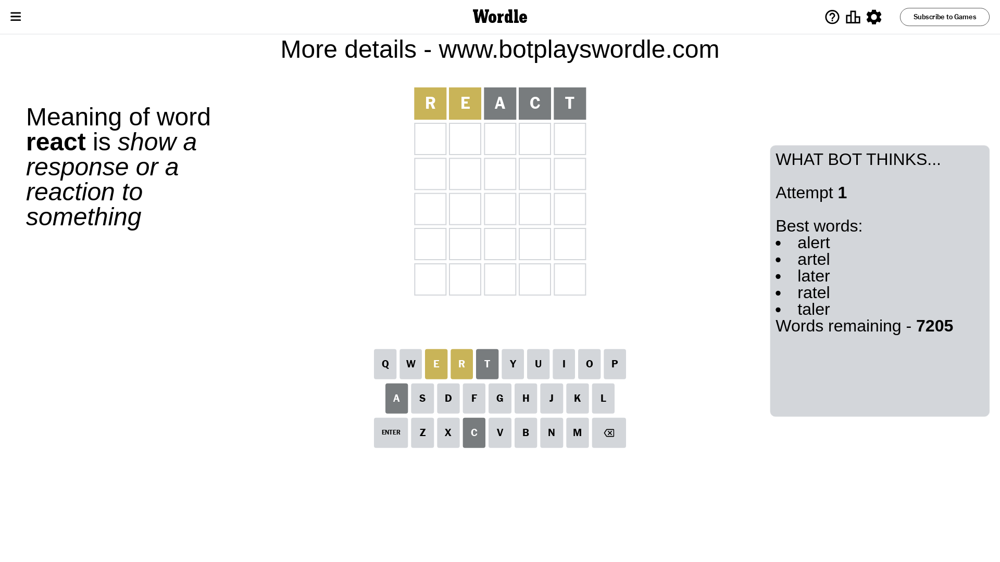
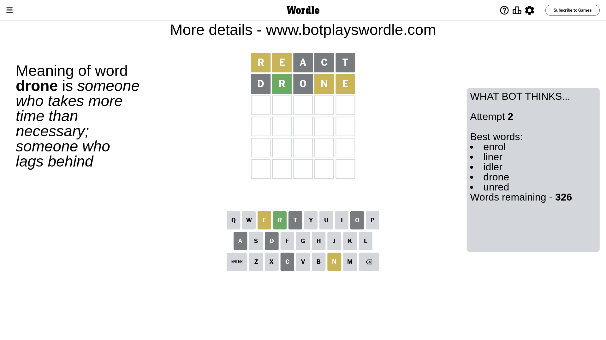
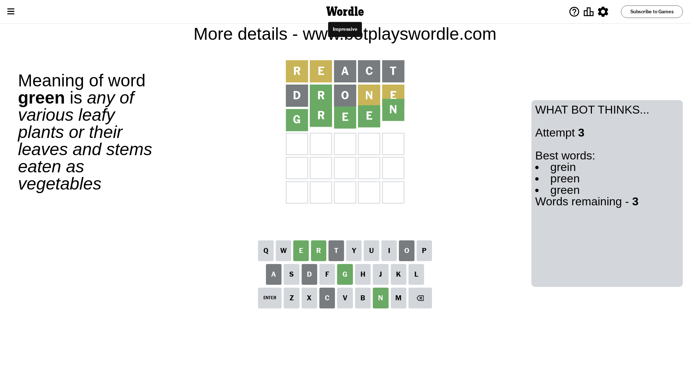

# Wordle for November 13, 2023 - \#877

## Attempt 1

This is the first attempt and we'll choose a random word to start with.

Let's start with word `react`

Attempt for `react` gives us 0 correct letters, 2 present letters and 3 wrong letters.

If we look into details, we can see that:

Letter `r` is on a different spot - this means that it cannot be at position 1

Letter `e` is on a different spot - this means that it cannot be at position 2

Letter `a` is not present in the word and we will not use it any more

Letter `c` is not present in the word and we will not use it any more

Letter `t` is not present in the word and we will not use it any more

Some letters are missing (like `a`, `c`, `t`) but it's also important piece of information

Word should contain letters `[r e]`

That was a great guess that limited number of remaining words

## Attempt 2

Right now we have 326 words to choose from and best of them seem to be `[enrol liner idler drone unred]`

So far we know that possible letters are:

At position 1: `[b d e f g h i j k l m n o p q s u v w x y z]`

At position 2: `[b d f g h i j k l m n o p q r s u v w x y z]`

At position 3: `[b d e f g h i j k l m n o p q r s u v w x y z]`

At position 4: `[b d e f g h i j k l m n o p q r s u v w x y z]`

At position 5: `[b d e f g h i j k l m n o p q r s u v w x y z]`

Next guess is `drone`, let's see what it gives us

Attempt for `drone` gives us 1 correct letters, 2 present letters and 2 wrong letters.

If we look into details, we can see that:

Letter `d` is not present in the word and we will not use it any more

Letter `r` should be at position 2

Letter `o` is not present in the word and we will not use it any more

Letter `n` is on a different spot - this means that it cannot be at position 4

Letter `e` is on a different spot - this means that it cannot be at position 5

We got information about the correct letters and it should make next attempt easier

Some letters are missing (like `d`, `o`) but it's also important piece of information

Word should contain letters `[r e n]`

That was a great guess that limited number of remaining words

## Attempt 3

Right now we have 3 words to choose from and best of them seem to be `[grein preen green]`

So far we know that possible letters are:

At position 1: `[b e f g h i j k l m n p q s u v w x y z]`

At position 2: `[r]`

At position 3: `[b e f g h i j k l m n p q r s u v w x y z]`

At position 4: `[b e f g h i j k l m p q r s u v w x y z]`

At position 5: `[b f g h i j k l m n p q r s u v w x y z]`

Next guess is `green`, let's see what it gives us

That's the correct answer! The word is `green`!

## Conclusion

Today's word is `green` and it took 3 attempts to guess it

