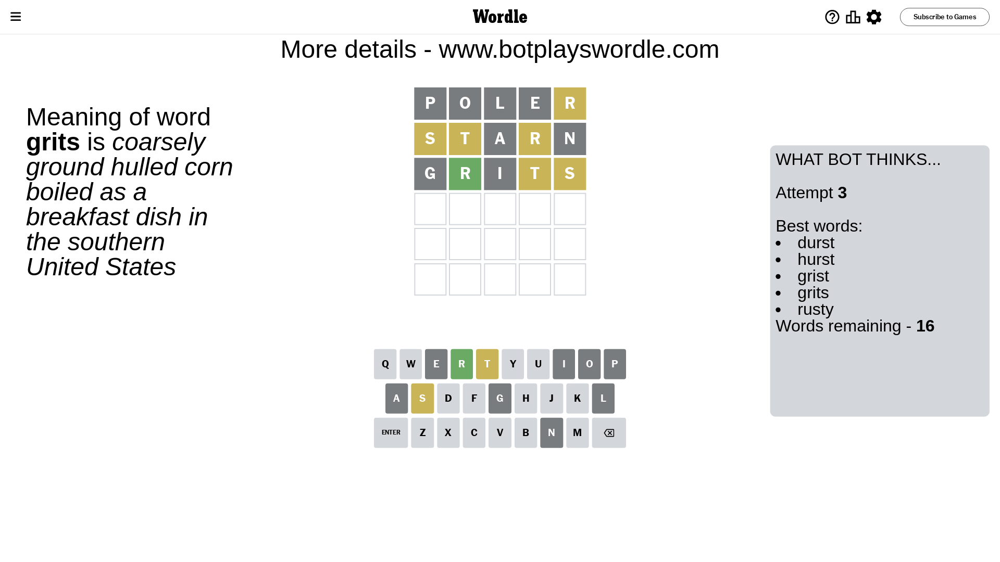

# Wordle for November 16, 2023 - \#880

## Attempt 1

This is the first attempt and we'll choose a random word to start with.

Let's start with word `poler`

Attempt for `poler` gives us 0 correct letters, 1 present letters and 4 wrong letters.

If we look into details, we can see that:

Letter `p` is not present in the word and we will not use it any more

Letter `o` is not present in the word and we will not use it any more

Letter `l` is not present in the word and we will not use it any more

Letter `e` is not present in the word and we will not use it any more

Letter `r` is on a different spot - this means that it cannot be at position 5

Some letters are missing (like `p`, `o`, `l`, `e`) but it's also important piece of information

Word should contain letters `[r]`

That was a great guess that limited number of remaining words

## Attempt 2

Right now we have 501 words to choose from and best of them seem to be `[drant riant train starn arnut]`

So far we know that possible letters are:

At position 1: `[a b c d f g h i j k m n q r s t u v w x y z]`

At position 2: `[a b c d f g h i j k m n q r s t u v w x y z]`

At position 3: `[a b c d f g h i j k m n q r s t u v w x y z]`

At position 4: `[a b c d f g h i j k m n q r s t u v w x y z]`

At position 5: `[a b c d f g h i j k m n q s t u v w x y z]`

Next guess is `starn`, let's see what it gives us

Attempt for `starn` gives us 0 correct letters, 3 present letters and 2 wrong letters.

If we look into details, we can see that:

Letter `s` is on a different spot - this means that it cannot be at position 1

Letter `t` is on a different spot - this means that it cannot be at position 2

Letter `a` is not present in the word and we will not use it any more

Letter `r` is on a different spot - this means that it cannot be at position 4

Letter `n` is not present in the word and we will not use it any more

Some letters are missing (like `a`, `n`) but it's also important piece of information

Word should contain letters `[r s t]`

That was a great guess that limited number of remaining words

## Attempt 3

Right now we have 16 words to choose from and best of them seem to be `[durst hurst grist grits rusty]`

So far we know that possible letters are:

At position 1: `[b c d f g h i j k m q r t u v w x y z]`

At position 2: `[b c d f g h i j k m q r s u v w x y z]`

At position 3: `[b c d f g h i j k m q r s t u v w x y z]`

At position 4: `[b c d f g h i j k m q s t u v w x y z]`

At position 5: `[b c d f g h i j k m q s t u v w x y z]`

Next guess is `grits`, let's see what it gives us

Attempt for `grits` gives us 1 correct letters, 2 present letters and 2 wrong letters.

If we look into details, we can see that:

Letter `g` is not present in the word and we will not use it any more

Letter `r` should be at position 2

Letter `i` is not present in the word and we will not use it any more

Letter `t` is on a different spot - this means that it cannot be at position 4

Letter `s` is on a different spot - this means that it cannot be at position 5

We got information about the correct letters and it should make next attempt easier

Some letters are missing (like `g`, `i`) but it's also important piece of information

Word should contain letters `[r s t]`

Not a bad guess in general

## Attempt 4

Right now we have 3 words to choose from and best of them seem to be `[crust trust tryst]`

So far we know that possible letters are:

At position 1: `[b c d f h j k m q r t u v w x y z]`

At position 2: `[r]`

At position 3: `[b c d f h j k m q r s t u v w x y z]`

At position 4: `[b c d f h j k m q s u v w x y z]`

At position 5: `[b c d f h j k m q t u v w x y z]`

Next guess is `crust`, let's see what it gives us

Attempt for `crust` gives us 4 correct letters, 0 present letters and 1 wrong letters.

If we look into details, we can see that:

Letter `c` is not present in the word and we will not use it any more

Letter `u` should be at position 3

Letter `s` should be at position 4

Letter `t` should be at position 5

We got information about the correct letters and it should make next attempt easier

Some letters are missing (like `c`) but it's also important piece of information

Word should contain letters `[r s t u]`

Could be a better guess

## Attempt 5

Right now we have 1 words to choose from and best of them seem to be `[trust]`

So far we know that possible letters are:

At position 1: `[b d f h j k m q r t u v w x y z]`

At position 2: `[r]`

At position 3: `[u]`

At position 4: `[s]`

At position 5: `[t]`

It must be `trust`

That's the correct answer! The word is `trust`!

## Conclusion

Today's word is `trust` and it took 5 attempts to guess it

