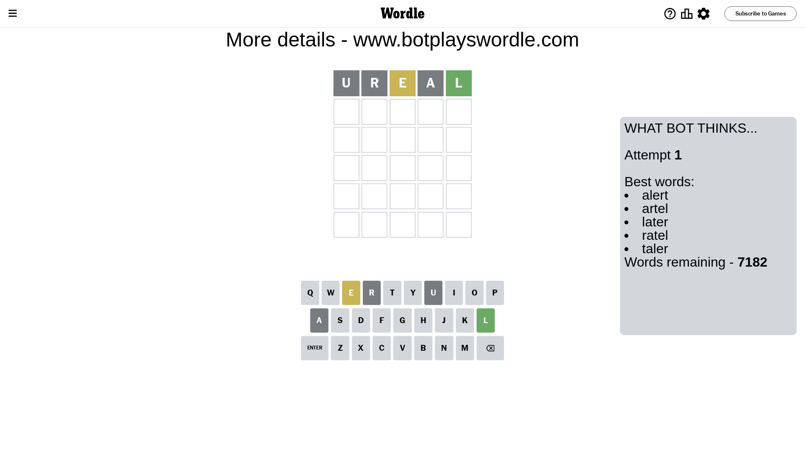
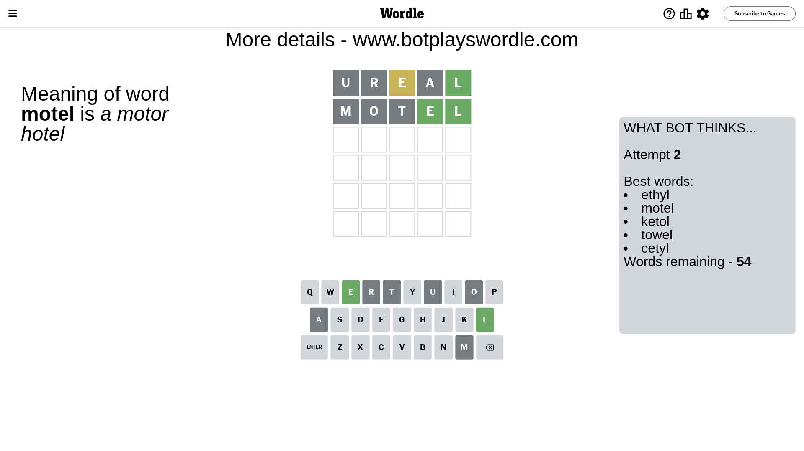
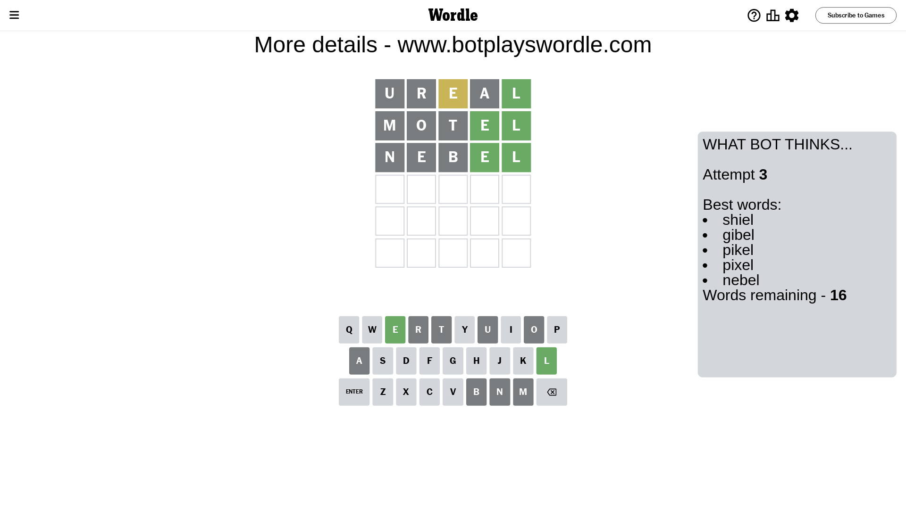
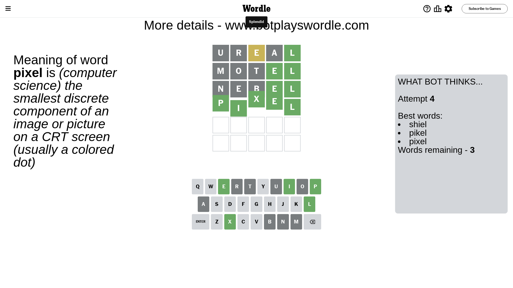

# Wordle for November 22, 2023 - \#886

## Attempt 1

This is the first attempt and we'll choose a random word to start with.

Let's start with word `ureal`

Attempt for `ureal` gives us 1 correct letters, 1 present letters and 3 wrong letters.

If we look into details, we can see that:

Letter `u` is not present in the word and we will not use it any more

Letter `r` is not present in the word and we will not use it any more

Letter `e` is on a different spot - this means that it cannot be at position 3

Letter `a` is not present in the word and we will not use it any more

Letter `l` should be at position 5

We got information about the correct letters and it should make next attempt easier

Some letters are missing (like `u`, `r`, `a`) but it's also important piece of information

Word should contain letters `[e l]`

That was a great guess that limited number of remaining words

## Attempt 2

Right now we have 54 words to choose from and best of them seem to be `[ethyl motel ketol towel cetyl]`

So far we know that possible letters are:

At position 1: `[b c d e f g h i j k l m n o p q s t v w x y z]`

At position 2: `[b c d e f g h i j k l m n o p q s t v w x y z]`

At position 3: `[b c d f g h i j k l m n o p q s t v w x y z]`

At position 4: `[b c d e f g h i j k l m n o p q s t v w x y z]`

At position 5: `[l]`

Next guess is `motel`, let's see what it gives us

Attempt for `motel` gives us 2 correct letters, 0 present letters and 3 wrong letters.

If we look into details, we can see that:

Letter `m` is not present in the word and we will not use it any more

Letter `o` is not present in the word and we will not use it any more

Letter `t` is not present in the word and we will not use it any more

Letter `e` should be at position 4

We got information about the correct letters and it should make next attempt easier

Some letters are missing (like `m`, `o`, `t`) but it's also important piece of information

Word should contain letters `[e l]`

Could be a better guess

## Attempt 3

Right now we have 16 words to choose from and best of them seem to be `[shiel gibel pikel pixel nebel]`

So far we know that possible letters are:

At position 1: `[b c d e f g h i j k l n p q s v w x y z]`

At position 2: `[b c d e f g h i j k l n p q s v w x y z]`

At position 3: `[b c d f g h i j k l n p q s v w x y z]`

At position 4: `[e]`

At position 5: `[l]`

Next guess is `nebel`, let's see what it gives us

Attempt for `nebel` gives us 2 correct letters, 0 present letters and 3 wrong letters.

If we look into details, we can see that:

Letter `n` is not present in the word and we will not use it any more

Letter `e` is not present in the word and we will not use it any more

Letter `b` is not present in the word and we will not use it any more

Some letters are missing (like `n`, `e`, `b`) but it's also important piece of information

Word should contain letters `[e l]`

Not a bad guess in general

## Attempt 4

Right now we have 3 words to choose from and best of them seem to be `[shiel pikel pixel]`

So far we know that possible letters are:

At position 1: `[c d f g h i j k l p q s v w x y z]`

At position 2: `[c d f g h i j k l p q s v w x y z]`

At position 3: `[c d f g h i j k l p q s v w x y z]`

At position 4: `[e]`

At position 5: `[l]`

Next guess is `pixel`, let's see what it gives us

That's the correct answer! The word is `pixel`!

## Conclusion

Today's word is `pixel` and it took 4 attempts to guess it

