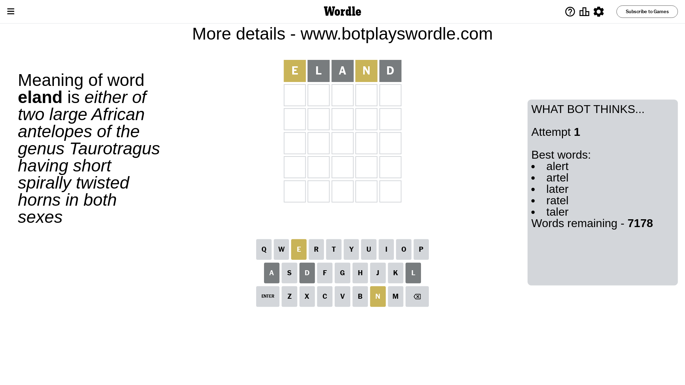
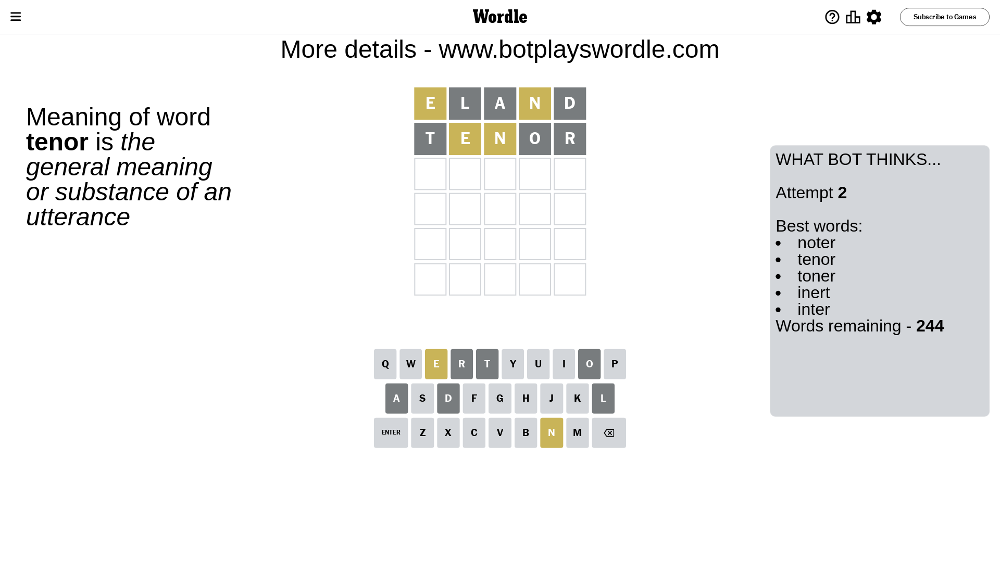
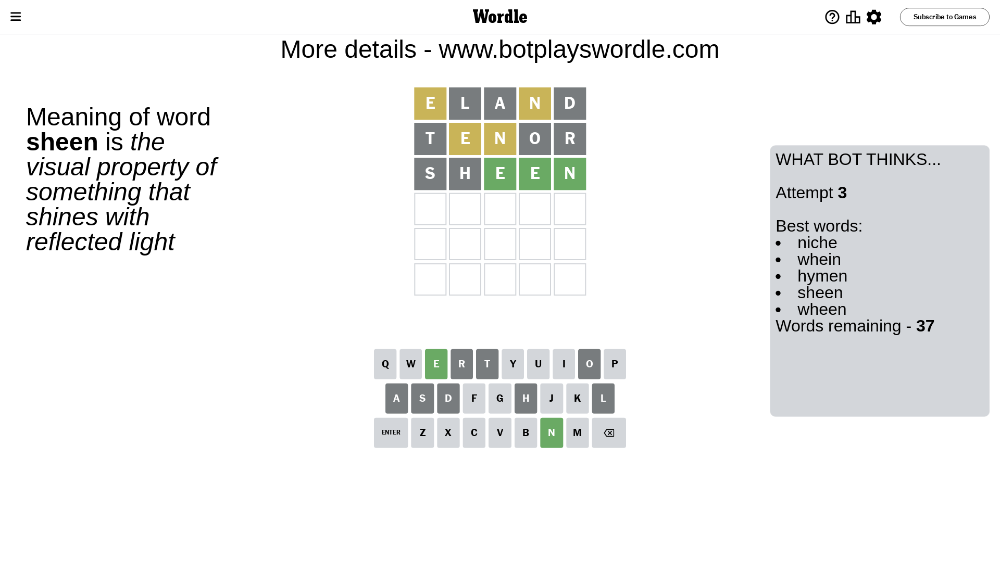
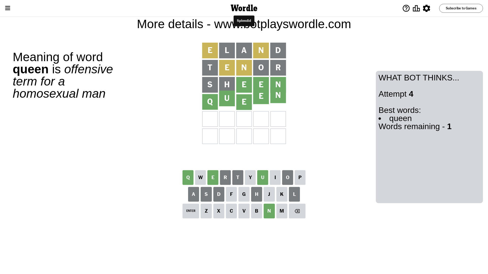

# Wordle for November 23, 2023 - \#887

## Attempt 1

This is the first attempt and we'll choose a random word to start with.

Let's start with word `eland`

Attempt for `eland` gives us 0 correct letters, 2 present letters and 3 wrong letters.

If we look into details, we can see that:

Letter `e` is on a different spot - this means that it cannot be at position 1

Letter `l` is not present in the word and we will not use it any more

Letter `a` is not present in the word and we will not use it any more

Letter `n` is on a different spot - this means that it cannot be at position 4

Letter `d` is not present in the word and we will not use it any more

Some letters are missing (like `l`, `a`, `d`) but it's also important piece of information

Word should contain letters `[e n]`

That was a great guess that limited number of remaining words

## Attempt 2

Right now we have 244 words to choose from and best of them seem to be `[noter tenor toner inert inter]`

So far we know that possible letters are:

At position 1: `[b c f g h i j k m n o p q r s t u v w x y z]`

At position 2: `[b c e f g h i j k m n o p q r s t u v w x y z]`

At position 3: `[b c e f g h i j k m n o p q r s t u v w x y z]`

At position 4: `[b c e f g h i j k m o p q r s t u v w x y z]`

At position 5: `[b c e f g h i j k m n o p q r s t u v w x y z]`

Next guess is `tenor`, let's see what it gives us

Attempt for `tenor` gives us 0 correct letters, 2 present letters and 3 wrong letters.

If we look into details, we can see that:

Letter `t` is not present in the word and we will not use it any more

Letter `e` is on a different spot - this means that it cannot be at position 2

Letter `n` is on a different spot - this means that it cannot be at position 3

Letter `o` is not present in the word and we will not use it any more

Letter `r` is not present in the word and we will not use it any more

Some letters are missing (like `t`, `o`, `r`) but it's also important piece of information

Word should contain letters `[e n]`

Not a bad guess in general

## Attempt 3

Right now we have 37 words to choose from and best of them seem to be `[niche whein hymen sheen wheen]`

So far we know that possible letters are:

At position 1: `[b c f g h i j k m n p q s u v w x y z]`

At position 2: `[b c f g h i j k m n p q s u v w x y z]`

At position 3: `[b c e f g h i j k m p q s u v w x y z]`

At position 4: `[b c e f g h i j k m p q s u v w x y z]`

At position 5: `[b c e f g h i j k m n p q s u v w x y z]`

Next guess is `sheen`, let's see what it gives us

Attempt for `sheen` gives us 3 correct letters, 0 present letters and 2 wrong letters.

If we look into details, we can see that:

Letter `s` is not present in the word and we will not use it any more

Letter `h` is not present in the word and we will not use it any more

Letter `e` should be at position 3

Letter `e` should be at position 4

Letter `n` should be at position 5

We got information about the correct letters and it should make next attempt easier

Some letters are missing (like `s`, `h`) but it's also important piece of information

Word should contain letters `[e n]`

That was a great guess that limited number of remaining words

## Attempt 4

Right now we have 1 words to choose from and best of them seem to be `[queen]`

So far we know that possible letters are:

At position 1: `[b c f g i j k m n p q u v w x y z]`

At position 2: `[b c f g i j k m n p q u v w x y z]`

At position 3: `[e]`

At position 4: `[e]`

At position 5: `[n]`

It must be `queen`

That's the correct answer! The word is `queen`!

## Conclusion

Today's word is `queen` and it took 4 attempts to guess it

