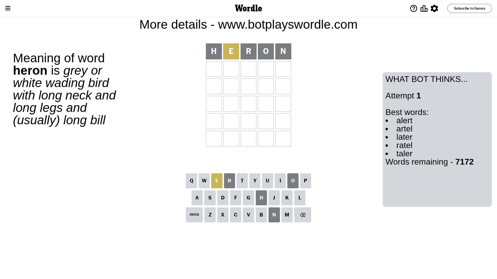
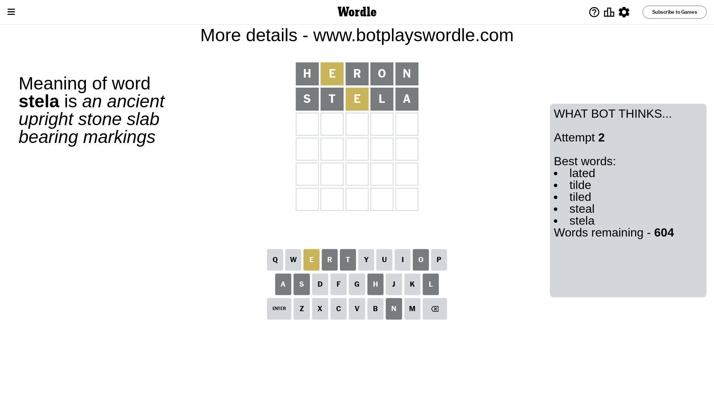
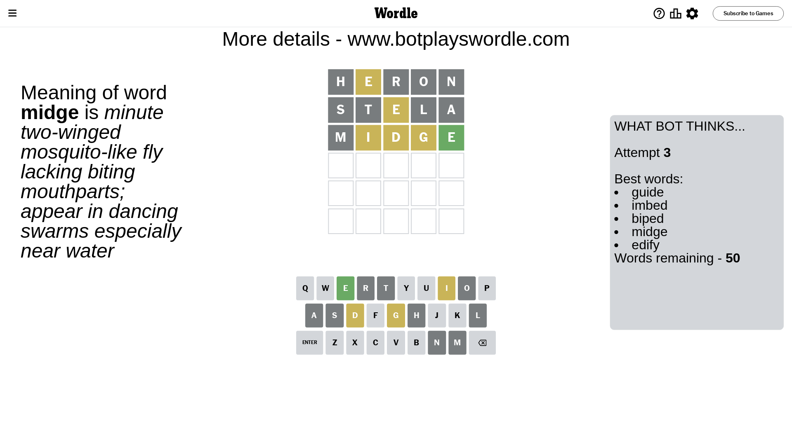
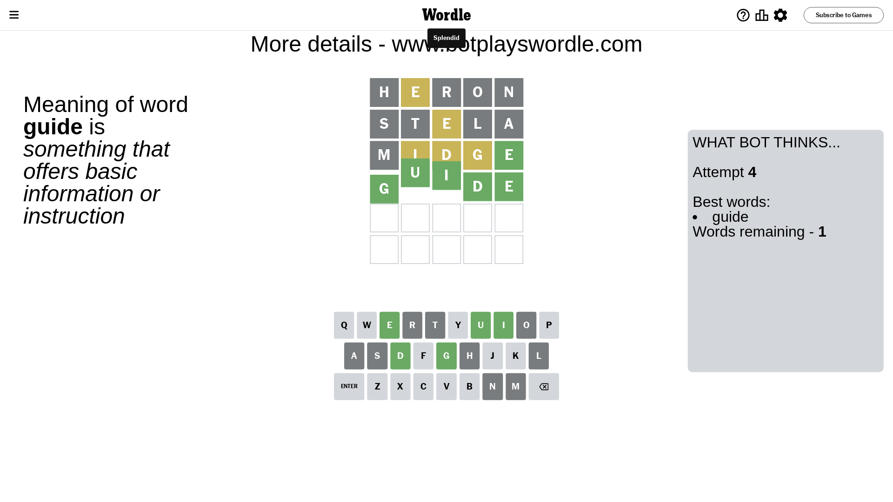

# Wordle for November 25, 2023 - \#889

## Attempt 1

This is the first attempt and we'll choose a random word to start with.

Let's start with word `heron`

Attempt for `heron` gives us 0 correct letters, 1 present letters and 4 wrong letters.

If we look into details, we can see that:

Letter `h` is not present in the word and we will not use it any more

Letter `e` is on a different spot - this means that it cannot be at position 2

Letter `r` is not present in the word and we will not use it any more

Letter `o` is not present in the word and we will not use it any more

Letter `n` is not present in the word and we will not use it any more

Some letters are missing (like `h`, `r`, `o`, `n`) but it's also important piece of information

Word should contain letters `[e]`

That was a great guess that limited number of remaining words

## Attempt 2

Right now we have 604 words to choose from and best of them seem to be `[lated tilde tiled steal stela]`

So far we know that possible letters are:

At position 1: `[a b c d e f g i j k l m p q s t u v w x y z]`

At position 2: `[a b c d f g i j k l m p q s t u v w x y z]`

At position 3: `[a b c d e f g i j k l m p q s t u v w x y z]`

At position 4: `[a b c d e f g i j k l m p q s t u v w x y z]`

At position 5: `[a b c d e f g i j k l m p q s t u v w x y z]`

Next guess is `stela`, let's see what it gives us

Attempt for `stela` gives us 0 correct letters, 1 present letters and 4 wrong letters.

If we look into details, we can see that:

Letter `s` is not present in the word and we will not use it any more

Letter `t` is not present in the word and we will not use it any more

Letter `e` is on a different spot - this means that it cannot be at position 3

Letter `l` is not present in the word and we will not use it any more

Letter `a` is not present in the word and we will not use it any more

Some letters are missing (like `s`, `t`, `l`, `a`) but it's also important piece of information

Word should contain letters `[e]`

That was a great guess that limited number of remaining words

## Attempt 3

Right now we have 50 words to choose from and best of them seem to be `[guide imbed biped midge edify]`

So far we know that possible letters are:

At position 1: `[b c d e f g i j k m p q u v w x y z]`

At position 2: `[b c d f g i j k m p q u v w x y z]`

At position 3: `[b c d f g i j k m p q u v w x y z]`

At position 4: `[b c d e f g i j k m p q u v w x y z]`

At position 5: `[b c d e f g i j k m p q u v w x y z]`

Next guess is `midge`, let's see what it gives us

Attempt for `midge` gives us 1 correct letters, 3 present letters and 1 wrong letters.

If we look into details, we can see that:

Letter `m` is not present in the word and we will not use it any more

Letter `i` is on a different spot - this means that it cannot be at position 2

Letter `d` is on a different spot - this means that it cannot be at position 3

Letter `g` is on a different spot - this means that it cannot be at position 4

Letter `e` should be at position 5

We got information about the correct letters and it should make next attempt easier

Some letters are missing (like `m`) but it's also important piece of information

Word should contain letters `[e i d g]`

That was a great guess that limited number of remaining words

## Attempt 4

Right now we have 1 words to choose from and best of them seem to be `[guide]`

So far we know that possible letters are:

At position 1: `[b c d e f g i j k p q u v w x y z]`

At position 2: `[b c d f g j k p q u v w x y z]`

At position 3: `[b c f g i j k p q u v w x y z]`

At position 4: `[b c d e f i j k p q u v w x y z]`

At position 5: `[e]`

It must be `guide`

That's the correct answer! The word is `guide`!

## Conclusion

Today's word is `guide` and it took 4 attempts to guess it

