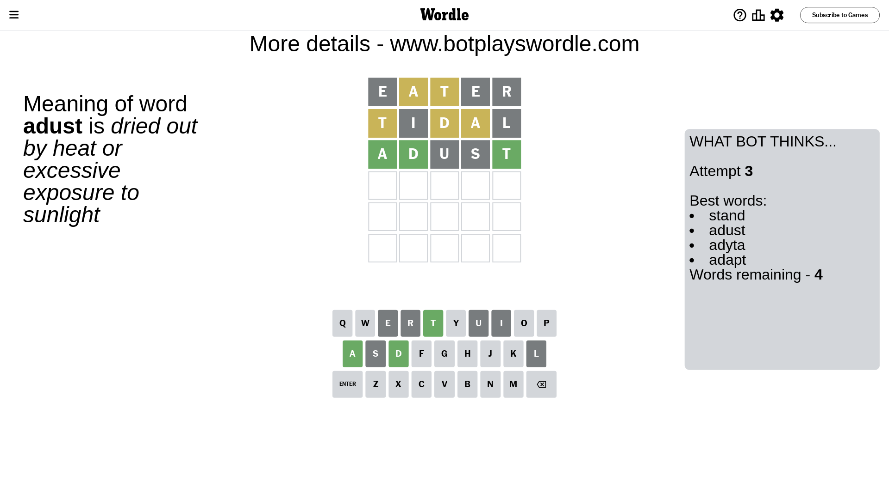

# Wordle for December 3, 2023 - \#897

## Attempt 1

This is the first attempt and we'll choose a random word to start with.

Let's start with word `eater`

Attempt for `eater` gives us 0 correct letters, 2 present letters and 3 wrong letters.

If we look into details, we can see that:

Letter `e` is not present in the word and we will not use it any more

Letter `a` is on a different spot - this means that it cannot be at position 2

Letter `t` is on a different spot - this means that it cannot be at position 3

Letter `e` is not present in the word and we will not use it any more

Letter `r` is not present in the word and we will not use it any more

Some letters are missing (like `e`, `r`) but it's also important piece of information

Word should contain letters `[a t]`

That was a great guess that limited number of remaining words

## Attempt 2

Right now we have 163 words to choose from and best of them seem to be `[tolan tonal slant plant tidal]`

So far we know that possible letters are:

At position 1: `[a b c d f g h i j k l m n o p q s t u v w x y z]`

At position 2: `[b c d f g h i j k l m n o p q s t u v w x y z]`

At position 3: `[a b c d f g h i j k l m n o p q s u v w x y z]`

At position 4: `[a b c d f g h i j k l m n o p q s t u v w x y z]`

At position 5: `[a b c d f g h i j k l m n o p q s t u v w x y z]`

Next guess is `tidal`, let's see what it gives us

Attempt for `tidal` gives us 0 correct letters, 3 present letters and 2 wrong letters.

If we look into details, we can see that:

Letter `t` is on a different spot - this means that it cannot be at position 1

Letter `i` is not present in the word and we will not use it any more

Letter `d` is on a different spot - this means that it cannot be at position 3

Letter `a` is on a different spot - this means that it cannot be at position 4

Letter `l` is not present in the word and we will not use it any more

Some letters are missing (like `i`, `l`) but it's also important piece of information

Word should contain letters `[a t d]`

That was a great guess that limited number of remaining words

## Attempt 3

Right now we have 4 words to choose from and best of them seem to be `[stand adust adyta adapt]`

So far we know that possible letters are:

At position 1: `[a b c d f g h j k m n o p q s u v w x y z]`

At position 2: `[b c d f g h j k m n o p q s t u v w x y z]`

At position 3: `[a b c f g h j k m n o p q s u v w x y z]`

At position 4: `[b c d f g h j k m n o p q s t u v w x y z]`

At position 5: `[a b c d f g h j k m n o p q s t u v w x y z]`

Next guess is `adust`, let's see what it gives us

Attempt for `adust` gives us 3 correct letters, 0 present letters and 2 wrong letters.

If we look into details, we can see that:

Letter `a` should be at position 1

Letter `d` should be at position 2

Letter `u` is not present in the word and we will not use it any more

Letter `s` is not present in the word and we will not use it any more

Letter `t` should be at position 5

We got information about the correct letters and it should make next attempt easier

Some letters are missing (like `u`, `s`) but it's also important piece of information

Word should contain letters `[a t d]`

Could be a better guess

## Attempt 4

Right now we have 1 words to choose from and best of them seem to be `[adapt]`

So far we know that possible letters are:

At position 1: `[a]`

At position 2: `[d]`

At position 3: `[a b c f g h j k m n o p q v w x y z]`

At position 4: `[b c d f g h j k m n o p q t v w x y z]`

At position 5: `[t]`

It must be `adapt`

That's the correct answer! The word is `adapt`!

## Conclusion

Today's word is `adapt` and it took 4 attempts to guess it

