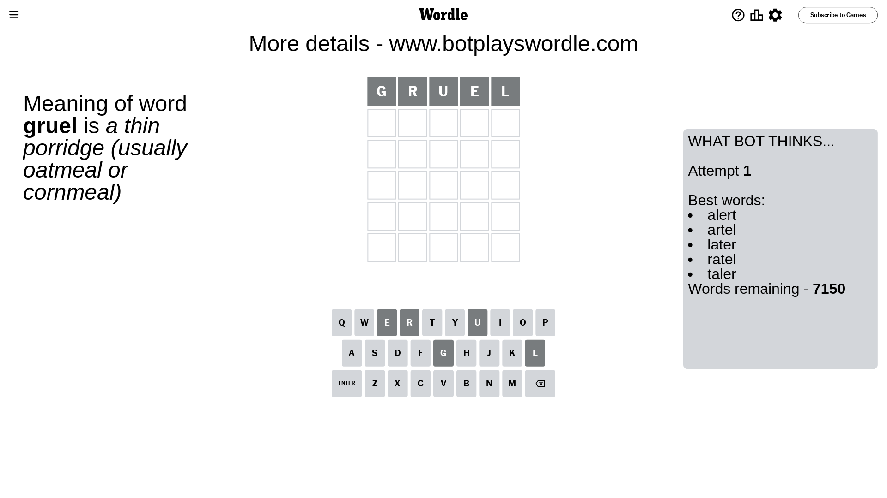

# Wordle for December 6, 2023 - \#900

## Attempt 1

This is the first attempt and we'll choose a random word to start with.

Let's start with word `gruel`

Attempt for `gruel` gives us 0 correct letters, 0 present letters and 5 wrong letters.

If we look into details, we can see that:

Letter `g` is not present in the word and we will not use it any more

Letter `r` is not present in the word and we will not use it any more

Letter `u` is not present in the word and we will not use it any more

Letter `e` is not present in the word and we will not use it any more

Letter `l` is not present in the word and we will not use it any more

Some letters are missing (like `g`, `r`, `u`, `e`, `l`) but it's also important piece of information

So far we don't know any of the letters!

Not a bad guess in general

## Attempt 2

Right now we have 1210 words to choose from and best of them seem to be `[idant stand ahint hiant snath]`

So far we know that possible letters are:

At position 1: `[a b c d f h i j k m n o p q s t v w x y z]`

At position 2: `[a b c d f h i j k m n o p q s t v w x y z]`

At position 3: `[a b c d f h i j k m n o p q s t v w x y z]`

At position 4: `[a b c d f h i j k m n o p q s t v w x y z]`

At position 5: `[a b c d f h i j k m n o p q s t v w x y z]`

Next guess is `stand`, let's see what it gives us

Attempt for `stand` gives us 0 correct letters, 2 present letters and 3 wrong letters.

If we look into details, we can see that:

Letter `s` is not present in the word and we will not use it any more

Letter `t` is not present in the word and we will not use it any more

Letter `a` is on a different spot - this means that it cannot be at position 3

Letter `n` is on a different spot - this means that it cannot be at position 4

Letter `d` is not present in the word and we will not use it any more

Some letters are missing (like `s`, `t`, `d`) but it's also important piece of information

Word should contain letters `[a n]`

That was a great guess that limited number of remaining words

## Attempt 3

Right now we have 80 words to choose from and best of them seem to be `[hanky yahan hanch bahan anomy]`

So far we know that possible letters are:

At position 1: `[a b c f h i j k m n o p q v w x y z]`

At position 2: `[a b c f h i j k m n o p q v w x y z]`

At position 3: `[b c f h i j k m n o p q v w x y z]`

At position 4: `[a b c f h i j k m o p q v w x y z]`

At position 5: `[a b c f h i j k m n o p q v w x y z]`

Next guess is `hanky`, let's see what it gives us

Attempt for `hanky` gives us 0 correct letters, 2 present letters and 3 wrong letters.

If we look into details, we can see that:

Letter `h` is not present in the word and we will not use it any more

Letter `a` is on a different spot - this means that it cannot be at position 2

Letter `n` is on a different spot - this means that it cannot be at position 3

Letter `k` is not present in the word and we will not use it any more

Letter `y` is not present in the word and we will not use it any more

Some letters are missing (like `h`, `k`, `y`) but it's also important piece of information

Word should contain letters `[a n]`

Not a bad guess in general

## Attempt 4

Right now we have 18 words to choose from and best of them seem to be `[axion anion imban woman oxman]`

So far we know that possible letters are:

At position 1: `[a b c f i j m n o p q v w x z]`

At position 2: `[b c f i j m n o p q v w x z]`

At position 3: `[b c f i j m o p q v w x z]`

At position 4: `[a b c f i j m o p q v w x z]`

At position 5: `[a b c f i j m n o p q v w x z]`

Next guess is `anion`, let's see what it gives us

Attempt for `anion` gives us 1 correct letters, 2 present letters and 2 wrong letters.

If we look into details, we can see that:

Letter `a` is on a different spot - this means that it cannot be at position 1

Letter `n` is not present in the word and we will not use it any more

Letter `i` is not present in the word and we will not use it any more

Letter `o` is on a different spot - this means that it cannot be at position 4

Letter `n` should be at position 5

We got information about the correct letters and it should make next attempt easier

Some letters are missing (like `n`, `i`) but it's also important piece of information

Word should contain letters `[a n o]`

That was a great guess that limited number of remaining words

## Attempt 5

Right now we have 2 words to choose from and best of them seem to be `[woman oxman]`

So far we know that possible letters are:

At position 1: `[b c f j m o p q v w x z]`

At position 2: `[b c f j m o p q v w x z]`

At position 3: `[b c f j m o p q v w x z]`

At position 4: `[a b c f j m p q v w x z]`

At position 5: `[n]`

Next guess is `woman`, let's see what it gives us

That's the correct answer! The word is `woman`!

## Conclusion

Today's word is `woman` and it took 5 attempts to guess it

