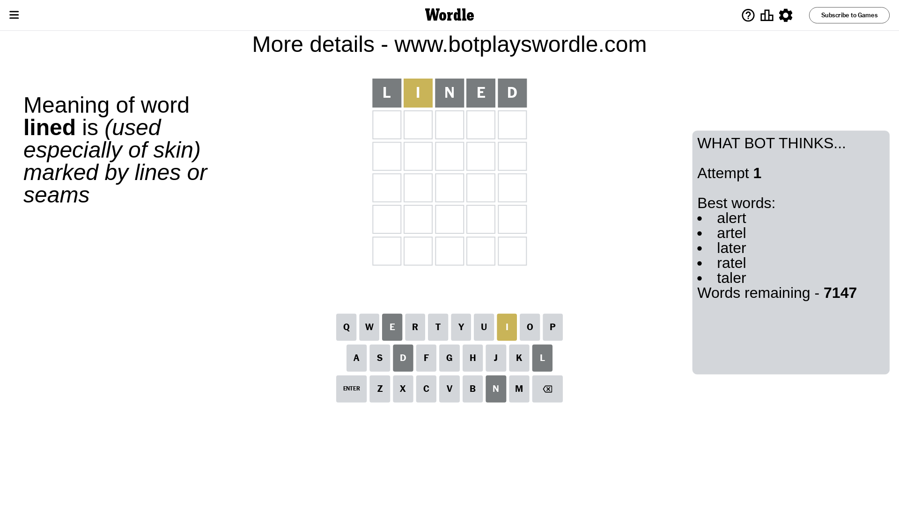
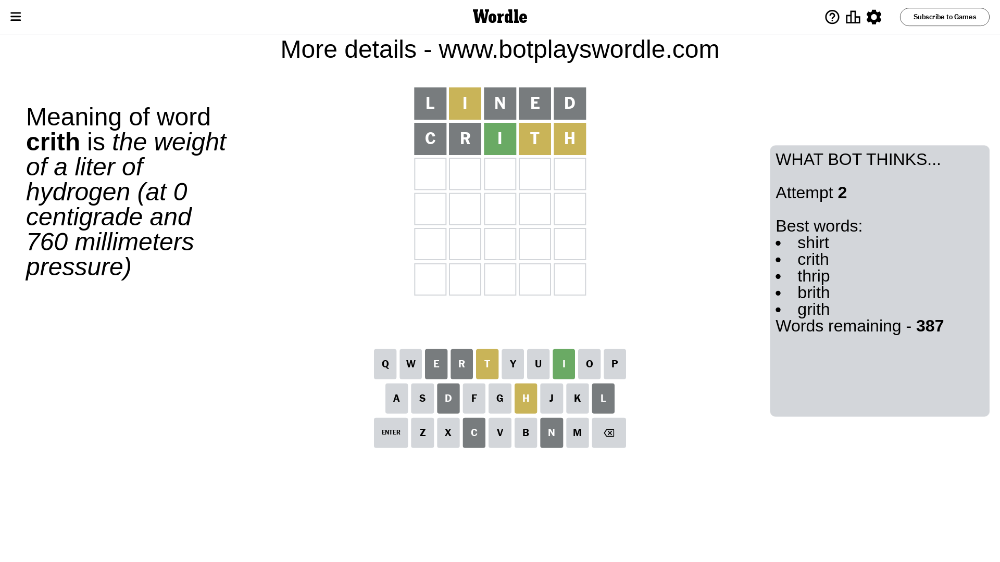
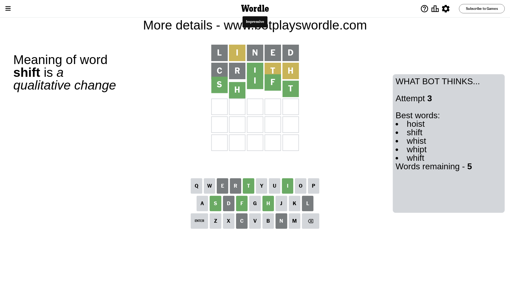

# Wordle for December 9, 2023 - \#903

## Attempt 1

This is the first attempt and we'll choose a random word to start with.

Let's start with word `lined`

Attempt for `lined` gives us 0 correct letters, 1 present letters and 4 wrong letters.

If we look into details, we can see that:

Letter `l` is not present in the word and we will not use it any more

Letter `i` is on a different spot - this means that it cannot be at position 2

Letter `n` is not present in the word and we will not use it any more

Letter `e` is not present in the word and we will not use it any more

Letter `d` is not present in the word and we will not use it any more

Some letters are missing (like `l`, `n`, `e`, `d`) but it's also important piece of information

Word should contain letters `[i]`

That was a great guess that limited number of remaining words

## Attempt 2

Right now we have 387 words to choose from and best of them seem to be `[shirt crith thrip brith grith]`

So far we know that possible letters are:

At position 1: `[a b c f g h i j k m o p q r s t u v w x y z]`

At position 2: `[a b c f g h j k m o p q r s t u v w x y z]`

At position 3: `[a b c f g h i j k m o p q r s t u v w x y z]`

At position 4: `[a b c f g h i j k m o p q r s t u v w x y z]`

At position 5: `[a b c f g h i j k m o p q r s t u v w x y z]`

Next guess is `crith`, let's see what it gives us

Attempt for `crith` gives us 1 correct letters, 2 present letters and 2 wrong letters.

If we look into details, we can see that:

Letter `c` is not present in the word and we will not use it any more

Letter `r` is not present in the word and we will not use it any more

Letter `i` should be at position 3

Letter `t` is on a different spot - this means that it cannot be at position 4

Letter `h` is on a different spot - this means that it cannot be at position 5

We got information about the correct letters and it should make next attempt easier

Some letters are missing (like `c`, `r`) but it's also important piece of information

Word should contain letters `[i t h]`

That was a great guess that limited number of remaining words

## Attempt 3

Right now we have 5 words to choose from and best of them seem to be `[hoist shift whist whipt whift]`

So far we know that possible letters are:

At position 1: `[a b f g h i j k m o p q s t u v w x y z]`

At position 2: `[a b f g h j k m o p q s t u v w x y z]`

At position 3: `[i]`

At position 4: `[a b f g h i j k m o p q s u v w x y z]`

At position 5: `[a b f g i j k m o p q s t u v w x y z]`

Next guess is `shift`, let's see what it gives us

That's the correct answer! The word is `shift`!

## Conclusion

Today's word is `shift` and it took 3 attempts to guess it

