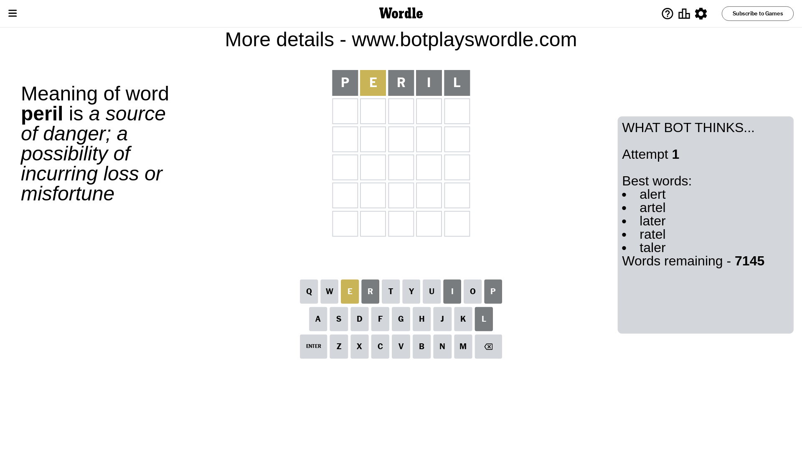

# Wordle for December 11, 2023 - \#905

## Attempt 1

This is the first attempt and we'll choose a random word to start with.

Let's start with word `peril`

Attempt for `peril` gives us 0 correct letters, 1 present letters and 4 wrong letters.

If we look into details, we can see that:

Letter `p` is not present in the word and we will not use it any more

Letter `e` is on a different spot - this means that it cannot be at position 2

Letter `r` is not present in the word and we will not use it any more

Letter `i` is not present in the word and we will not use it any more

Letter `l` is not present in the word and we will not use it any more

Some letters are missing (like `p`, `r`, `i`, `l`) but it's also important piece of information

Word should contain letters `[e]`

That was a great guess that limited number of remaining words

## Attempt 2

Right now we have 543 words to choose from and best of them seem to be `[thane noted toned stend tuned]`

So far we know that possible letters are:

At position 1: `[a b c d e f g h j k m n o q s t u v w x y z]`

At position 2: `[a b c d f g h j k m n o q s t u v w x y z]`

At position 3: `[a b c d e f g h j k m n o q s t u v w x y z]`

At position 4: `[a b c d e f g h j k m n o q s t u v w x y z]`

At position 5: `[a b c d e f g h j k m n o q s t u v w x y z]`

Next guess is `thane`, let's see what it gives us

Attempt for `thane` gives us 1 correct letters, 1 present letters and 3 wrong letters.

If we look into details, we can see that:

Letter `t` is not present in the word and we will not use it any more

Letter `h` is on a different spot - this means that it cannot be at position 2

Letter `a` is not present in the word and we will not use it any more

Letter `n` is not present in the word and we will not use it any more

Letter `e` should be at position 5

We got information about the correct letters and it should make next attempt easier

Some letters are missing (like `t`, `a`, `n`) but it's also important piece of information

Word should contain letters `[e h]`

That was a great guess that limited number of remaining words

## Attempt 3

Right now we have 2 words to choose from and best of them seem to be `[house hoove]`

So far we know that possible letters are:

At position 1: `[b c d e f g h j k m o q s u v w x y z]`

At position 2: `[b c d f g j k m o q s u v w x y z]`

At position 3: `[b c d e f g h j k m o q s u v w x y z]`

At position 4: `[b c d e f g h j k m o q s u v w x y z]`

At position 5: `[e]`

Next guess is `house`, let's see what it gives us

That's the correct answer! The word is `house`!

## Conclusion

Today's word is `house` and it took 3 attempts to guess it

