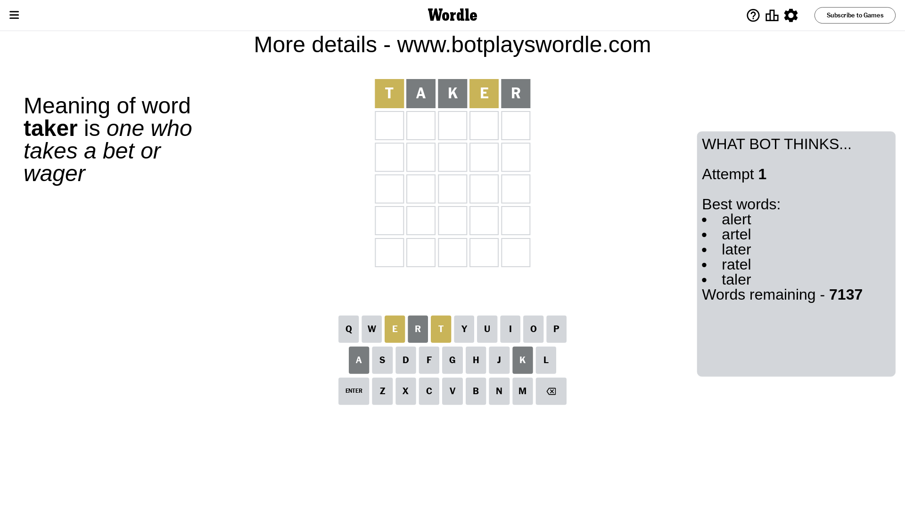
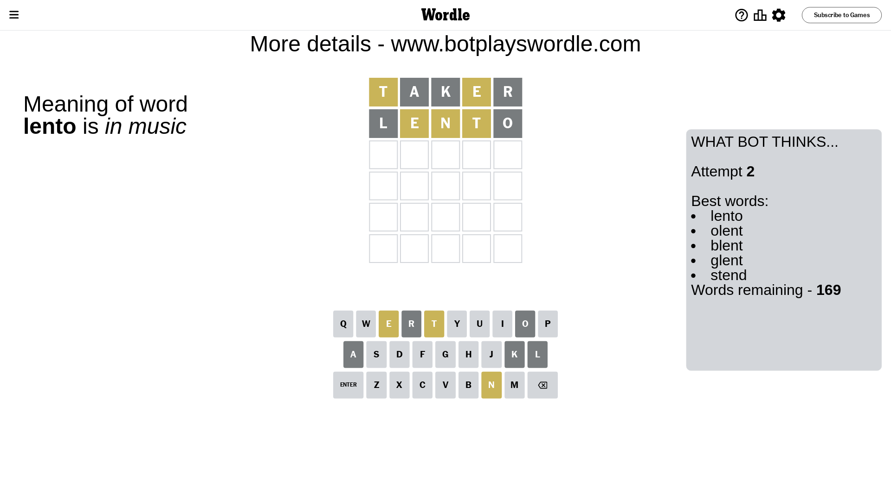
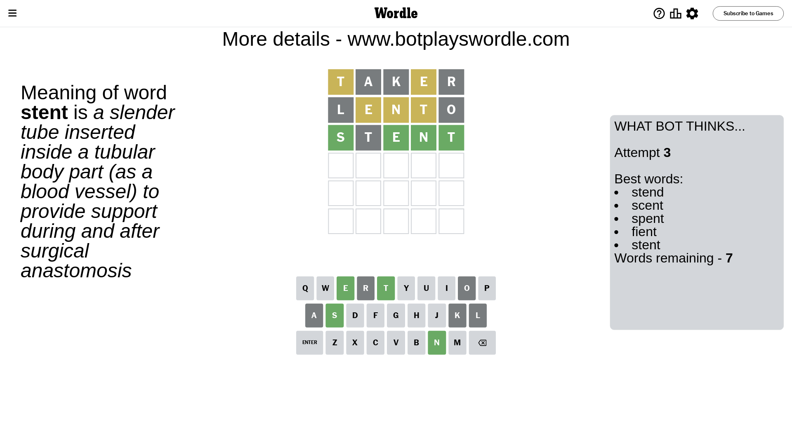

# Wordle for December 13, 2023 - \#907

## Attempt 1

This is the first attempt and we'll choose a random word to start with.

Let's start with word `taker`

Attempt for `taker` gives us 0 correct letters, 2 present letters and 3 wrong letters.

If we look into details, we can see that:

Letter `t` is on a different spot - this means that it cannot be at position 1

Letter `a` is not present in the word and we will not use it any more

Letter `k` is not present in the word and we will not use it any more

Letter `e` is on a different spot - this means that it cannot be at position 4

Letter `r` is not present in the word and we will not use it any more

Some letters are missing (like `a`, `k`, `r`) but it's also important piece of information

Word should contain letters `[t e]`

That was a great guess that limited number of remaining words

## Attempt 2

Right now we have 169 words to choose from and best of them seem to be `[lento olent blent glent stend]`

So far we know that possible letters are:

At position 1: `[b c d e f g h i j l m n o p q s u v w x y z]`

At position 2: `[b c d e f g h i j l m n o p q s t u v w x y z]`

At position 3: `[b c d e f g h i j l m n o p q s t u v w x y z]`

At position 4: `[b c d f g h i j l m n o p q s t u v w x y z]`

At position 5: `[b c d e f g h i j l m n o p q s t u v w x y z]`

Next guess is `lento`, let's see what it gives us

Attempt for `lento` gives us 0 correct letters, 3 present letters and 2 wrong letters.

If we look into details, we can see that:

Letter `l` is not present in the word and we will not use it any more

Letter `e` is on a different spot - this means that it cannot be at position 2

Letter `n` is on a different spot - this means that it cannot be at position 3

Letter `t` is on a different spot - this means that it cannot be at position 4

Letter `o` is not present in the word and we will not use it any more

Some letters are missing (like `l`, `o`) but it's also important piece of information

Word should contain letters `[t e n]`

That was a great guess that limited number of remaining words

## Attempt 3

Right now we have 7 words to choose from and best of them seem to be `[stend scent spent fient stent]`

So far we know that possible letters are:

At position 1: `[b c d e f g h i j m n p q s u v w x y z]`

At position 2: `[b c d f g h i j m n p q s t u v w x y z]`

At position 3: `[b c d e f g h i j m p q s t u v w x y z]`

At position 4: `[b c d f g h i j m n p q s u v w x y z]`

At position 5: `[b c d e f g h i j m n p q s t u v w x y z]`

Next guess is `stent`, let's see what it gives us

Attempt for `stent` gives us 4 correct letters, 0 present letters and 1 wrong letters.

If we look into details, we can see that:

Letter `s` should be at position 1

Letter `t` is not present in the word and we will not use it any more

Letter `e` should be at position 3

Letter `n` should be at position 4

Letter `t` should be at position 5

We got information about the correct letters and it should make next attempt easier

Some letters are missing (like `t`) but it's also important piece of information

Word should contain letters `[t e n s]`

Could be a better guess

## Attempt 4

Right now we have 2 words to choose from and best of them seem to be `[scent spent]`

So far we know that possible letters are:

At position 1: `[s]`

At position 2: `[b c d f g h i j m n p q s u v w x y z]`

At position 3: `[e]`

At position 4: `[n]`

At position 5: `[t]`

Next guess is `spent`, let's see what it gives us

That's the correct answer! The word is `spent`!

## Conclusion

Today's word is `spent` and it took 4 attempts to guess it

