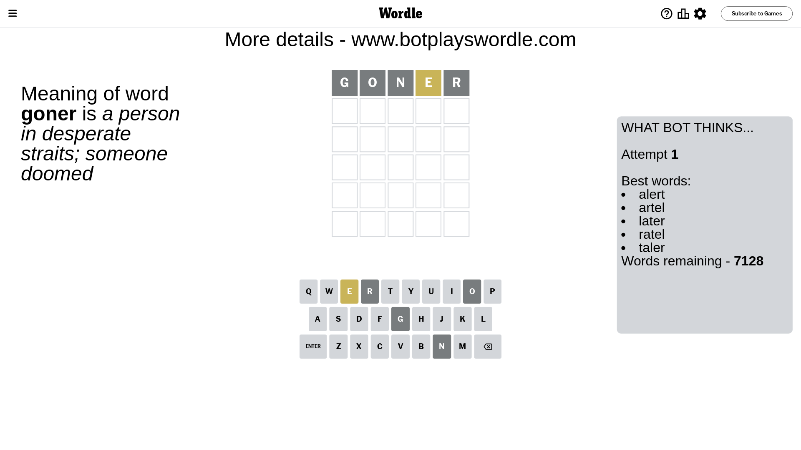
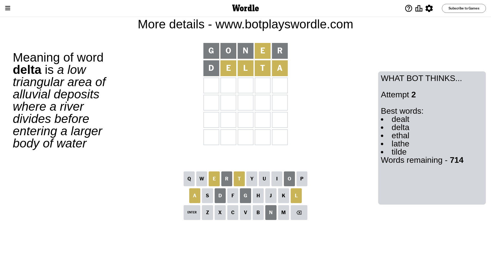
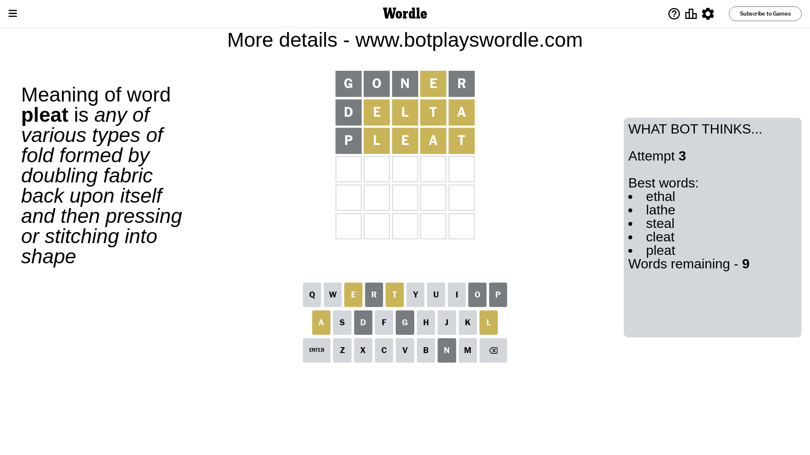

# Wordle for December 19, 2023 - \#913

## Attempt 1

This is the first attempt and we'll choose a random word to start with.

Let's start with word `goner`

Attempt for `goner` gives us 0 correct letters, 1 present letters and 4 wrong letters.

If we look into details, we can see that:

Letter `g` is not present in the word and we will not use it any more

Letter `o` is not present in the word and we will not use it any more

Letter `n` is not present in the word and we will not use it any more

Letter `e` is on a different spot - this means that it cannot be at position 4

Letter `r` is not present in the word and we will not use it any more

Some letters are missing (like `g`, `o`, `n`, `r`) but it's also important piece of information

Word should contain letters `[e]`

That was a great guess that limited number of remaining words

## Attempt 2

Right now we have 714 words to choose from and best of them seem to be `[dealt delta ethal lathe tilde]`

So far we know that possible letters are:

At position 1: `[a b c d e f h i j k l m p q s t u v w x y z]`

At position 2: `[a b c d e f h i j k l m p q s t u v w x y z]`

At position 3: `[a b c d e f h i j k l m p q s t u v w x y z]`

At position 4: `[a b c d f h i j k l m p q s t u v w x y z]`

At position 5: `[a b c d e f h i j k l m p q s t u v w x y z]`

Next guess is `delta`, let's see what it gives us

Attempt for `delta` gives us 0 correct letters, 4 present letters and 1 wrong letters.

If we look into details, we can see that:

Letter `d` is not present in the word and we will not use it any more

Letter `e` is on a different spot - this means that it cannot be at position 2

Letter `l` is on a different spot - this means that it cannot be at position 3

Letter `t` is on a different spot - this means that it cannot be at position 4

Letter `a` is on a different spot - this means that it cannot be at position 5

Some letters are missing (like `d`) but it's also important piece of information

Word should contain letters `[e l t a]`

That was a great guess that limited number of remaining words

## Attempt 3

Right now we have 9 words to choose from and best of them seem to be `[ethal lathe steal cleat pleat]`

So far we know that possible letters are:

At position 1: `[a b c e f h i j k l m p q s t u v w x y z]`

At position 2: `[a b c f h i j k l m p q s t u v w x y z]`

At position 3: `[a b c e f h i j k m p q s t u v w x y z]`

At position 4: `[a b c f h i j k l m p q s u v w x y z]`

At position 5: `[b c e f h i j k l m p q s t u v w x y z]`

Next guess is `pleat`, let's see what it gives us

Attempt for `pleat` gives us 0 correct letters, 4 present letters and 1 wrong letters.

If we look into details, we can see that:

Letter `p` is not present in the word and we will not use it any more

Letter `l` is on a different spot - this means that it cannot be at position 2

Letter `e` is on a different spot - this means that it cannot be at position 3

Letter `a` is on a different spot - this means that it cannot be at position 4

Letter `t` is on a different spot - this means that it cannot be at position 5

Some letters are missing (like `p`) but it's also important piece of information

Word should contain letters `[e l t a]`

Not a bad guess in general

## Attempt 4

Right now we have 2 words to choose from and best of them seem to be `[lathe table]`

So far we know that possible letters are:

At position 1: `[a b c e f h i j k l m q s t u v w x y z]`

At position 2: `[a b c f h i j k m q s t u v w x y z]`

At position 3: `[a b c f h i j k m q s t u v w x y z]`

At position 4: `[b c f h i j k l m q s u v w x y z]`

At position 5: `[b c e f h i j k l m q s u v w x y z]`

Next guess is `table`, let's see what it gives us

That's the correct answer! The word is `table`!

## Conclusion

Today's word is `table` and it took 4 attempts to guess it

