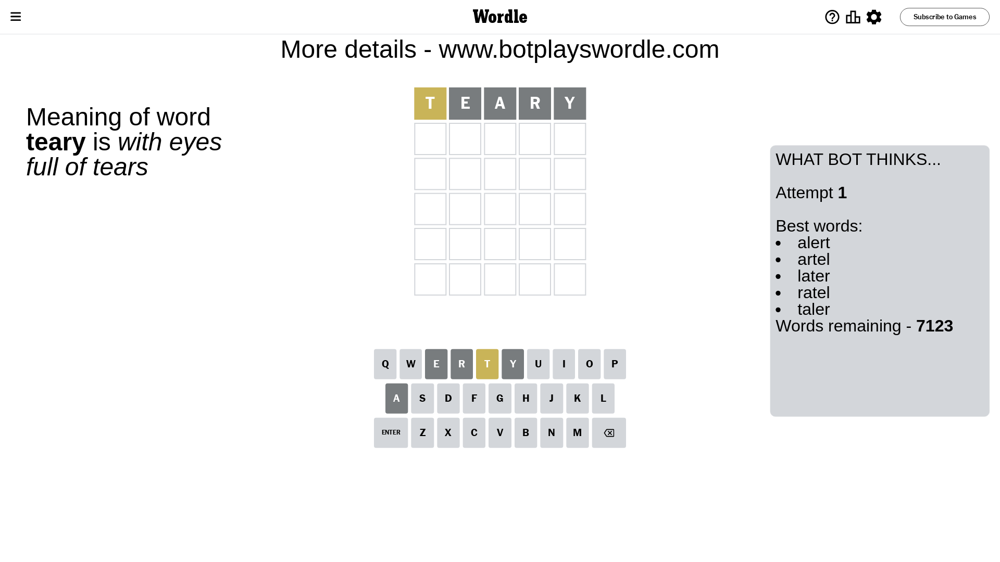

# Wordle for December 21, 2023 - \#915

## Attempt 1

This is the first attempt and we'll choose a random word to start with.

Let's start with word `teary`

Attempt for `teary` gives us 0 correct letters, 1 present letters and 4 wrong letters.

If we look into details, we can see that:

Letter `t` is on a different spot - this means that it cannot be at position 1

Letter `e` is not present in the word and we will not use it any more

Letter `a` is not present in the word and we will not use it any more

Letter `r` is not present in the word and we will not use it any more

Letter `y` is not present in the word and we will not use it any more

Some letters are missing (like `e`, `a`, `r`, `y`) but it's also important piece of information

Word should contain letters `[t]`

That was a great guess that limited number of remaining words

## Attempt 2

Right now we have 256 words to choose from and best of them seem to be `[clint glint flint blunt intil]`

So far we know that possible letters are:

At position 1: `[b c d f g h i j k l m n o p q s u v w x z]`

At position 2: `[b c d f g h i j k l m n o p q s t u v w x z]`

At position 3: `[b c d f g h i j k l m n o p q s t u v w x z]`

At position 4: `[b c d f g h i j k l m n o p q s t u v w x z]`

At position 5: `[b c d f g h i j k l m n o p q s t u v w x z]`

Next guess is `glint`, let's see what it gives us

Attempt for `glint` gives us 2 correct letters, 1 present letters and 2 wrong letters.

If we look into details, we can see that:

Letter `g` is not present in the word and we will not use it any more

Letter `l` is on a different spot - this means that it cannot be at position 2

Letter `i` should be at position 3

Letter `n` is not present in the word and we will not use it any more

Letter `t` should be at position 5

We got information about the correct letters and it should make next attempt easier

Some letters are missing (like `g`, `n`) but it's also important piece of information

Word should contain letters `[t l i]`

That was a great guess that limited number of remaining words

## Attempt 3

Right now we have 4 words to choose from and best of them seem to be `[spilt built quilt stilt]`

So far we know that possible letters are:

At position 1: `[b c d f h i j k l m o p q s u v w x z]`

At position 2: `[b c d f h i j k m o p q s t u v w x z]`

At position 3: `[i]`

At position 4: `[b c d f h i j k l m o p q s t u v w x z]`

At position 5: `[t]`

Next guess is `built`, let's see what it gives us

That's the correct answer! The word is `built`!

## Conclusion

Today's word is `built` and it took 3 attempts to guess it

