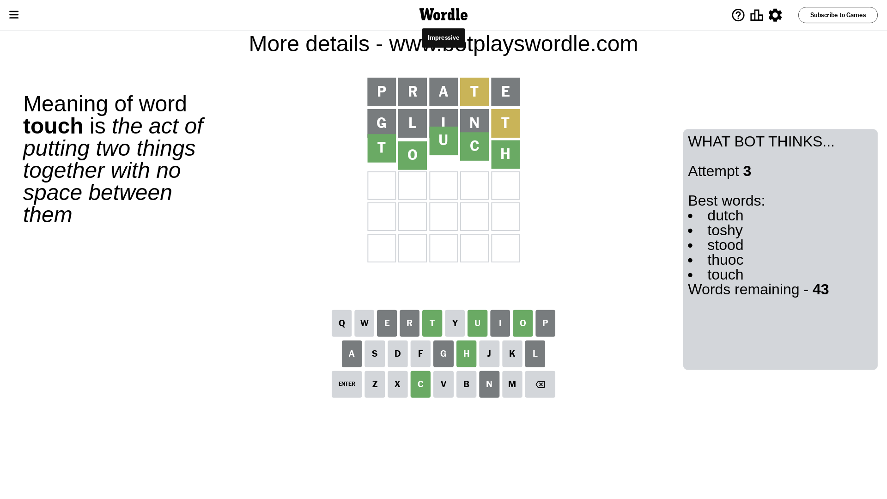

# Wordle for December 22, 2023 - \#916

## Attempt 1

This is the first attempt and we'll choose a random word to start with.

Let's start with word `prate`

Attempt for `prate` gives us 0 correct letters, 1 present letters and 4 wrong letters.

If we look into details, we can see that:

Letter `p` is not present in the word and we will not use it any more

Letter `r` is not present in the word and we will not use it any more

Letter `a` is not present in the word and we will not use it any more

Letter `t` is on a different spot - this means that it cannot be at position 4

Letter `e` is not present in the word and we will not use it any more

Some letters are missing (like `p`, `r`, `a`, `e`) but it's also important piece of information

Word should contain letters `[t]`

That was a great guess that limited number of remaining words

## Attempt 2

Right now we have 259 words to choose from and best of them seem to be `[clint glint flint blunt intil]`

So far we know that possible letters are:

At position 1: `[b c d f g h i j k l m n o q s t u v w x y z]`

At position 2: `[b c d f g h i j k l m n o q s t u v w x y z]`

At position 3: `[b c d f g h i j k l m n o q s t u v w x y z]`

At position 4: `[b c d f g h i j k l m n o q s u v w x y z]`

At position 5: `[b c d f g h i j k l m n o q s t u v w x y z]`

Next guess is `glint`, let's see what it gives us

Attempt for `glint` gives us 0 correct letters, 1 present letters and 4 wrong letters.

If we look into details, we can see that:

Letter `g` is not present in the word and we will not use it any more

Letter `l` is not present in the word and we will not use it any more

Letter `i` is not present in the word and we will not use it any more

Letter `n` is not present in the word and we will not use it any more

Letter `t` is on a different spot - this means that it cannot be at position 5

Some letters are missing (like `g`, `l`, `i`, `n`) but it's also important piece of information

Word should contain letters `[t]`

Not a bad guess in general

## Attempt 3

Right now we have 43 words to choose from and best of them seem to be `[dutch toshy stood thuoc touch]`

So far we know that possible letters are:

At position 1: `[b c d f h j k m o q s t u v w x y z]`

At position 2: `[b c d f h j k m o q s t u v w x y z]`

At position 3: `[b c d f h j k m o q s t u v w x y z]`

At position 4: `[b c d f h j k m o q s u v w x y z]`

At position 5: `[b c d f h j k m o q s u v w x y z]`

Next guess is `touch`, let's see what it gives us

That's the correct answer! The word is `touch`!

To be honest that was a pretty lucky guess, but it worked out well.

## Conclusion

Today's word is `touch` and it took 3 attempts to guess it

