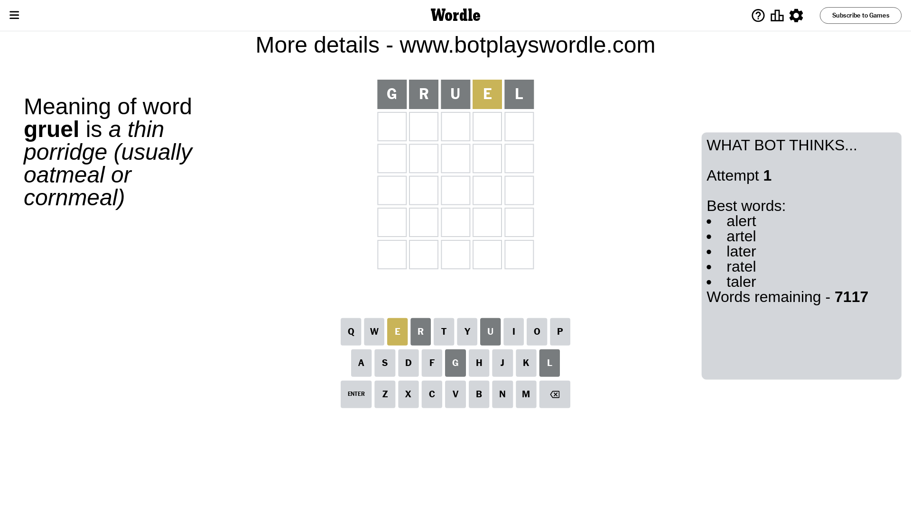
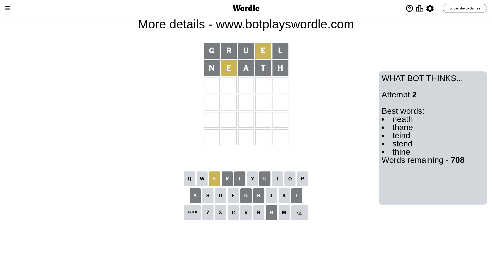
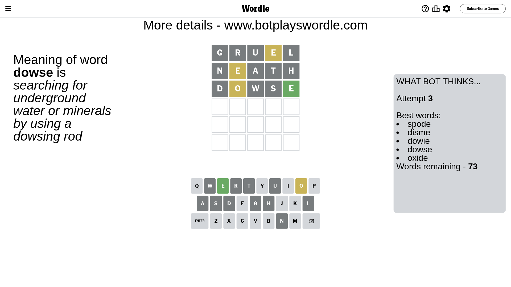
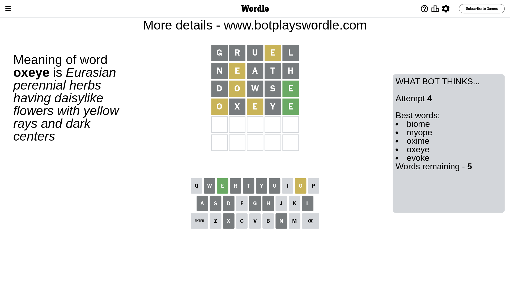
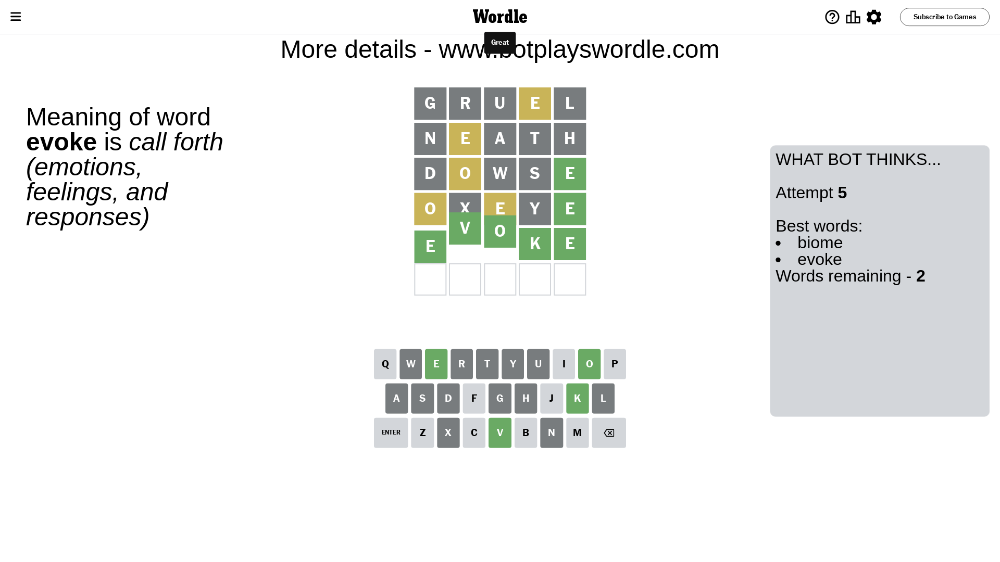

# Wordle for December 25, 2023 - \#919

## Attempt 1

This is the first attempt and we'll choose a random word to start with.

Let's start with word `gruel`

Attempt for `gruel` gives us 0 correct letters, 1 present letters and 4 wrong letters.

If we look into details, we can see that:

Letter `g` is not present in the word and we will not use it any more

Letter `r` is not present in the word and we will not use it any more

Letter `u` is not present in the word and we will not use it any more

Letter `e` is on a different spot - this means that it cannot be at position 4

Letter `l` is not present in the word and we will not use it any more

Some letters are missing (like `g`, `r`, `u`, `l`) but it's also important piece of information

Word should contain letters `[e]`

That was a great guess that limited number of remaining words

## Attempt 2

Right now we have 708 words to choose from and best of them seem to be `[neath thane teind stend thine]`

So far we know that possible letters are:

At position 1: `[a b c d e f h i j k m n o p q s t v w x y z]`

At position 2: `[a b c d e f h i j k m n o p q s t v w x y z]`

At position 3: `[a b c d e f h i j k m n o p q s t v w x y z]`

At position 4: `[a b c d f h i j k m n o p q s t v w x y z]`

At position 5: `[a b c d e f h i j k m n o p q s t v w x y z]`

Next guess is `neath`, let's see what it gives us

Attempt for `neath` gives us 0 correct letters, 1 present letters and 4 wrong letters.

If we look into details, we can see that:

Letter `n` is not present in the word and we will not use it any more

Letter `e` is on a different spot - this means that it cannot be at position 2

Letter `a` is not present in the word and we will not use it any more

Letter `t` is not present in the word and we will not use it any more

Letter `h` is not present in the word and we will not use it any more

Some letters are missing (like `n`, `a`, `t`, `h`) but it's also important piece of information

Word should contain letters `[e]`

That was a great guess that limited number of remaining words

## Attempt 3

Right now we have 73 words to choose from and best of them seem to be `[spode disme dowie dowse oxide]`

So far we know that possible letters are:

At position 1: `[b c d e f i j k m o p q s v w x y z]`

At position 2: `[b c d f i j k m o p q s v w x y z]`

At position 3: `[b c d e f i j k m o p q s v w x y z]`

At position 4: `[b c d f i j k m o p q s v w x y z]`

At position 5: `[b c d e f i j k m o p q s v w x y z]`

Next guess is `dowse`, let's see what it gives us

Attempt for `dowse` gives us 1 correct letters, 1 present letters and 3 wrong letters.

If we look into details, we can see that:

Letter `d` is not present in the word and we will not use it any more

Letter `o` is on a different spot - this means that it cannot be at position 2

Letter `w` is not present in the word and we will not use it any more

Letter `s` is not present in the word and we will not use it any more

Letter `e` should be at position 5

We got information about the correct letters and it should make next attempt easier

Some letters are missing (like `d`, `w`, `s`) but it's also important piece of information

Word should contain letters `[e o]`

That was a great guess that limited number of remaining words

## Attempt 4

Right now we have 5 words to choose from and best of them seem to be `[biome myope oxime oxeye evoke]`

So far we know that possible letters are:

At position 1: `[b c e f i j k m o p q v x y z]`

At position 2: `[b c f i j k m p q v x y z]`

At position 3: `[b c e f i j k m o p q v x y z]`

At position 4: `[b c f i j k m o p q v x y z]`

At position 5: `[e]`

Next guess is `oxeye`, let's see what it gives us

Attempt for `oxeye` gives us 1 correct letters, 2 present letters and 2 wrong letters.

If we look into details, we can see that:

Letter `o` is on a different spot - this means that it cannot be at position 1

Letter `x` is not present in the word and we will not use it any more

Letter `e` is on a different spot - this means that it cannot be at position 3

Letter `y` is not present in the word and we will not use it any more

Some letters are missing (like `x`, `y`) but it's also important piece of information

Word should contain letters `[e o]`

Could be a better guess

## Attempt 5

Right now we have 2 words to choose from and best of them seem to be `[biome evoke]`

So far we know that possible letters are:

At position 1: `[b c e f i j k m p q v z]`

At position 2: `[b c f i j k m p q v z]`

At position 3: `[b c f i j k m o p q v z]`

At position 4: `[b c f i j k m o p q v z]`

At position 5: `[e]`

Next guess is `evoke`, let's see what it gives us

That's the correct answer! The word is `evoke`!

## Conclusion

Today's word is `evoke` and it took 5 attempts to guess it

