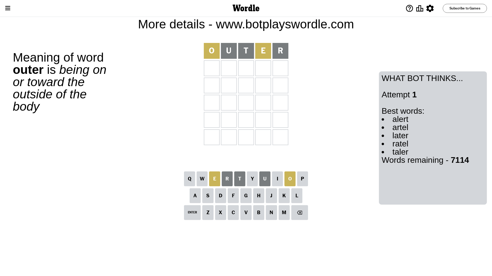
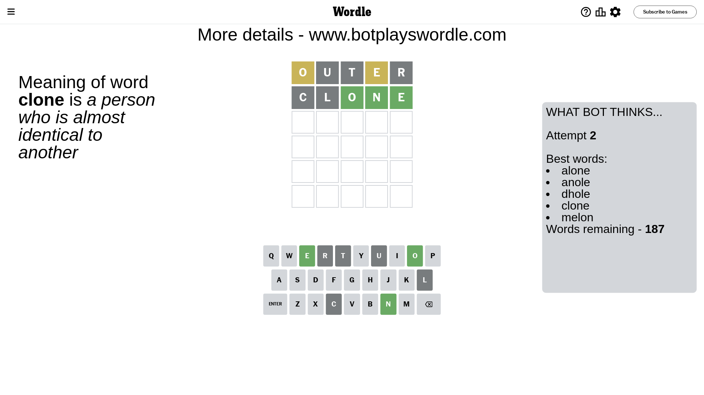
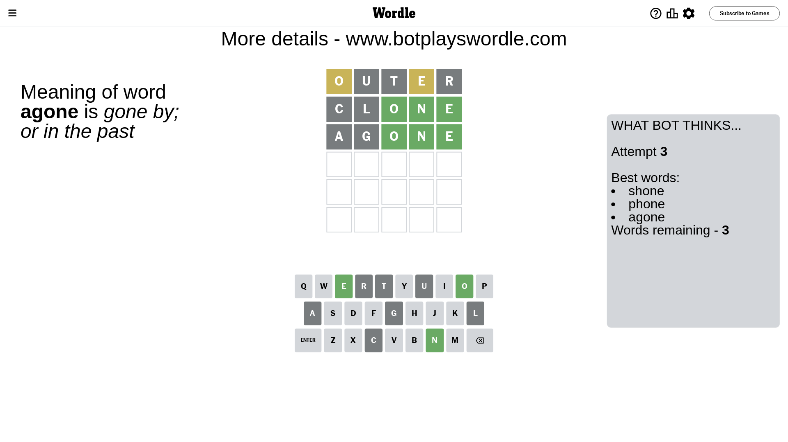
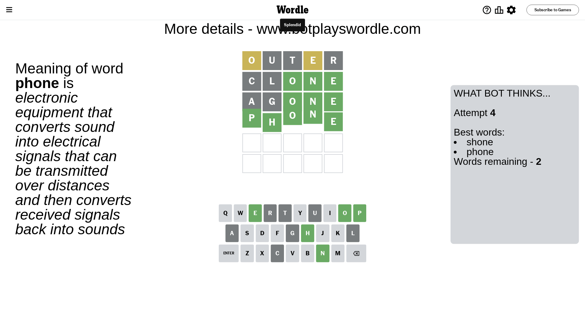

# Wordle for December 26, 2023 - \#920

## Attempt 1

This is the first attempt and we'll choose a random word to start with.

Let's start with word `outer`

Attempt for `outer` gives us 0 correct letters, 2 present letters and 3 wrong letters.

If we look into details, we can see that:

Letter `o` is on a different spot - this means that it cannot be at position 1

Letter `u` is not present in the word and we will not use it any more

Letter `t` is not present in the word and we will not use it any more

Letter `e` is on a different spot - this means that it cannot be at position 4

Letter `r` is not present in the word and we will not use it any more

Some letters are missing (like `u`, `t`, `r`) but it's also important piece of information

Word should contain letters `[o e]`

That was a great guess that limited number of remaining words

## Attempt 2

Right now we have 187 words to choose from and best of them seem to be `[alone anole dhole clone melon]`

So far we know that possible letters are:

At position 1: `[a b c d e f g h i j k l m n p q s v w x y z]`

At position 2: `[a b c d e f g h i j k l m n o p q s v w x y z]`

At position 3: `[a b c d e f g h i j k l m n o p q s v w x y z]`

At position 4: `[a b c d f g h i j k l m n o p q s v w x y z]`

At position 5: `[a b c d e f g h i j k l m n o p q s v w x y z]`

Next guess is `clone`, let's see what it gives us

Attempt for `clone` gives us 3 correct letters, 0 present letters and 2 wrong letters.

If we look into details, we can see that:

Letter `c` is not present in the word and we will not use it any more

Letter `l` is not present in the word and we will not use it any more

Letter `o` should be at position 3

Letter `n` should be at position 4

Letter `e` should be at position 5

We got information about the correct letters and it should make next attempt easier

Some letters are missing (like `c`, `l`) but it's also important piece of information

Word should contain letters `[o e n]`

That was a great guess that limited number of remaining words

## Attempt 3

Right now we have 3 words to choose from and best of them seem to be `[shone phone agone]`

So far we know that possible letters are:

At position 1: `[a b d e f g h i j k m n p q s v w x y z]`

At position 2: `[a b d e f g h i j k m n o p q s v w x y z]`

At position 3: `[o]`

At position 4: `[n]`

At position 5: `[e]`

Next guess is `agone`, let's see what it gives us

Attempt for `agone` gives us 3 correct letters, 0 present letters and 2 wrong letters.

If we look into details, we can see that:

Letter `a` is not present in the word and we will not use it any more

Letter `g` is not present in the word and we will not use it any more

Some letters are missing (like `a`, `g`) but it's also important piece of information

Word should contain letters `[o e n]`

This was a waste, almost no valuable information...

## Attempt 4

Right now we have 2 words to choose from and best of them seem to be `[shone phone]`

So far we know that possible letters are:

At position 1: `[b d e f h i j k m n p q s v w x y z]`

At position 2: `[b d e f h i j k m n o p q s v w x y z]`

At position 3: `[o]`

At position 4: `[n]`

At position 5: `[e]`

Next guess is `phone`, let's see what it gives us

That's the correct answer! The word is `phone`!

## Conclusion

Today's word is `phone` and it took 4 attempts to guess it

