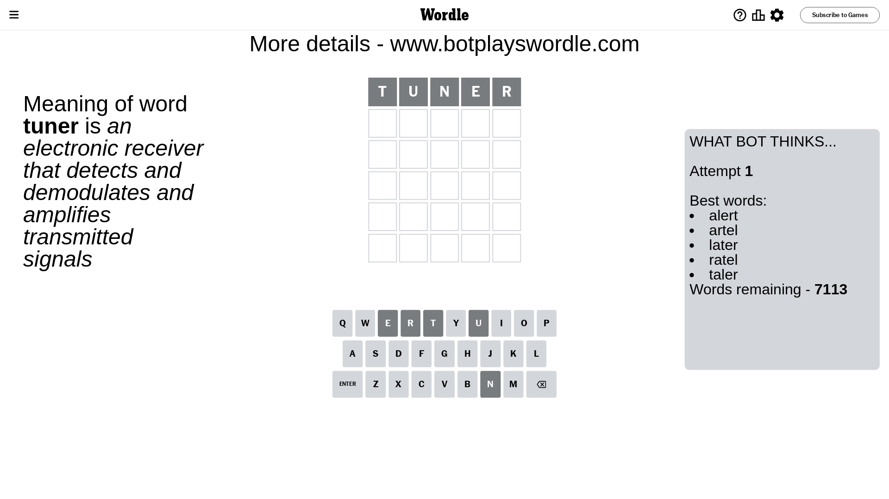
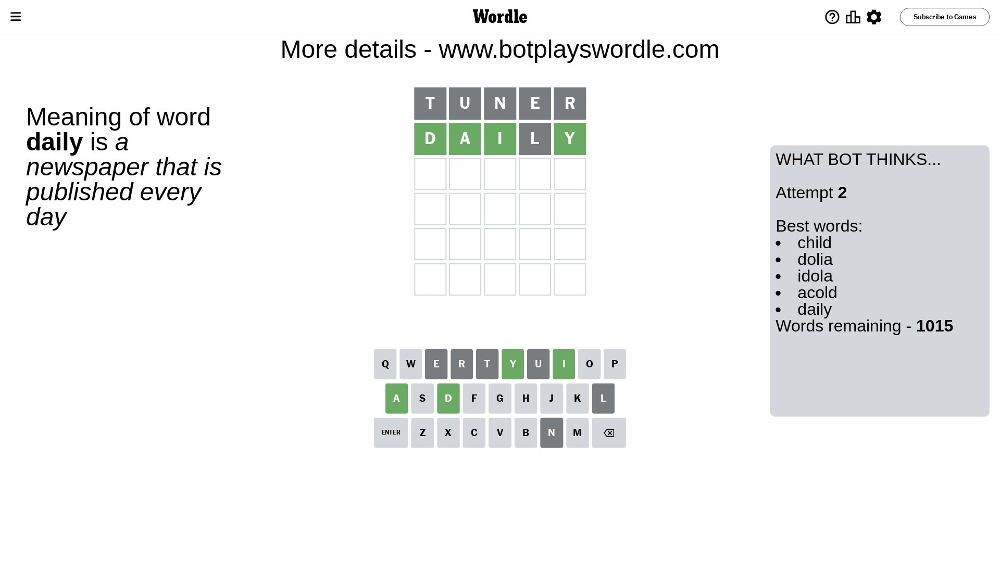
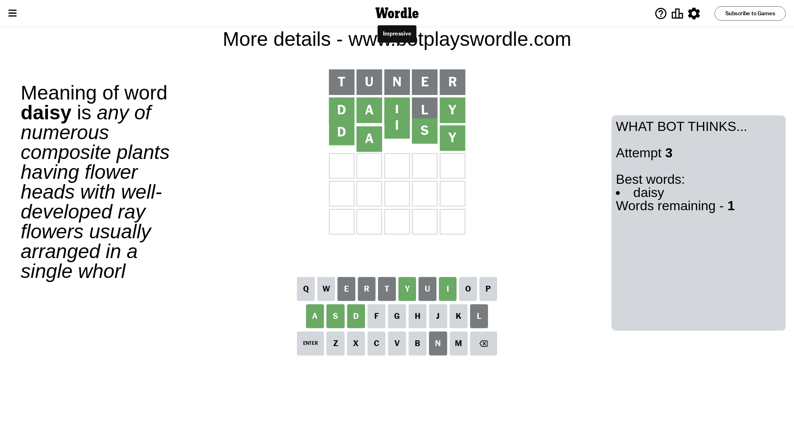

# Wordle for December 27, 2023 - \#921

## Attempt 1

This is the first attempt and we'll choose a random word to start with.

Let's start with word `tuner`

Attempt for `tuner` gives us 0 correct letters, 0 present letters and 5 wrong letters.

If we look into details, we can see that:

Letter `t` is not present in the word and we will not use it any more

Letter `u` is not present in the word and we will not use it any more

Letter `n` is not present in the word and we will not use it any more

Letter `e` is not present in the word and we will not use it any more

Letter `r` is not present in the word and we will not use it any more

Some letters are missing (like `t`, `u`, `n`, `e`, `r`) but it's also important piece of information

So far we don't know any of the letters!

Not a bad guess in general

## Attempt 2

Right now we have 1015 words to choose from and best of them seem to be `[child dolia idola acold daily]`

So far we know that possible letters are:

At position 1: `[a b c d f g h i j k l m o p q s v w x y z]`

At position 2: `[a b c d f g h i j k l m o p q s v w x y z]`

At position 3: `[a b c d f g h i j k l m o p q s v w x y z]`

At position 4: `[a b c d f g h i j k l m o p q s v w x y z]`

At position 5: `[a b c d f g h i j k l m o p q s v w x y z]`

Next guess is `daily`, let's see what it gives us

Attempt for `daily` gives us 4 correct letters, 0 present letters and 1 wrong letters.

If we look into details, we can see that:

Letter `d` should be at position 1

Letter `a` should be at position 2

Letter `i` should be at position 3

Letter `l` is not present in the word and we will not use it any more

Letter `y` should be at position 5

We got information about the correct letters and it should make next attempt easier

Some letters are missing (like `l`) but it's also important piece of information

Word should contain letters `[d a i y]`

That was a great guess that limited number of remaining words

## Attempt 3

Right now we have 1 words to choose from and best of them seem to be `[daisy]`

So far we know that possible letters are:

At position 1: `[d]`

At position 2: `[a]`

At position 3: `[i]`

At position 4: `[a b c d f g h i j k m o p q s v w x y z]`

At position 5: `[y]`

It must be `daisy`

That's the correct answer! The word is `daisy`!

## Conclusion

Today's word is `daisy` and it took 3 attempts to guess it

