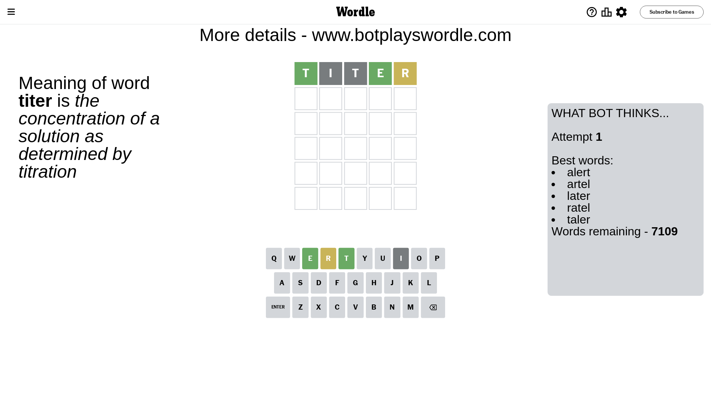
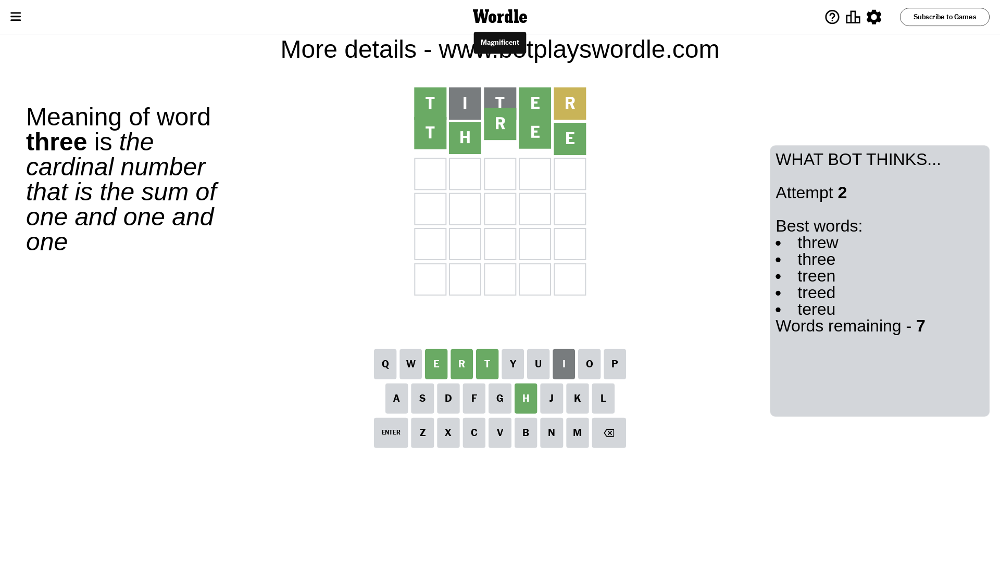

# Wordle for December 30, 2023 - \#924

## Attempt 1

This is the first attempt and we'll choose a random word to start with.

Let's start with word `titer`

Attempt for `titer` gives us 2 correct letters, 1 present letters and 2 wrong letters.

If we look into details, we can see that:

Letter `t` should be at position 1

Letter `i` is not present in the word and we will not use it any more

Letter `t` is not present in the word and we will not use it any more

Letter `e` should be at position 4

Letter `r` is on a different spot - this means that it cannot be at position 5

We got information about the correct letters and it should make next attempt easier

Some letters are missing (like `i`, `t`) but it's also important piece of information

Word should contain letters `[t e r]`

That was a great guess that limited number of remaining words

## Attempt 2

Right now we have 7 words to choose from and best of them seem to be `[threw three treen treed tereu]`

So far we know that possible letters are:

At position 1: `[t]`

At position 2: `[a b c d e f g h j k l m n o p q r s u v w x y z]`

At position 3: `[a b c d e f g h j k l m n o p q r s u v w x y z]`

At position 4: `[e]`

At position 5: `[a b c d e f g h j k l m n o p q s u v w x y z]`

Next guess is `three`, let's see what it gives us

That's the correct answer! The word is `three`!

## Conclusion

Today's word is `three` and it took 2 attempts to guess it

