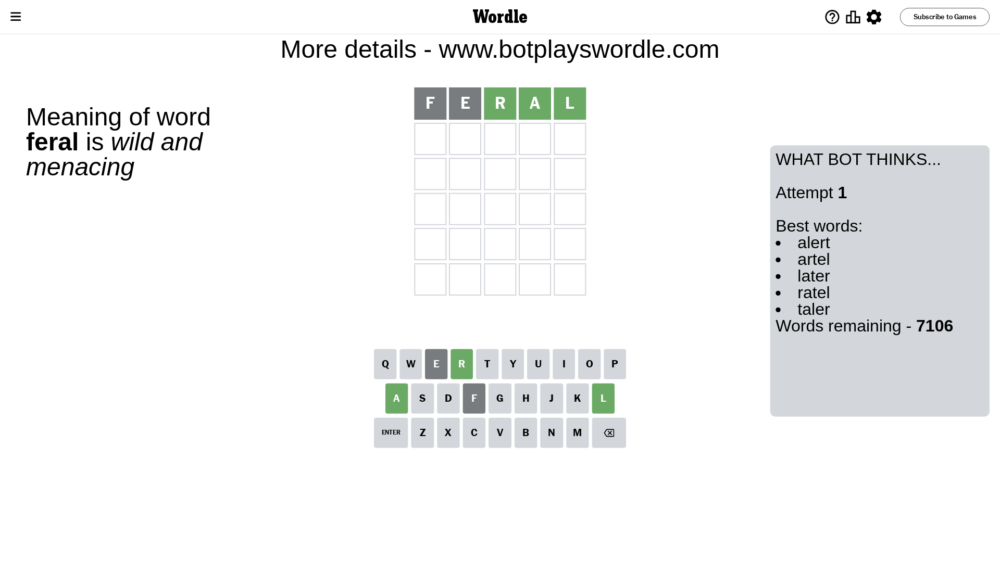
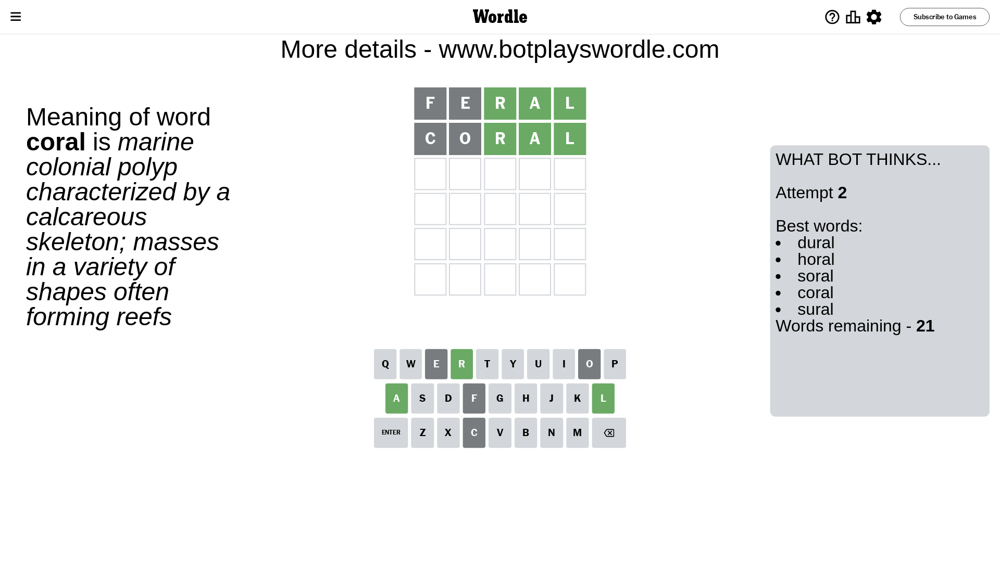
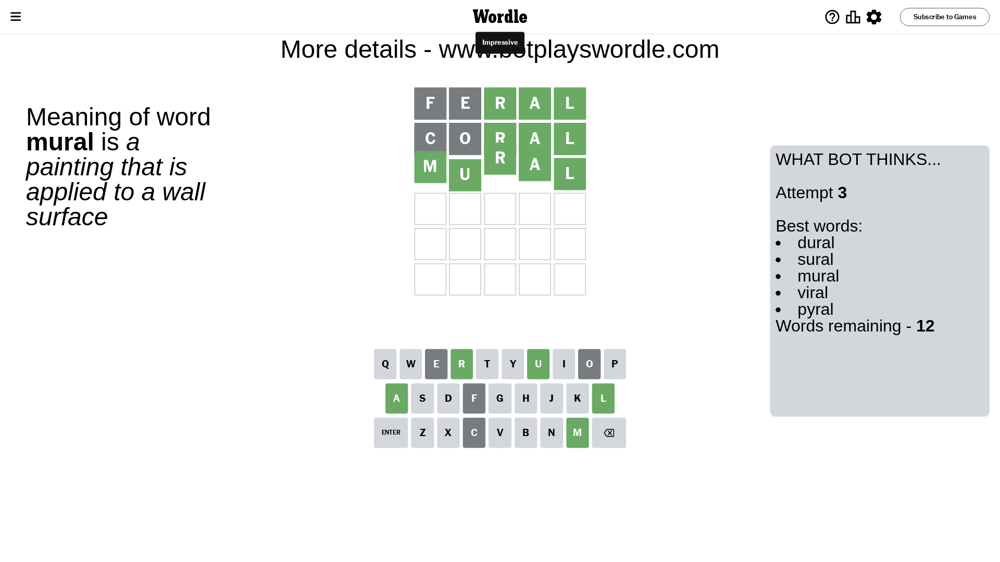

# Wordle for January 1, 2024 - \#926

## Attempt 1

This is the first attempt and we'll choose a random word to start with.

Let's start with word `feral`

Attempt for `feral` gives us 3 correct letters, 0 present letters and 2 wrong letters.

If we look into details, we can see that:

Letter `f` is not present in the word and we will not use it any more

Letter `e` is not present in the word and we will not use it any more

Letter `r` should be at position 3

Letter `a` should be at position 4

Letter `l` should be at position 5

We got information about the correct letters and it should make next attempt easier

Some letters are missing (like `f`, `e`) but it's also important piece of information

Word should contain letters `[r a l]`

That was a great guess that limited number of remaining words

## Attempt 2

Right now we have 21 words to choose from and best of them seem to be `[dural horal soral coral sural]`

So far we know that possible letters are:

At position 1: `[a b c d g h i j k l m n o p q r s t u v w x y z]`

At position 2: `[a b c d g h i j k l m n o p q r s t u v w x y z]`

At position 3: `[r]`

At position 4: `[a]`

At position 5: `[l]`

Next guess is `coral`, let's see what it gives us

Attempt for `coral` gives us 3 correct letters, 0 present letters and 2 wrong letters.

If we look into details, we can see that:

Letter `c` is not present in the word and we will not use it any more

Letter `o` is not present in the word and we will not use it any more

Some letters are missing (like `c`, `o`) but it's also important piece of information

Word should contain letters `[r a l]`

This was a waste, almost no valuable information...

## Attempt 3

Right now we have 12 words to choose from and best of them seem to be `[dural sural mural viral pyral]`

So far we know that possible letters are:

At position 1: `[a b d g h i j k l m n p q r s t u v w x y z]`

At position 2: `[a b d g h i j k l m n p q r s t u v w x y z]`

At position 3: `[r]`

At position 4: `[a]`

At position 5: `[l]`

Next guess is `mural`, let's see what it gives us

That's the correct answer! The word is `mural`!

To be honest that was a pretty lucky guess, but it worked out well.

## Conclusion

Today's word is `mural` and it took 3 attempts to guess it

