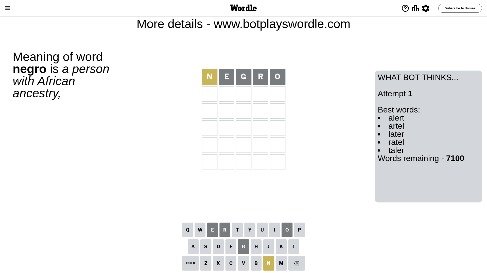
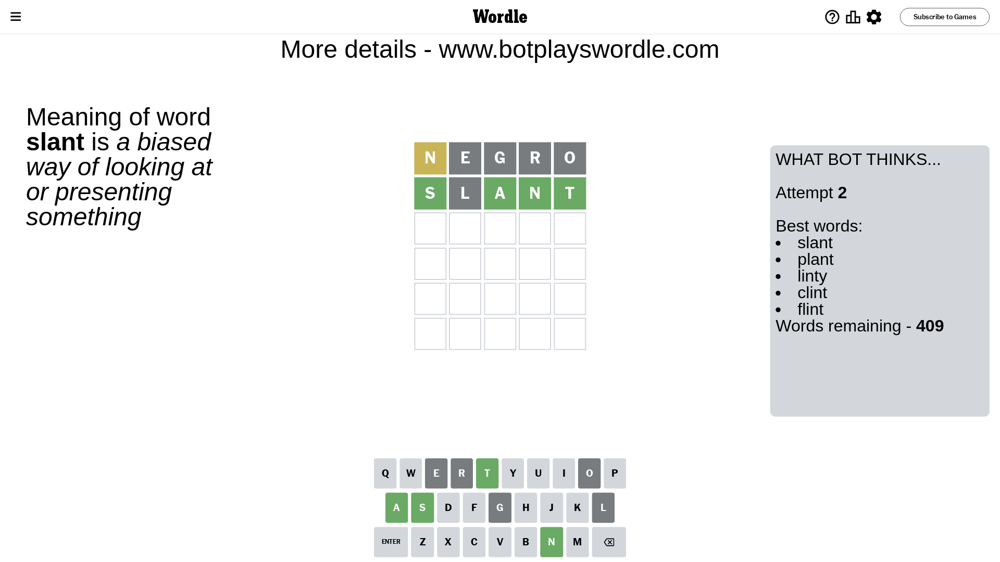
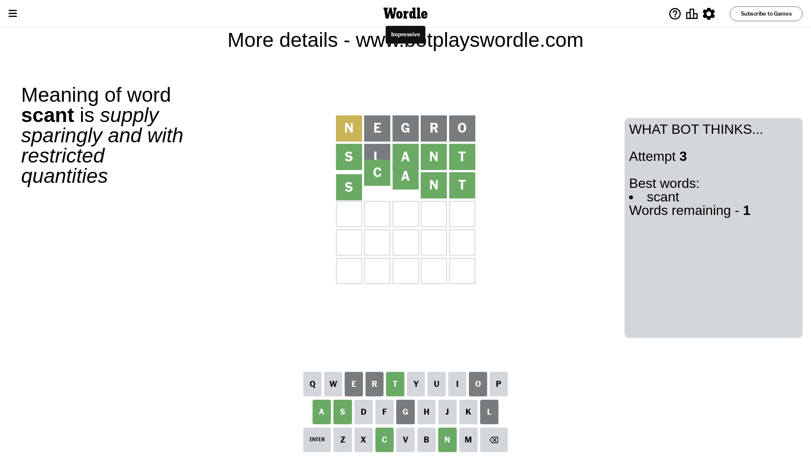

# Wordle for January 4, 2024 - \#929

## Attempt 1

This is the first attempt and we'll choose a random word to start with.

Let's start with word `negro`

Attempt for `negro` gives us 0 correct letters, 1 present letters and 4 wrong letters.

If we look into details, we can see that:

Letter `n` is on a different spot - this means that it cannot be at position 1

Letter `e` is not present in the word and we will not use it any more

Letter `g` is not present in the word and we will not use it any more

Letter `r` is not present in the word and we will not use it any more

Letter `o` is not present in the word and we will not use it any more

Some letters are missing (like `e`, `g`, `r`, `o`) but it's also important piece of information

Word should contain letters `[n]`

That was a great guess that limited number of remaining words

## Attempt 2

Right now we have 409 words to choose from and best of them seem to be `[slant plant linty clint flint]`

So far we know that possible letters are:

At position 1: `[a b c d f h i j k l m p q s t u v w x y z]`

At position 2: `[a b c d f h i j k l m n p q s t u v w x y z]`

At position 3: `[a b c d f h i j k l m n p q s t u v w x y z]`

At position 4: `[a b c d f h i j k l m n p q s t u v w x y z]`

At position 5: `[a b c d f h i j k l m n p q s t u v w x y z]`

Next guess is `slant`, let's see what it gives us

Attempt for `slant` gives us 4 correct letters, 0 present letters and 1 wrong letters.

If we look into details, we can see that:

Letter `s` should be at position 1

Letter `l` is not present in the word and we will not use it any more

Letter `a` should be at position 3

Letter `n` should be at position 4

Letter `t` should be at position 5

We got information about the correct letters and it should make next attempt easier

Some letters are missing (like `l`) but it's also important piece of information

Word should contain letters `[n s a t]`

That was a great guess that limited number of remaining words

## Attempt 3

Right now we have 1 words to choose from and best of them seem to be `[scant]`

So far we know that possible letters are:

At position 1: `[s]`

At position 2: `[a b c d f h i j k m n p q s t u v w x y z]`

At position 3: `[a]`

At position 4: `[n]`

At position 5: `[t]`

It must be `scant`

That's the correct answer! The word is `scant`!

## Conclusion

Today's word is `scant` and it took 3 attempts to guess it

