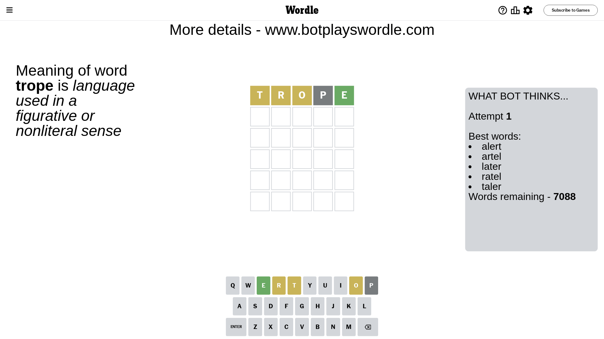
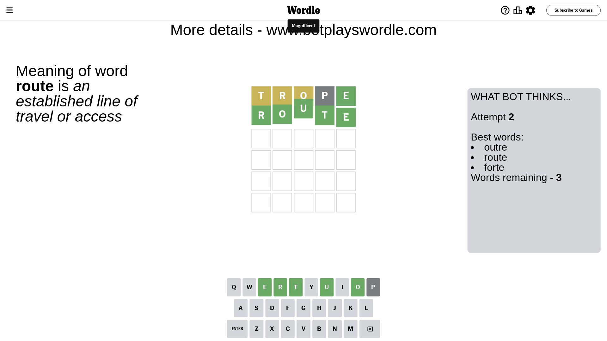

# Wordle for January 12, 2024 - \#937

## Attempt 1

This is the first attempt and we'll choose a random word to start with.

Let's start with word `trope`

Attempt for `trope` gives us 1 correct letters, 3 present letters and 1 wrong letters.

If we look into details, we can see that:

Letter `t` is on a different spot - this means that it cannot be at position 1

Letter `r` is on a different spot - this means that it cannot be at position 2

Letter `o` is on a different spot - this means that it cannot be at position 3

Letter `p` is not present in the word and we will not use it any more

Letter `e` should be at position 5

We got information about the correct letters and it should make next attempt easier

Some letters are missing (like `p`) but it's also important piece of information

Word should contain letters `[t r o e]`

That was a great guess that limited number of remaining words

## Attempt 2

Right now we have 3 words to choose from and best of them seem to be `[outre route forte]`

So far we know that possible letters are:

At position 1: `[a b c d e f g h i j k l m n o q r s u v w x y z]`

At position 2: `[a b c d e f g h i j k l m n o q s t u v w x y z]`

At position 3: `[a b c d e f g h i j k l m n q r s t u v w x y z]`

At position 4: `[a b c d e f g h i j k l m n o q r s t u v w x y z]`

At position 5: `[e]`

Next guess is `route`, let's see what it gives us

That's the correct answer! The word is `route`!

## Conclusion

Today's word is `route` and it took 2 attempts to guess it

