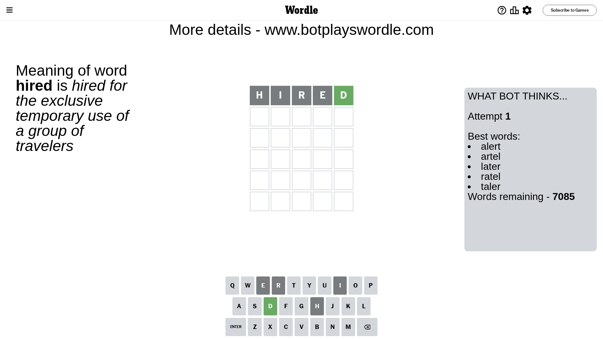
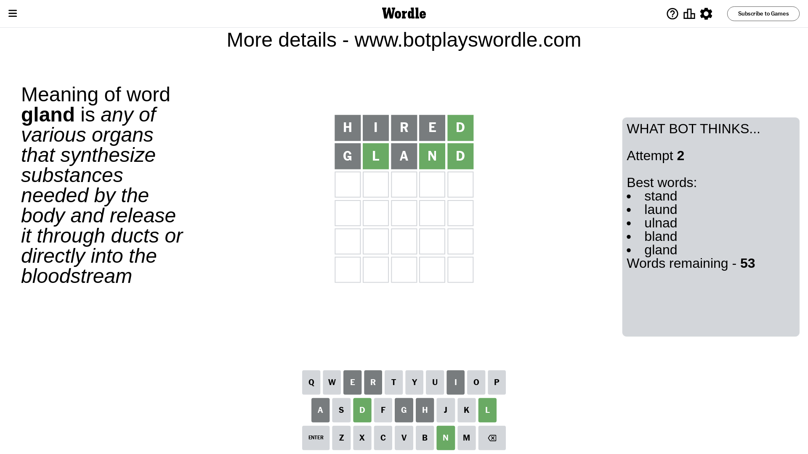
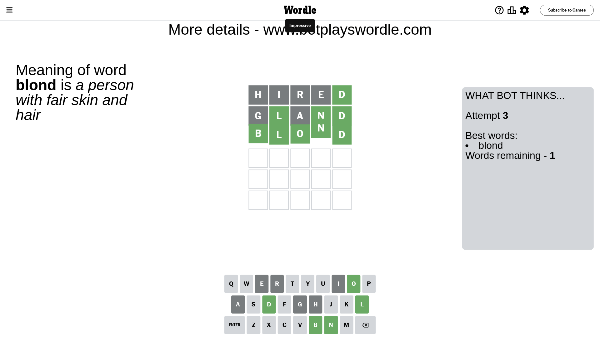

# Wordle for January 16, 2024 - \#941

## Attempt 1

This is the first attempt and we'll choose a random word to start with.

Let's start with word `hired`

Attempt for `hired` gives us 1 correct letters, 0 present letters and 4 wrong letters.

If we look into details, we can see that:

Letter `h` is not present in the word and we will not use it any more

Letter `i` is not present in the word and we will not use it any more

Letter `r` is not present in the word and we will not use it any more

Letter `e` is not present in the word and we will not use it any more

Letter `d` should be at position 5

We got information about the correct letters and it should make next attempt easier

Some letters are missing (like `h`, `i`, `r`, `e`) but it's also important piece of information

Word should contain letters `[d]`

That was a great guess that limited number of remaining words

## Attempt 2

Right now we have 53 words to choose from and best of them seem to be `[stand laund ulnad bland gland]`

So far we know that possible letters are:

At position 1: `[a b c d f g j k l m n o p q s t u v w x y z]`

At position 2: `[a b c d f g j k l m n o p q s t u v w x y z]`

At position 3: `[a b c d f g j k l m n o p q s t u v w x y z]`

At position 4: `[a b c d f g j k l m n o p q s t u v w x y z]`

At position 5: `[d]`

Next guess is `gland`, let's see what it gives us

Attempt for `gland` gives us 3 correct letters, 0 present letters and 2 wrong letters.

If we look into details, we can see that:

Letter `g` is not present in the word and we will not use it any more

Letter `l` should be at position 2

Letter `a` is not present in the word and we will not use it any more

Letter `n` should be at position 4

We got information about the correct letters and it should make next attempt easier

Some letters are missing (like `g`, `a`) but it's also important piece of information

Word should contain letters `[d l n]`

That was a great guess that limited number of remaining words

## Attempt 3

Right now we have 1 words to choose from and best of them seem to be `[blond]`

So far we know that possible letters are:

At position 1: `[b c d f j k l m n o p q s t u v w x y z]`

At position 2: `[l]`

At position 3: `[b c d f j k l m n o p q s t u v w x y z]`

At position 4: `[n]`

At position 5: `[d]`

It must be `blond`

That's the correct answer! The word is `blond`!

## Conclusion

Today's word is `blond` and it took 3 attempts to guess it

