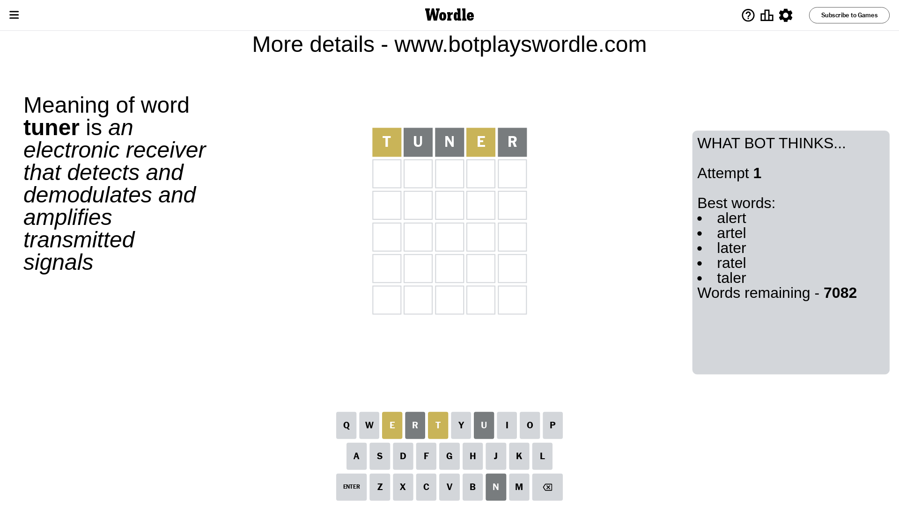
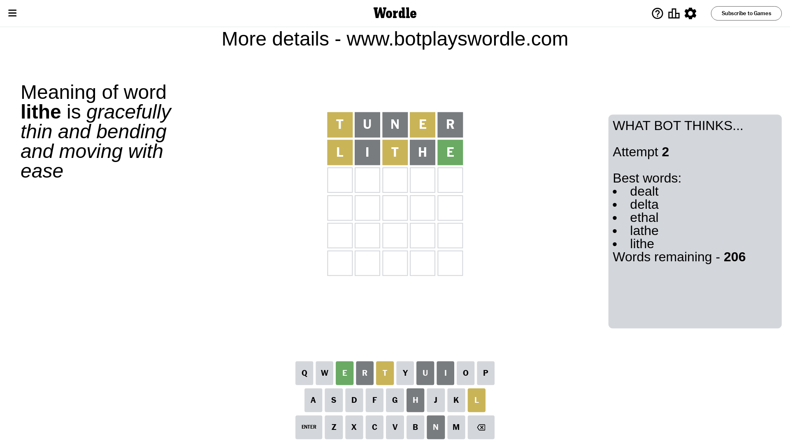
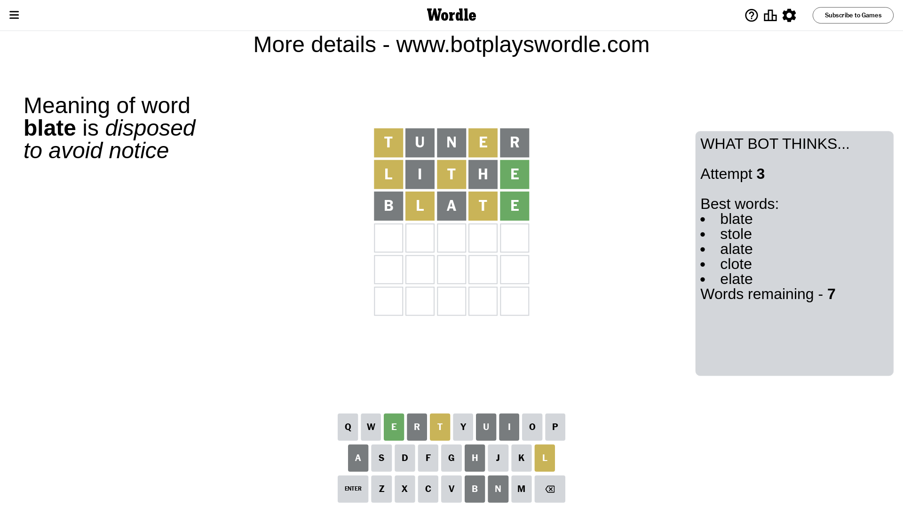
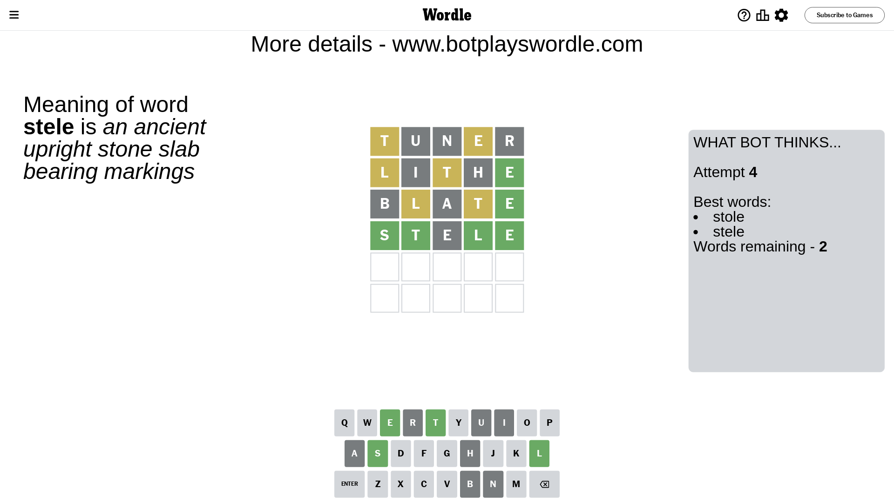
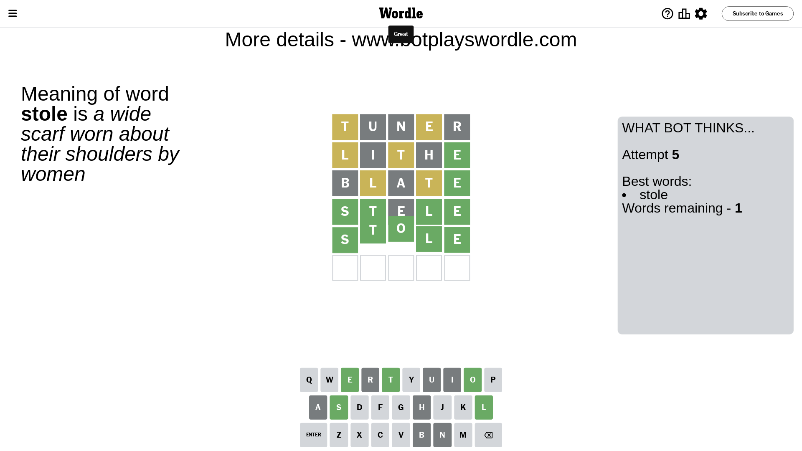

# Wordle for January 18, 2024 - \#943

## Attempt 1

This is the first attempt and we'll choose a random word to start with.

Let's start with word `tuner`

Attempt for `tuner` gives us 0 correct letters, 2 present letters and 3 wrong letters.

If we look into details, we can see that:

Letter `t` is on a different spot - this means that it cannot be at position 1

Letter `u` is not present in the word and we will not use it any more

Letter `n` is not present in the word and we will not use it any more

Letter `e` is on a different spot - this means that it cannot be at position 4

Letter `r` is not present in the word and we will not use it any more

Some letters are missing (like `u`, `n`, `r`) but it's also important piece of information

Word should contain letters `[t e]`

That was a great guess that limited number of remaining words

## Attempt 2

Right now we have 206 words to choose from and best of them seem to be `[dealt delta ethal lathe lithe]`

So far we know that possible letters are:

At position 1: `[a b c d e f g h i j k l m o p q s v w x y z]`

At position 2: `[a b c d e f g h i j k l m o p q s t v w x y z]`

At position 3: `[a b c d e f g h i j k l m o p q s t v w x y z]`

At position 4: `[a b c d f g h i j k l m o p q s t v w x y z]`

At position 5: `[a b c d e f g h i j k l m o p q s t v w x y z]`

Next guess is `lithe`, let's see what it gives us

Attempt for `lithe` gives us 1 correct letters, 2 present letters and 2 wrong letters.

If we look into details, we can see that:

Letter `l` is on a different spot - this means that it cannot be at position 1

Letter `i` is not present in the word and we will not use it any more

Letter `t` is on a different spot - this means that it cannot be at position 3

Letter `h` is not present in the word and we will not use it any more

Letter `e` should be at position 5

We got information about the correct letters and it should make next attempt easier

Some letters are missing (like `i`, `h`) but it's also important piece of information

Word should contain letters `[t e l]`

That was a great guess that limited number of remaining words

## Attempt 3

Right now we have 7 words to choose from and best of them seem to be `[blate stole alate clote elate]`

So far we know that possible letters are:

At position 1: `[a b c d e f g j k m o p q s v w x y z]`

At position 2: `[a b c d e f g j k l m o p q s t v w x y z]`

At position 3: `[a b c d e f g j k l m o p q s v w x y z]`

At position 4: `[a b c d f g j k l m o p q s t v w x y z]`

At position 5: `[e]`

Next guess is `blate`, let's see what it gives us

Attempt for `blate` gives us 1 correct letters, 2 present letters and 2 wrong letters.

If we look into details, we can see that:

Letter `b` is not present in the word and we will not use it any more

Letter `l` is on a different spot - this means that it cannot be at position 2

Letter `a` is not present in the word and we will not use it any more

Letter `t` is on a different spot - this means that it cannot be at position 4

Some letters are missing (like `b`, `a`) but it's also important piece of information

Word should contain letters `[t e l]`

Could be a better guess

## Attempt 4

Right now we have 2 words to choose from and best of them seem to be `[stole stele]`

So far we know that possible letters are:

At position 1: `[c d e f g j k m o p q s v w x y z]`

At position 2: `[c d e f g j k m o p q s t v w x y z]`

At position 3: `[c d e f g j k l m o p q s v w x y z]`

At position 4: `[c d f g j k l m o p q s v w x y z]`

At position 5: `[e]`

Next guess is `stele`, let's see what it gives us

Attempt for `stele` gives us 4 correct letters, 0 present letters and 1 wrong letters.

If we look into details, we can see that:

Letter `s` should be at position 1

Letter `t` should be at position 2

Letter `e` is not present in the word and we will not use it any more

Letter `l` should be at position 4

We got information about the correct letters and it should make next attempt easier

Some letters are missing (like `e`) but it's also important piece of information

Word should contain letters `[t e l s]`

This was a waste, almost no valuable information...

## Attempt 5

Right now we have 1 words to choose from and best of them seem to be `[stole]`

So far we know that possible letters are:

At position 1: `[s]`

At position 2: `[t]`

At position 3: `[c d f g j k l m o p q s v w x y z]`

At position 4: `[l]`

At position 5: `[e]`

It must be `stole`

That's the correct answer! The word is `stole`!

## Conclusion

Today's word is `stole` and it took 5 attempts to guess it

