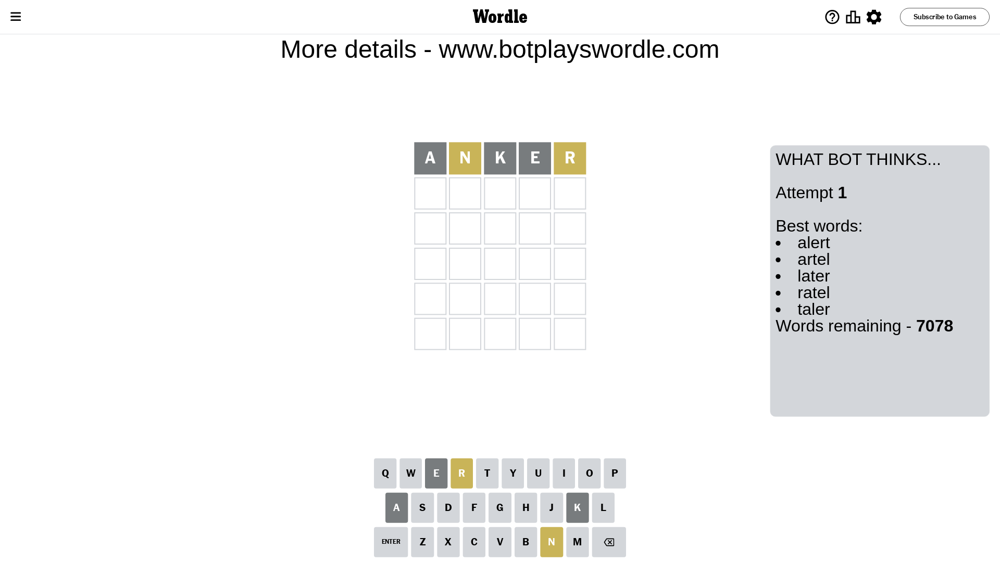

# Wordle for January 21, 2024 - \#946

## Attempt 1

This is the first attempt and we'll choose a random word to start with.

Let's start with word `anker`

Attempt for `anker` gives us 0 correct letters, 2 present letters and 3 wrong letters.

If we look into details, we can see that:

Letter `a` is not present in the word and we will not use it any more

Letter `n` is on a different spot - this means that it cannot be at position 2

Letter `k` is not present in the word and we will not use it any more

Letter `e` is not present in the word and we will not use it any more

Letter `r` is on a different spot - this means that it cannot be at position 5

Some letters are missing (like `a`, `k`, `e`) but it's also important piece of information

Word should contain letters `[n r]`

That was a great guess that limited number of remaining words

## Attempt 2

Right now we have 72 words to choose from and best of them seem to be `[north thorn nitro rutin tronc]`

So far we know that possible letters are:

At position 1: `[b c d f g h i j l m n o p q r s t u v w x y z]`

At position 2: `[b c d f g h i j l m o p q r s t u v w x y z]`

At position 3: `[b c d f g h i j l m n o p q r s t u v w x y z]`

At position 4: `[b c d f g h i j l m n o p q r s t u v w x y z]`

At position 5: `[b c d f g h i j l m n o p q s t u v w x y z]`

Next guess is `nitro`, let's see what it gives us

Attempt for `nitro` gives us 1 correct letters, 3 present letters and 1 wrong letters.

If we look into details, we can see that:

Letter `n` should be at position 1

Letter `i` is not present in the word and we will not use it any more

Letter `t` is on a different spot - this means that it cannot be at position 3

Letter `r` is on a different spot - this means that it cannot be at position 4

Letter `o` is on a different spot - this means that it cannot be at position 5

We got information about the correct letters and it should make next attempt easier

Some letters are missing (like `i`) but it's also important piece of information

Word should contain letters `[n r t o]`

That was a great guess that limited number of remaining words

## Attempt 3

Right now we have 1 words to choose from and best of them seem to be `[north]`

So far we know that possible letters are:

At position 1: `[n]`

At position 2: `[b c d f g h j l m o p q r s t u v w x y z]`

At position 3: `[b c d f g h j l m n o p q r s u v w x y z]`

At position 4: `[b c d f g h j l m n o p q s t u v w x y z]`

At position 5: `[b c d f g h j l m n p q s t u v w x y z]`

It must be `north`

That's the correct answer! The word is `north`!

## Conclusion

Today's word is `north` and it took 3 attempts to guess it

