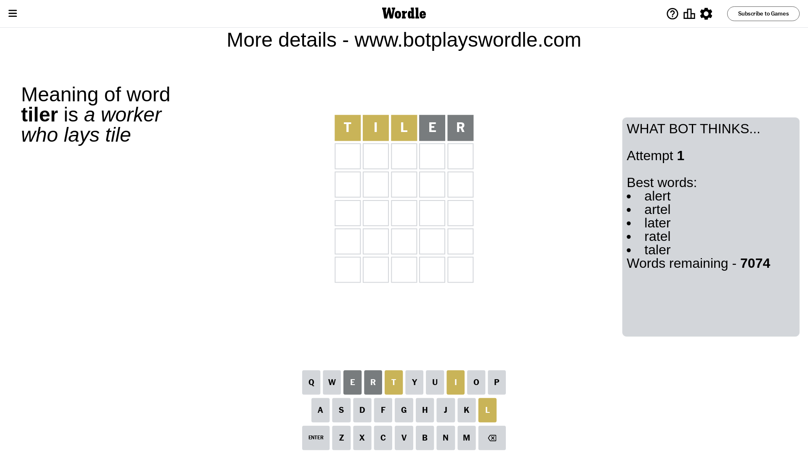
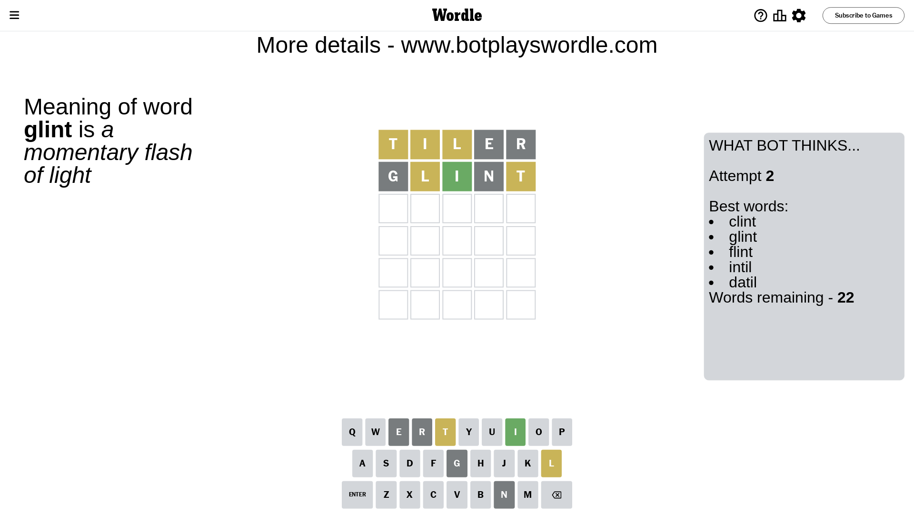
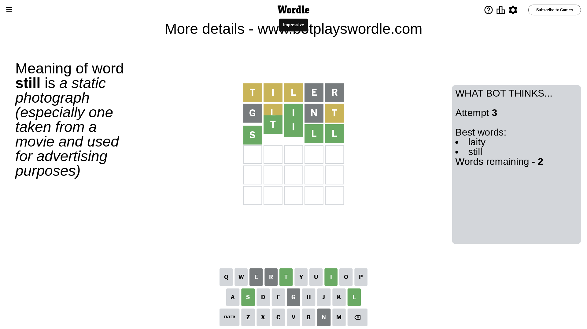

# Wordle for January 23, 2024 - \#948

## Attempt 1

This is the first attempt and we'll choose a random word to start with.

Let's start with word `tiler`

Attempt for `tiler` gives us 0 correct letters, 3 present letters and 2 wrong letters.

If we look into details, we can see that:

Letter `t` is on a different spot - this means that it cannot be at position 1

Letter `i` is on a different spot - this means that it cannot be at position 2

Letter `l` is on a different spot - this means that it cannot be at position 3

Letter `e` is not present in the word and we will not use it any more

Letter `r` is not present in the word and we will not use it any more

Some letters are missing (like `e`, `r`) but it's also important piece of information

Word should contain letters `[t i l]`

That was a great guess that limited number of remaining words

## Attempt 2

Right now we have 22 words to choose from and best of them seem to be `[clint glint flint intil datil]`

So far we know that possible letters are:

At position 1: `[a b c d f g h i j k l m n o p q s u v w x y z]`

At position 2: `[a b c d f g h j k l m n o p q s t u v w x y z]`

At position 3: `[a b c d f g h i j k m n o p q s t u v w x y z]`

At position 4: `[a b c d f g h i j k l m n o p q s t u v w x y z]`

At position 5: `[a b c d f g h i j k l m n o p q s t u v w x y z]`

Next guess is `glint`, let's see what it gives us

Attempt for `glint` gives us 1 correct letters, 2 present letters and 2 wrong letters.

If we look into details, we can see that:

Letter `g` is not present in the word and we will not use it any more

Letter `l` is on a different spot - this means that it cannot be at position 2

Letter `i` should be at position 3

Letter `n` is not present in the word and we will not use it any more

Letter `t` is on a different spot - this means that it cannot be at position 5

We got information about the correct letters and it should make next attempt easier

Some letters are missing (like `g`, `n`) but it's also important piece of information

Word should contain letters `[t i l]`

That was a great guess that limited number of remaining words

## Attempt 3

Right now we have 2 words to choose from and best of them seem to be `[laity still]`

So far we know that possible letters are:

At position 1: `[a b c d f h i j k l m o p q s u v w x y z]`

At position 2: `[a b c d f h j k m o p q s t u v w x y z]`

At position 3: `[i]`

At position 4: `[a b c d f h i j k l m o p q s t u v w x y z]`

At position 5: `[a b c d f h i j k l m o p q s u v w x y z]`

Next guess is `still`, let's see what it gives us

That's the correct answer! The word is `still`!

## Conclusion

Today's word is `still` and it took 3 attempts to guess it

