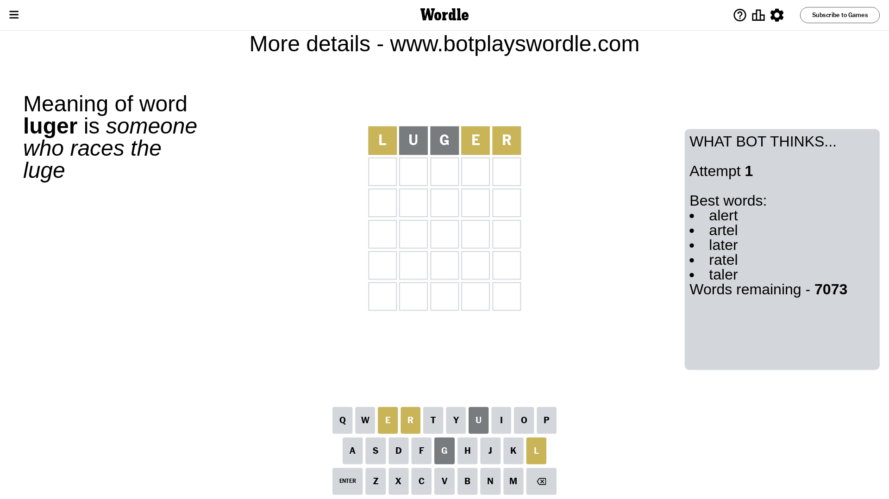
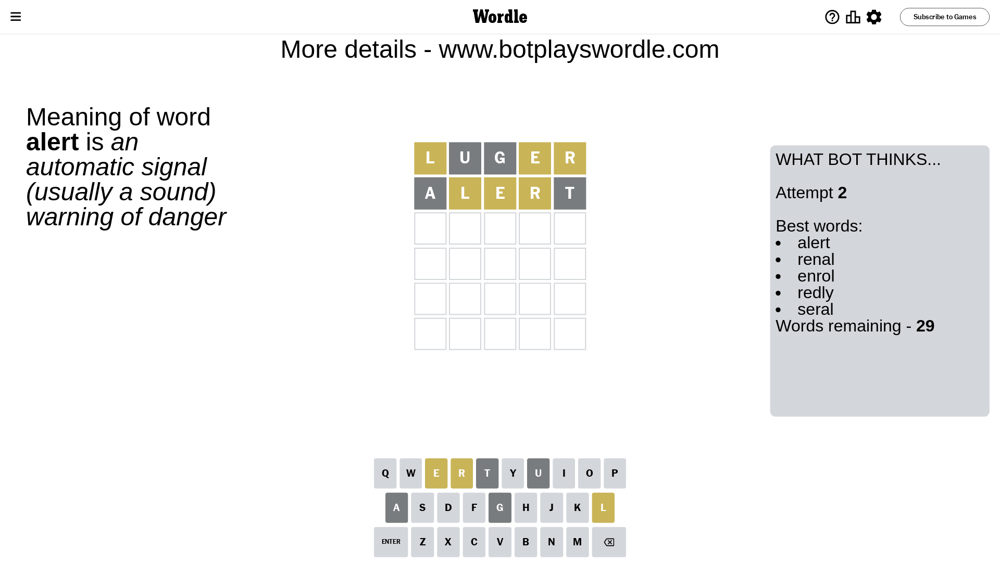
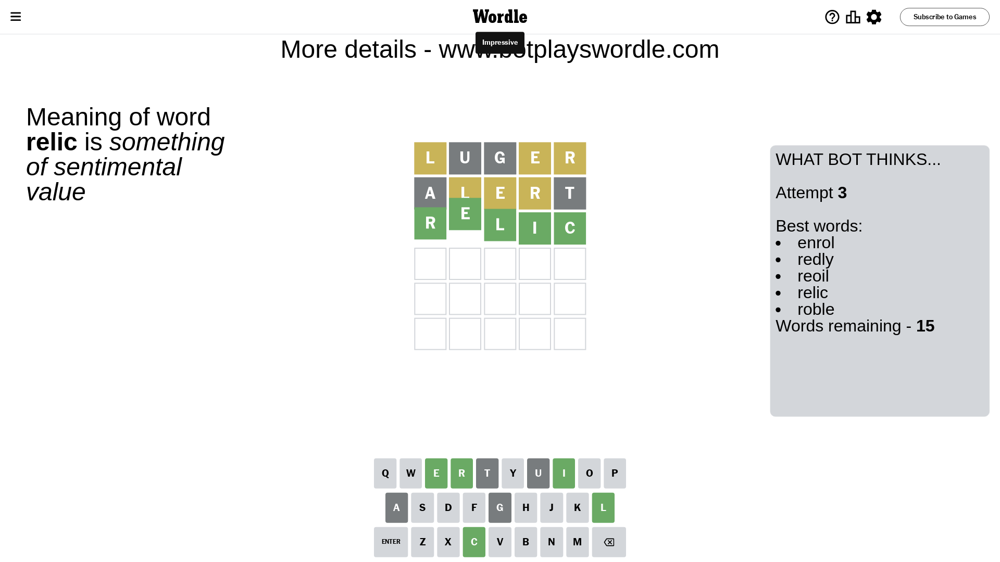

# Wordle for January 24, 2024 - \#949

## Attempt 1

This is the first attempt and we'll choose a random word to start with.

Let's start with word `luger`

Attempt for `luger` gives us 0 correct letters, 3 present letters and 2 wrong letters.

If we look into details, we can see that:

Letter `l` is on a different spot - this means that it cannot be at position 1

Letter `u` is not present in the word and we will not use it any more

Letter `g` is not present in the word and we will not use it any more

Letter `e` is on a different spot - this means that it cannot be at position 4

Letter `r` is on a different spot - this means that it cannot be at position 5

Some letters are missing (like `u`, `g`) but it's also important piece of information

Word should contain letters `[l e r]`

That was a great guess that limited number of remaining words

## Attempt 2

Right now we have 29 words to choose from and best of them seem to be `[alert renal enrol redly seral]`

So far we know that possible letters are:

At position 1: `[a b c d e f h i j k m n o p q r s t v w x y z]`

At position 2: `[a b c d e f h i j k l m n o p q r s t v w x y z]`

At position 3: `[a b c d e f h i j k l m n o p q r s t v w x y z]`

At position 4: `[a b c d f h i j k l m n o p q r s t v w x y z]`

At position 5: `[a b c d e f h i j k l m n o p q s t v w x y z]`

Next guess is `alert`, let's see what it gives us

Attempt for `alert` gives us 0 correct letters, 3 present letters and 2 wrong letters.

If we look into details, we can see that:

Letter `a` is not present in the word and we will not use it any more

Letter `l` is on a different spot - this means that it cannot be at position 2

Letter `e` is on a different spot - this means that it cannot be at position 3

Letter `r` is on a different spot - this means that it cannot be at position 4

Letter `t` is not present in the word and we will not use it any more

Some letters are missing (like `a`, `t`) but it's also important piece of information

Word should contain letters `[l e r]`

This was a waste, almost no valuable information...

## Attempt 3

Right now we have 15 words to choose from and best of them seem to be `[enrol redly reoil relic roble]`

So far we know that possible letters are:

At position 1: `[b c d e f h i j k m n o p q r s v w x y z]`

At position 2: `[b c d e f h i j k m n o p q r s v w x y z]`

At position 3: `[b c d f h i j k l m n o p q r s v w x y z]`

At position 4: `[b c d f h i j k l m n o p q s v w x y z]`

At position 5: `[b c d e f h i j k l m n o p q s v w x y z]`

Next guess is `relic`, let's see what it gives us

That's the correct answer! The word is `relic`!

To be honest that was a pretty lucky guess, but it worked out well.

## Conclusion

Today's word is `relic` and it took 3 attempts to guess it

