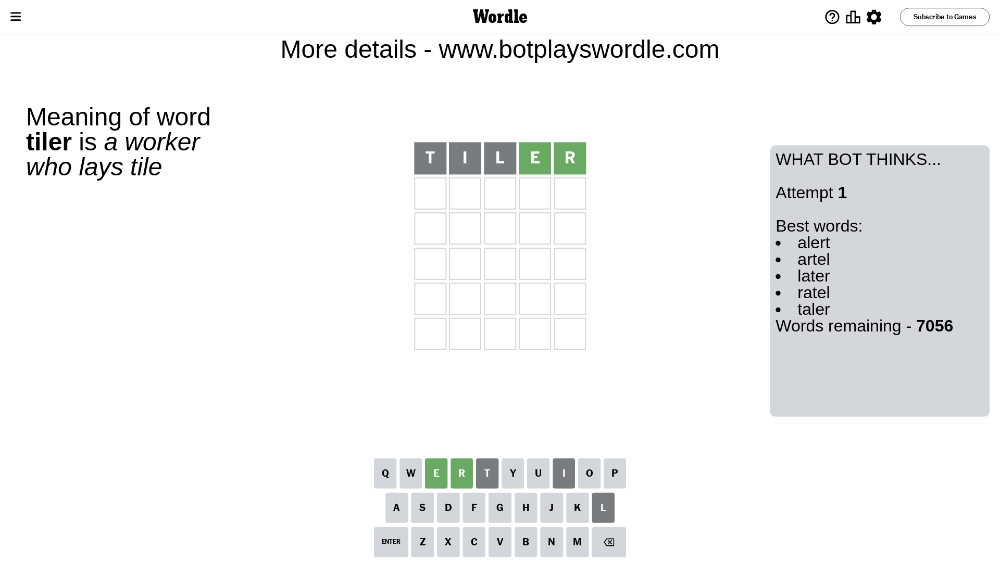
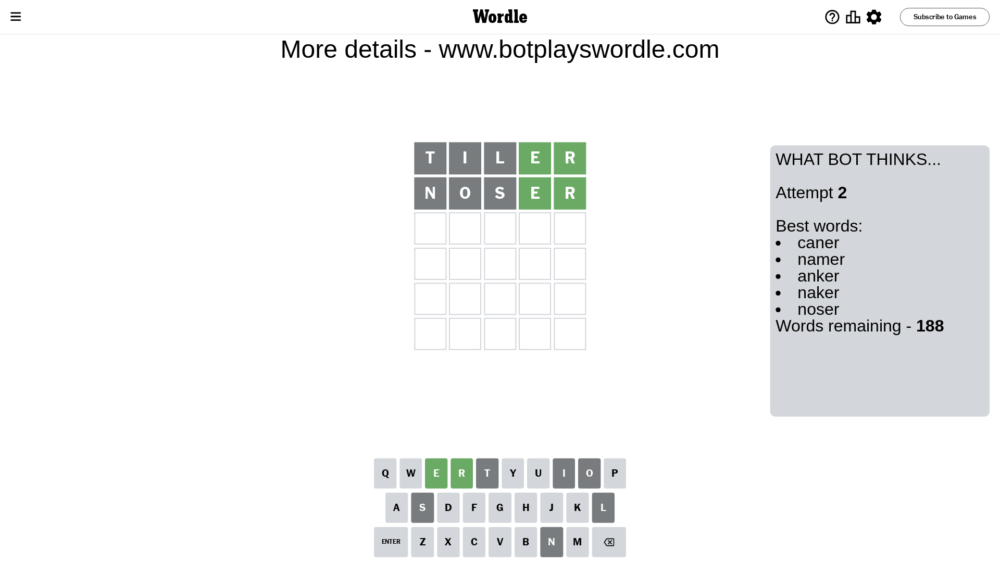
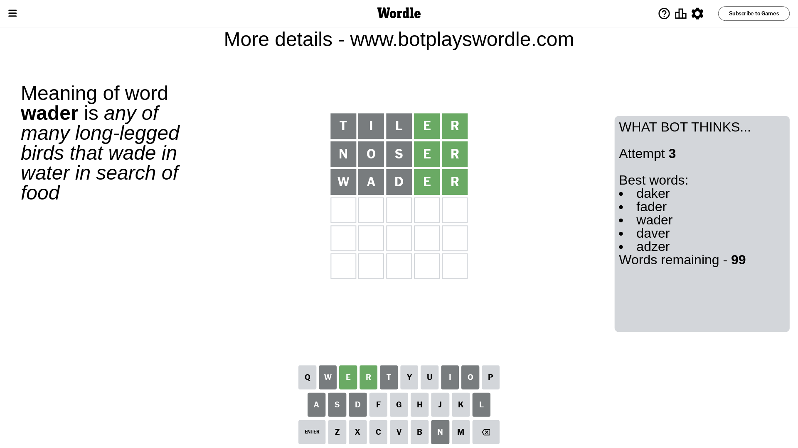
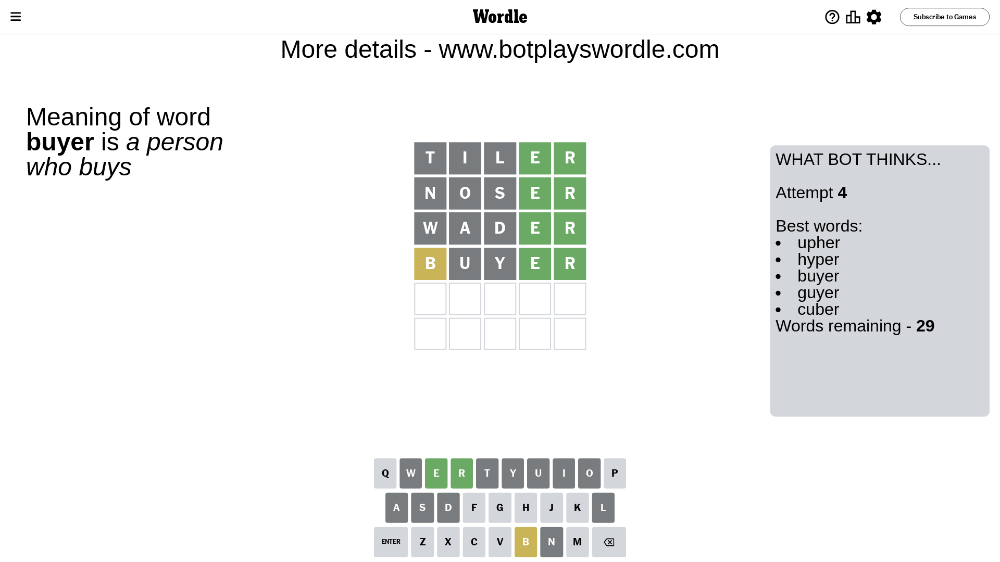
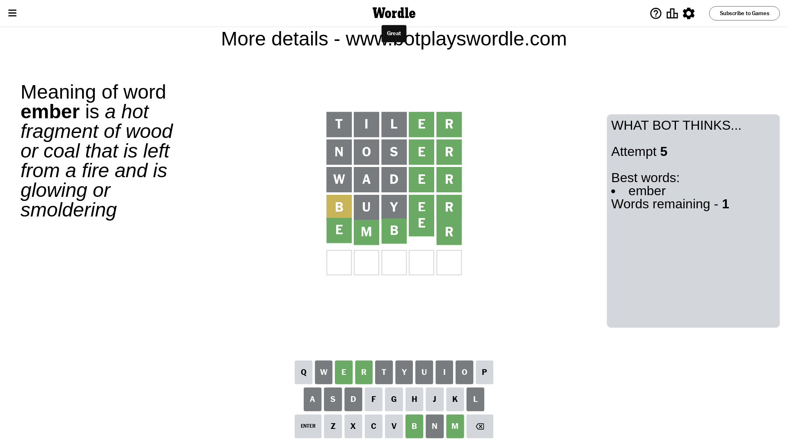

# Wordle for January 28, 2024 - \#953

## Attempt 1

This is the first attempt and we'll choose a random word to start with.

Let's start with word `tiler`

Attempt for `tiler` gives us 2 correct letters, 0 present letters and 3 wrong letters.

If we look into details, we can see that:

Letter `t` is not present in the word and we will not use it any more

Letter `i` is not present in the word and we will not use it any more

Letter `l` is not present in the word and we will not use it any more

Letter `e` should be at position 4

Letter `r` should be at position 5

We got information about the correct letters and it should make next attempt easier

Some letters are missing (like `t`, `i`, `l`) but it's also important piece of information

Word should contain letters `[e r]`

That was a great guess that limited number of remaining words

## Attempt 2

Right now we have 188 words to choose from and best of them seem to be `[caner namer anker naker noser]`

So far we know that possible letters are:

At position 1: `[a b c d e f g h j k m n o p q r s u v w x y z]`

At position 2: `[a b c d e f g h j k m n o p q r s u v w x y z]`

At position 3: `[a b c d e f g h j k m n o p q r s u v w x y z]`

At position 4: `[e]`

At position 5: `[r]`

Next guess is `noser`, let's see what it gives us

Attempt for `noser` gives us 2 correct letters, 0 present letters and 3 wrong letters.

If we look into details, we can see that:

Letter `n` is not present in the word and we will not use it any more

Letter `o` is not present in the word and we will not use it any more

Letter `s` is not present in the word and we will not use it any more

Some letters are missing (like `n`, `o`, `s`) but it's also important piece of information

Word should contain letters `[e r]`

This was a waste, almost no valuable information...

## Attempt 3

Right now we have 99 words to choose from and best of them seem to be `[daker fader wader daver adzer]`

So far we know that possible letters are:

At position 1: `[a b c d e f g h j k m p q r u v w x y z]`

At position 2: `[a b c d e f g h j k m p q r u v w x y z]`

At position 3: `[a b c d e f g h j k m p q r u v w x y z]`

At position 4: `[e]`

At position 5: `[r]`

Next guess is `wader`, let's see what it gives us

Attempt for `wader` gives us 2 correct letters, 0 present letters and 3 wrong letters.

If we look into details, we can see that:

Letter `w` is not present in the word and we will not use it any more

Letter `a` is not present in the word and we will not use it any more

Letter `d` is not present in the word and we will not use it any more

Some letters are missing (like `w`, `a`, `d`) but it's also important piece of information

Word should contain letters `[e r]`

Could be a better guess

## Attempt 4

Right now we have 29 words to choose from and best of them seem to be `[upher hyper buyer guyer cuber]`

So far we know that possible letters are:

At position 1: `[b c e f g h j k m p q r u v x y z]`

At position 2: `[b c e f g h j k m p q r u v x y z]`

At position 3: `[b c e f g h j k m p q r u v x y z]`

At position 4: `[e]`

At position 5: `[r]`

Next guess is `buyer`, let's see what it gives us

Attempt for `buyer` gives us 2 correct letters, 1 present letters and 2 wrong letters.

If we look into details, we can see that:

Letter `b` is on a different spot - this means that it cannot be at position 1

Letter `u` is not present in the word and we will not use it any more

Letter `y` is not present in the word and we will not use it any more

Some letters are missing (like `u`, `y`) but it's also important piece of information

Word should contain letters `[e r b]`

That was a great guess that limited number of remaining words

## Attempt 5

Right now we have 1 words to choose from and best of them seem to be `[ember]`

So far we know that possible letters are:

At position 1: `[c e f g h j k m p q r v x z]`

At position 2: `[b c e f g h j k m p q r v x z]`

At position 3: `[b c e f g h j k m p q r v x z]`

At position 4: `[e]`

At position 5: `[r]`

It must be `ember`

That's the correct answer! The word is `ember`!

## Conclusion

Today's word is `ember` and it took 5 attempts to guess it

