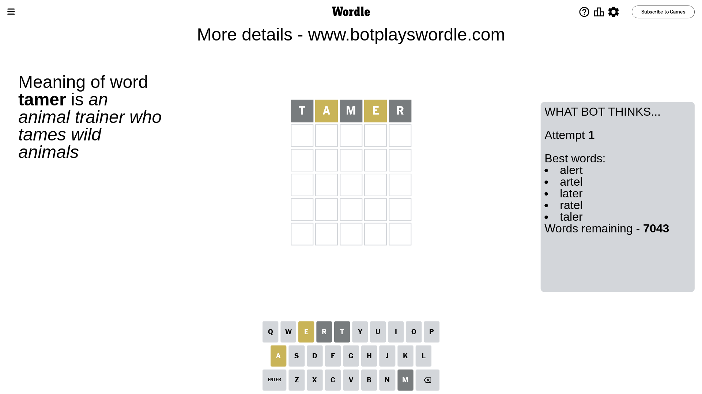
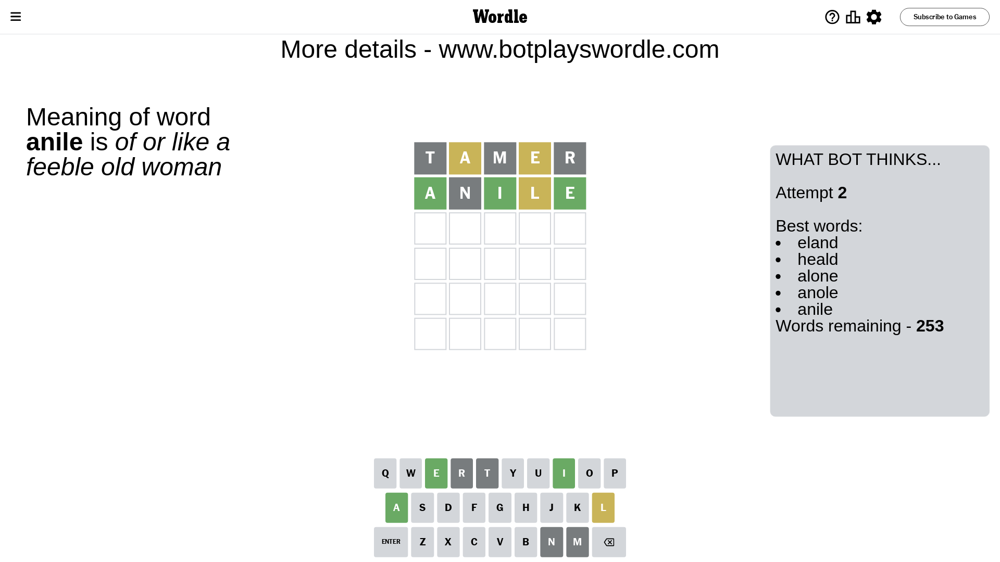
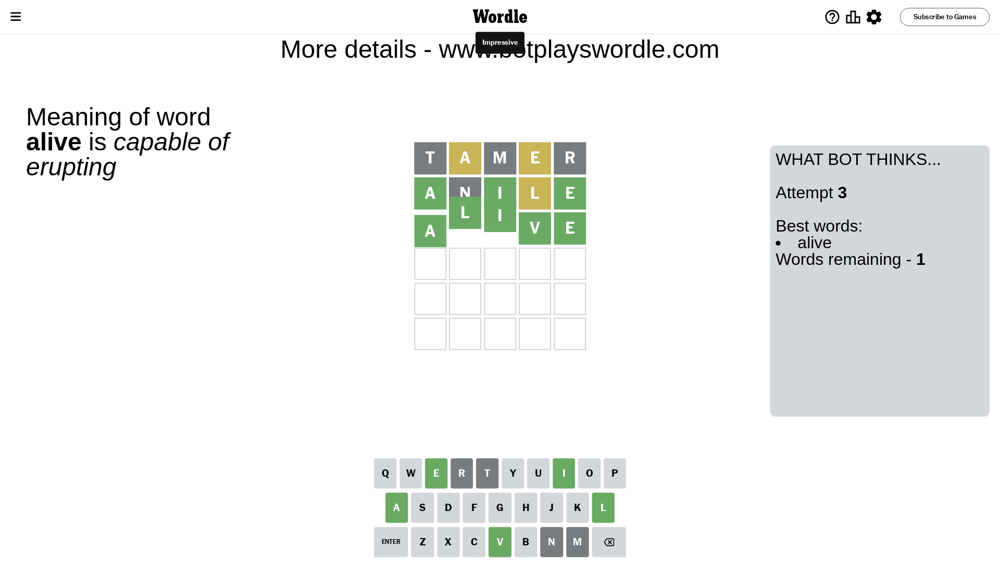

# Wordle for February 1, 2024 - \#957

## Attempt 1

This is the first attempt and we'll choose a random word to start with.

Let's start with word `tamer`

Attempt for `tamer` gives us 0 correct letters, 2 present letters and 3 wrong letters.

If we look into details, we can see that:

Letter `t` is not present in the word and we will not use it any more

Letter `a` is on a different spot - this means that it cannot be at position 2

Letter `m` is not present in the word and we will not use it any more

Letter `e` is on a different spot - this means that it cannot be at position 4

Letter `r` is not present in the word and we will not use it any more

Some letters are missing (like `t`, `m`, `r`) but it's also important piece of information

Word should contain letters `[a e]`

That was a great guess that limited number of remaining words

## Attempt 2

Right now we have 253 words to choose from and best of them seem to be `[eland heald alone anole anile]`

So far we know that possible letters are:

At position 1: `[a b c d e f g h i j k l n o p q s u v w x y z]`

At position 2: `[b c d e f g h i j k l n o p q s u v w x y z]`

At position 3: `[a b c d e f g h i j k l n o p q s u v w x y z]`

At position 4: `[a b c d f g h i j k l n o p q s u v w x y z]`

At position 5: `[a b c d e f g h i j k l n o p q s u v w x y z]`

Next guess is `anile`, let's see what it gives us

Attempt for `anile` gives us 3 correct letters, 1 present letters and 1 wrong letters.

If we look into details, we can see that:

Letter `a` should be at position 1

Letter `n` is not present in the word and we will not use it any more

Letter `i` should be at position 3

Letter `l` is on a different spot - this means that it cannot be at position 4

Letter `e` should be at position 5

We got information about the correct letters and it should make next attempt easier

Some letters are missing (like `n`) but it's also important piece of information

Word should contain letters `[a e i l]`

That was a great guess that limited number of remaining words

## Attempt 3

Right now we have 1 words to choose from and best of them seem to be `[alive]`

So far we know that possible letters are:

At position 1: `[a]`

At position 2: `[b c d e f g h i j k l o p q s u v w x y z]`

At position 3: `[i]`

At position 4: `[a b c d f g h i j k o p q s u v w x y z]`

At position 5: `[e]`

It must be `alive`

That's the correct answer! The word is `alive`!

## Conclusion

Today's word is `alive` and it took 3 attempts to guess it

