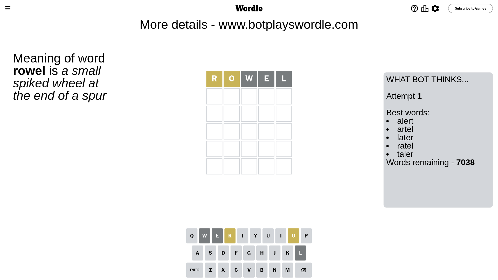
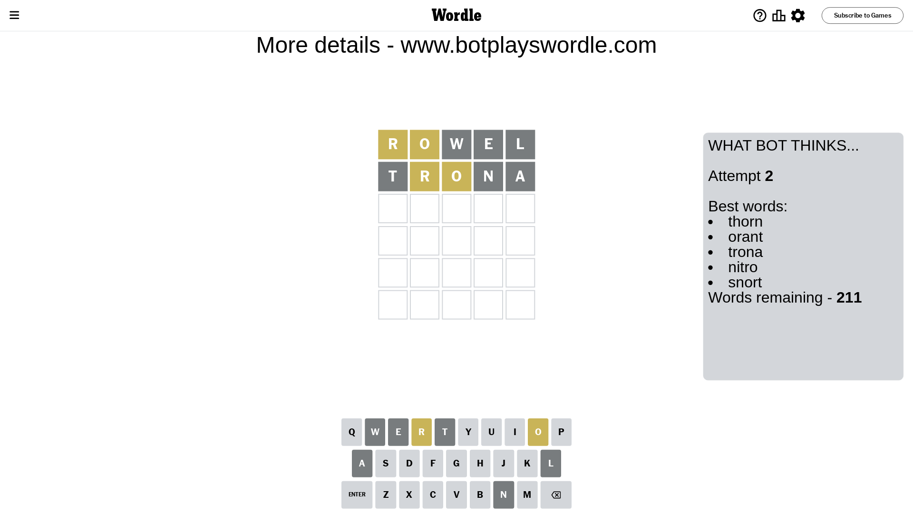
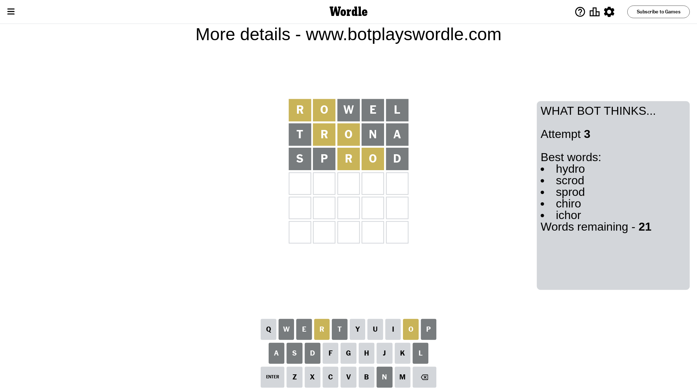
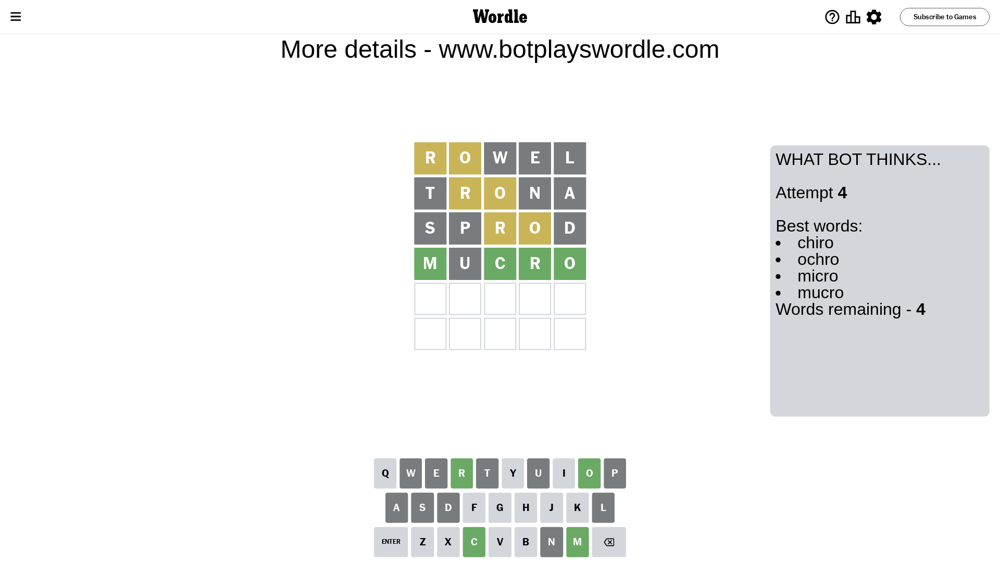
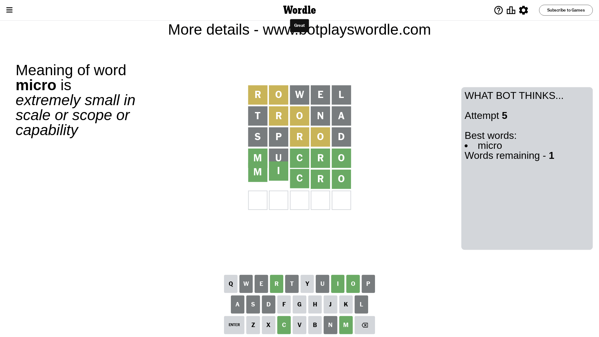

# Wordle for February 3, 2024 - \#959

## Attempt 1

This is the first attempt and we'll choose a random word to start with.

Let's start with word `rowel`

Attempt for `rowel` gives us 0 correct letters, 2 present letters and 3 wrong letters.

If we look into details, we can see that:

Letter `r` is on a different spot - this means that it cannot be at position 1

Letter `o` is on a different spot - this means that it cannot be at position 2

Letter `w` is not present in the word and we will not use it any more

Letter `e` is not present in the word and we will not use it any more

Letter `l` is not present in the word and we will not use it any more

Some letters are missing (like `w`, `e`, `l`) but it's also important piece of information

Word should contain letters `[r o]`

That was a great guess that limited number of remaining words

## Attempt 2

Right now we have 211 words to choose from and best of them seem to be `[thorn orant trona nitro snort]`

So far we know that possible letters are:

At position 1: `[a b c d f g h i j k m n o p q s t u v x y z]`

At position 2: `[a b c d f g h i j k m n p q r s t u v x y z]`

At position 3: `[a b c d f g h i j k m n o p q r s t u v x y z]`

At position 4: `[a b c d f g h i j k m n o p q r s t u v x y z]`

At position 5: `[a b c d f g h i j k m n o p q r s t u v x y z]`

Next guess is `trona`, let's see what it gives us

Attempt for `trona` gives us 0 correct letters, 2 present letters and 3 wrong letters.

If we look into details, we can see that:

Letter `t` is not present in the word and we will not use it any more

Letter `r` is on a different spot - this means that it cannot be at position 2

Letter `o` is on a different spot - this means that it cannot be at position 3

Letter `n` is not present in the word and we will not use it any more

Letter `a` is not present in the word and we will not use it any more

Some letters are missing (like `t`, `n`, `a`) but it's also important piece of information

Word should contain letters `[r o]`

That was a great guess that limited number of remaining words

## Attempt 3

Right now we have 21 words to choose from and best of them seem to be `[hydro scrod sprod chiro ichor]`

So far we know that possible letters are:

At position 1: `[b c d f g h i j k m o p q s u v x y z]`

At position 2: `[b c d f g h i j k m p q s u v x y z]`

At position 3: `[b c d f g h i j k m p q r s u v x y z]`

At position 4: `[b c d f g h i j k m o p q r s u v x y z]`

At position 5: `[b c d f g h i j k m o p q r s u v x y z]`

Next guess is `sprod`, let's see what it gives us

Attempt for `sprod` gives us 0 correct letters, 2 present letters and 3 wrong letters.

If we look into details, we can see that:

Letter `s` is not present in the word and we will not use it any more

Letter `p` is not present in the word and we will not use it any more

Letter `r` is on a different spot - this means that it cannot be at position 3

Letter `o` is on a different spot - this means that it cannot be at position 4

Letter `d` is not present in the word and we will not use it any more

Some letters are missing (like `s`, `p`, `d`) but it's also important piece of information

Word should contain letters `[r o]`

Not a bad guess in general

## Attempt 4

Right now we have 4 words to choose from and best of them seem to be `[chiro ochro micro mucro]`

So far we know that possible letters are:

At position 1: `[b c f g h i j k m o q u v x y z]`

At position 2: `[b c f g h i j k m q u v x y z]`

At position 3: `[b c f g h i j k m q u v x y z]`

At position 4: `[b c f g h i j k m q r u v x y z]`

At position 5: `[b c f g h i j k m o q r u v x y z]`

Next guess is `mucro`, let's see what it gives us

Attempt for `mucro` gives us 4 correct letters, 0 present letters and 1 wrong letters.

If we look into details, we can see that:

Letter `m` should be at position 1

Letter `u` is not present in the word and we will not use it any more

Letter `c` should be at position 3

Letter `r` should be at position 4

Letter `o` should be at position 5

We got information about the correct letters and it should make next attempt easier

Some letters are missing (like `u`) but it's also important piece of information

Word should contain letters `[r o m c]`

Could be a better guess

## Attempt 5

Right now we have 1 words to choose from and best of them seem to be `[micro]`

So far we know that possible letters are:

At position 1: `[m]`

At position 2: `[b c f g h i j k m q v x y z]`

At position 3: `[c]`

At position 4: `[r]`

At position 5: `[o]`

It must be `micro`

That's the correct answer! The word is `micro`!

## Conclusion

Today's word is `micro` and it took 5 attempts to guess it

