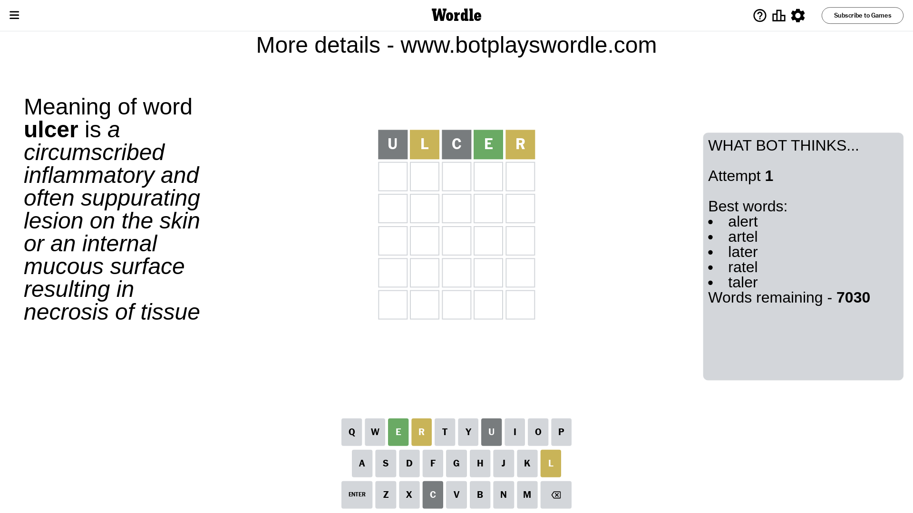
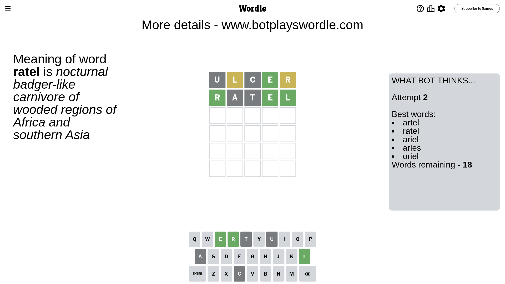
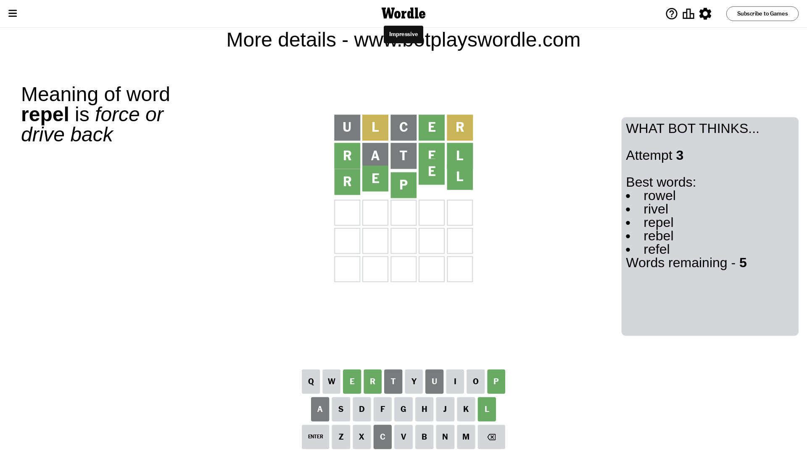

# Wordle for February 5, 2024 - \#961

## Attempt 1

This is the first attempt and we'll choose a random word to start with.

Let's start with word `ulcer`

Attempt for `ulcer` gives us 1 correct letters, 2 present letters and 2 wrong letters.

If we look into details, we can see that:

Letter `u` is not present in the word and we will not use it any more

Letter `l` is on a different spot - this means that it cannot be at position 2

Letter `c` is not present in the word and we will not use it any more

Letter `e` should be at position 4

Letter `r` is on a different spot - this means that it cannot be at position 5

We got information about the correct letters and it should make next attempt easier

Some letters are missing (like `u`, `c`) but it's also important piece of information

Word should contain letters `[l e r]`

That was a great guess that limited number of remaining words

## Attempt 2

Right now we have 18 words to choose from and best of them seem to be `[artel ratel ariel arles oriel]`

So far we know that possible letters are:

At position 1: `[a b d e f g h i j k l m n o p q r s t v w x y z]`

At position 2: `[a b d e f g h i j k m n o p q r s t v w x y z]`

At position 3: `[a b d e f g h i j k l m n o p q r s t v w x y z]`

At position 4: `[e]`

At position 5: `[a b d e f g h i j k l m n o p q s t v w x y z]`

Next guess is `ratel`, let's see what it gives us

Attempt for `ratel` gives us 3 correct letters, 0 present letters and 2 wrong letters.

If we look into details, we can see that:

Letter `r` should be at position 1

Letter `a` is not present in the word and we will not use it any more

Letter `t` is not present in the word and we will not use it any more

Letter `l` should be at position 5

We got information about the correct letters and it should make next attempt easier

Some letters are missing (like `a`, `t`) but it's also important piece of information

Word should contain letters `[l e r]`

Could be a better guess

## Attempt 3

Right now we have 5 words to choose from and best of them seem to be `[rowel rivel repel rebel refel]`

So far we know that possible letters are:

At position 1: `[r]`

At position 2: `[b d e f g h i j k m n o p q r s v w x y z]`

At position 3: `[b d e f g h i j k l m n o p q r s v w x y z]`

At position 4: `[e]`

At position 5: `[l]`

Next guess is `repel`, let's see what it gives us

That's the correct answer! The word is `repel`!

## Conclusion

Today's word is `repel` and it took 3 attempts to guess it

