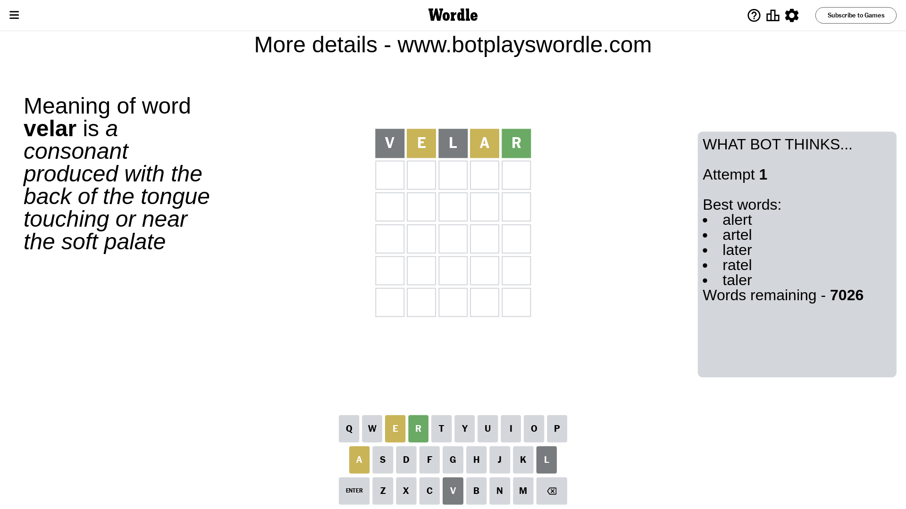
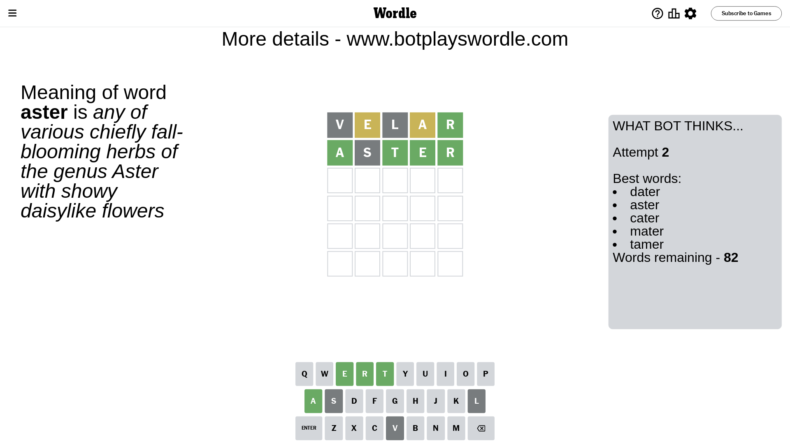
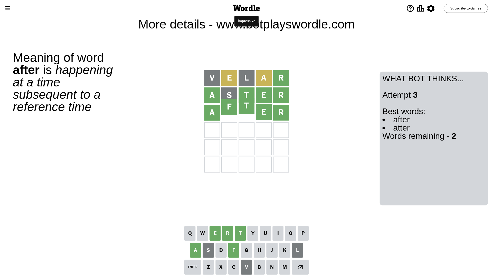

# Wordle for February 7, 2024 - \#963

## Attempt 1

This is the first attempt and we'll choose a random word to start with.

Let's start with word `velar`

Attempt for `velar` gives us 1 correct letters, 2 present letters and 2 wrong letters.

If we look into details, we can see that:

Letter `v` is not present in the word and we will not use it any more

Letter `e` is on a different spot - this means that it cannot be at position 2

Letter `l` is not present in the word and we will not use it any more

Letter `a` is on a different spot - this means that it cannot be at position 4

Letter `r` should be at position 5

We got information about the correct letters and it should make next attempt easier

Some letters are missing (like `v`, `l`) but it's also important piece of information

Word should contain letters `[e a r]`

That was a great guess that limited number of remaining words

## Attempt 2

Right now we have 82 words to choose from and best of them seem to be `[dater aster cater mater tamer]`

So far we know that possible letters are:

At position 1: `[a b c d e f g h i j k m n o p q r s t u w x y z]`

At position 2: `[a b c d f g h i j k m n o p q r s t u w x y z]`

At position 3: `[a b c d e f g h i j k m n o p q r s t u w x y z]`

At position 4: `[b c d e f g h i j k m n o p q r s t u w x y z]`

At position 5: `[r]`

Next guess is `aster`, let's see what it gives us

Attempt for `aster` gives us 4 correct letters, 0 present letters and 1 wrong letters.

If we look into details, we can see that:

Letter `a` should be at position 1

Letter `s` is not present in the word and we will not use it any more

Letter `t` should be at position 3

Letter `e` should be at position 4

We got information about the correct letters and it should make next attempt easier

Some letters are missing (like `s`) but it's also important piece of information

Word should contain letters `[e a r t]`

That was a great guess that limited number of remaining words

## Attempt 3

Right now we have 2 words to choose from and best of them seem to be `[after atter]`

So far we know that possible letters are:

At position 1: `[a]`

At position 2: `[a b c d f g h i j k m n o p q r t u w x y z]`

At position 3: `[t]`

At position 4: `[e]`

At position 5: `[r]`

Next guess is `after`, let's see what it gives us

That's the correct answer! The word is `after`!

## Conclusion

Today's word is `after` and it took 3 attempts to guess it

