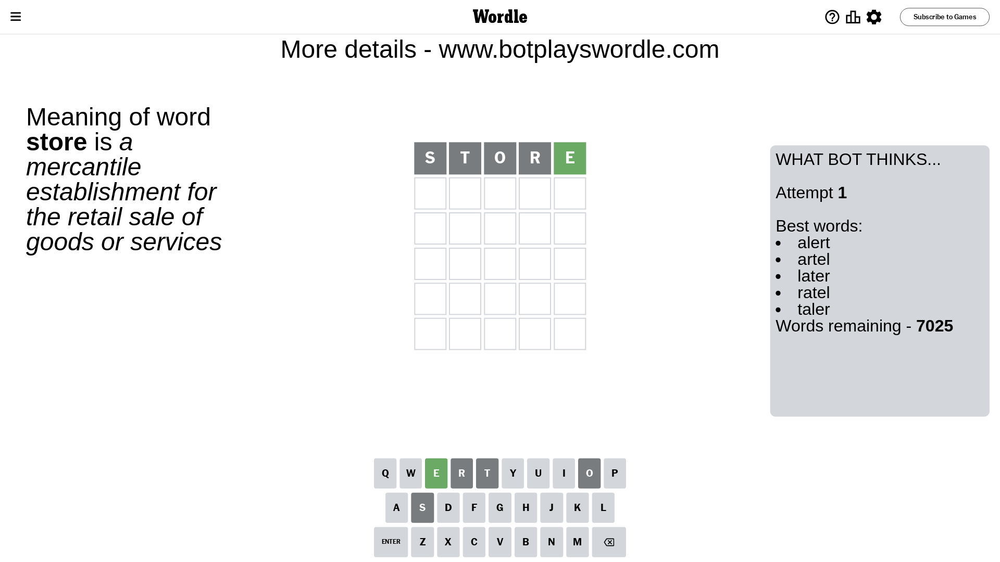
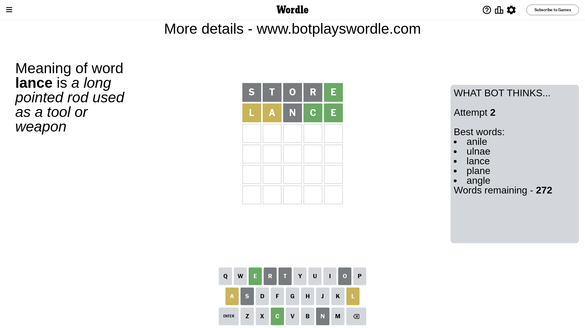
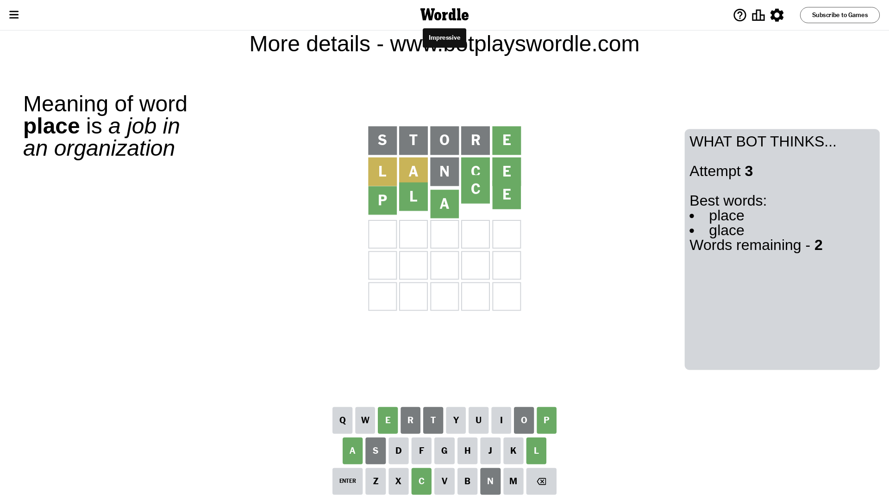

# Wordle for February 8, 2024 - \#964

## Attempt 1

This is the first attempt and we'll choose a random word to start with.

Let's start with word `store`

Attempt for `store` gives us 1 correct letters, 0 present letters and 4 wrong letters.

If we look into details, we can see that:

Letter `s` is not present in the word and we will not use it any more

Letter `t` is not present in the word and we will not use it any more

Letter `o` is not present in the word and we will not use it any more

Letter `r` is not present in the word and we will not use it any more

Letter `e` should be at position 5

We got information about the correct letters and it should make next attempt easier

Some letters are missing (like `s`, `t`, `o`, `r`) but it's also important piece of information

Word should contain letters `[e]`

That was a great guess that limited number of remaining words

## Attempt 2

Right now we have 272 words to choose from and best of them seem to be `[anile ulnae lance plane angle]`

So far we know that possible letters are:

At position 1: `[a b c d e f g h i j k l m n p q u v w x y z]`

At position 2: `[a b c d e f g h i j k l m n p q u v w x y z]`

At position 3: `[a b c d e f g h i j k l m n p q u v w x y z]`

At position 4: `[a b c d e f g h i j k l m n p q u v w x y z]`

At position 5: `[e]`

Next guess is `lance`, let's see what it gives us

Attempt for `lance` gives us 2 correct letters, 2 present letters and 1 wrong letters.

If we look into details, we can see that:

Letter `l` is on a different spot - this means that it cannot be at position 1

Letter `a` is on a different spot - this means that it cannot be at position 2

Letter `n` is not present in the word and we will not use it any more

Letter `c` should be at position 4

We got information about the correct letters and it should make next attempt easier

Some letters are missing (like `n`) but it's also important piece of information

Word should contain letters `[e l a c]`

That was a great guess that limited number of remaining words

## Attempt 3

Right now we have 2 words to choose from and best of them seem to be `[place glace]`

So far we know that possible letters are:

At position 1: `[a b c d e f g h i j k m p q u v w x y z]`

At position 2: `[b c d e f g h i j k l m p q u v w x y z]`

At position 3: `[a b c d e f g h i j k l m p q u v w x y z]`

At position 4: `[c]`

At position 5: `[e]`

Next guess is `place`, let's see what it gives us

That's the correct answer! The word is `place`!

## Conclusion

Today's word is `place` and it took 3 attempts to guess it

