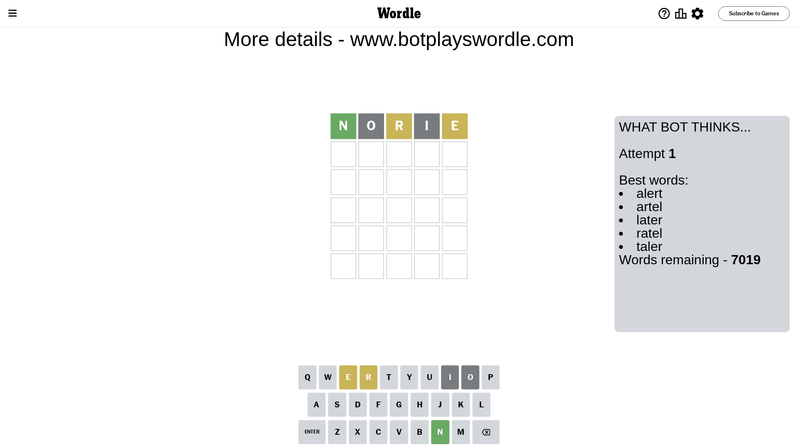
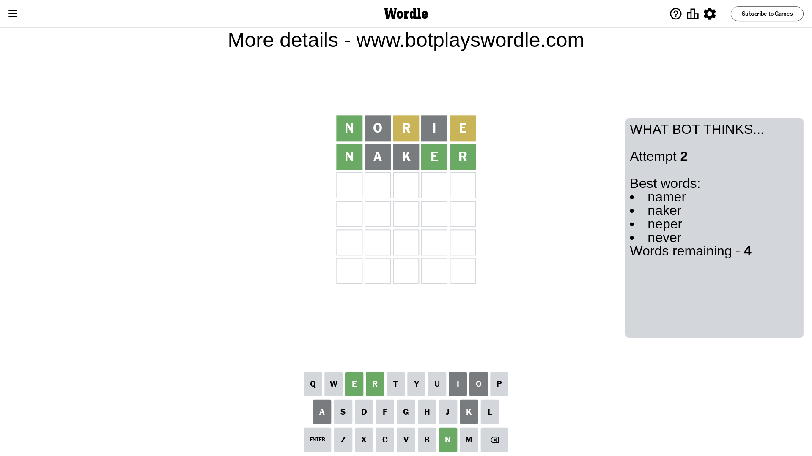
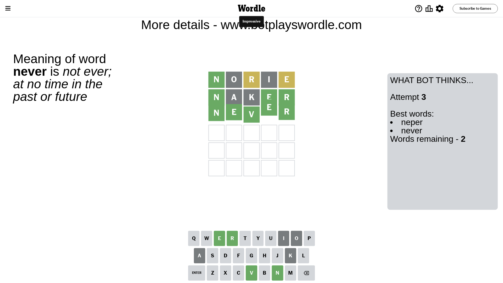

# Wordle for February 11, 2024 - \#967

## Attempt 1

This is the first attempt and we'll choose a random word to start with.

Let's start with word `norie`

Attempt for `norie` gives us 1 correct letters, 2 present letters and 2 wrong letters.

If we look into details, we can see that:

Letter `n` should be at position 1

Letter `o` is not present in the word and we will not use it any more

Letter `r` is on a different spot - this means that it cannot be at position 3

Letter `i` is not present in the word and we will not use it any more

Letter `e` is on a different spot - this means that it cannot be at position 5

We got information about the correct letters and it should make next attempt easier

Some letters are missing (like `o`, `i`) but it's also important piece of information

Word should contain letters `[n r e]`

That was a great guess that limited number of remaining words

## Attempt 2

Right now we have 4 words to choose from and best of them seem to be `[namer naker neper never]`

So far we know that possible letters are:

At position 1: `[n]`

At position 2: `[a b c d e f g h j k l m n p q r s t u v w x y z]`

At position 3: `[a b c d e f g h j k l m n p q s t u v w x y z]`

At position 4: `[a b c d e f g h j k l m n p q r s t u v w x y z]`

At position 5: `[a b c d f g h j k l m n p q r s t u v w x y z]`

Next guess is `naker`, let's see what it gives us

Attempt for `naker` gives us 3 correct letters, 0 present letters and 2 wrong letters.

If we look into details, we can see that:

Letter `a` is not present in the word and we will not use it any more

Letter `k` is not present in the word and we will not use it any more

Letter `e` should be at position 4

Letter `r` should be at position 5

We got information about the correct letters and it should make next attempt easier

Some letters are missing (like `a`, `k`) but it's also important piece of information

Word should contain letters `[n r e]`

This was a waste, almost no valuable information...

## Attempt 3

Right now we have 2 words to choose from and best of them seem to be `[neper never]`

So far we know that possible letters are:

At position 1: `[n]`

At position 2: `[b c d e f g h j l m n p q r s t u v w x y z]`

At position 3: `[b c d e f g h j l m n p q s t u v w x y z]`

At position 4: `[e]`

At position 5: `[r]`

Next guess is `never`, let's see what it gives us

That's the correct answer! The word is `never`!

## Conclusion

Today's word is `never` and it took 3 attempts to guess it

