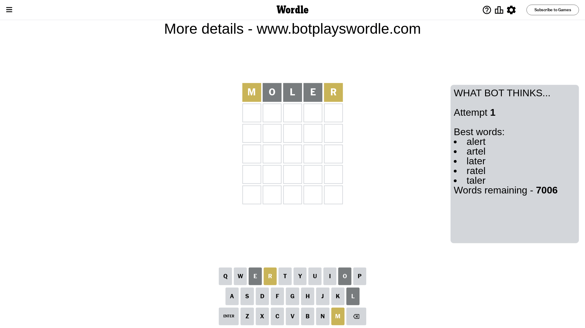
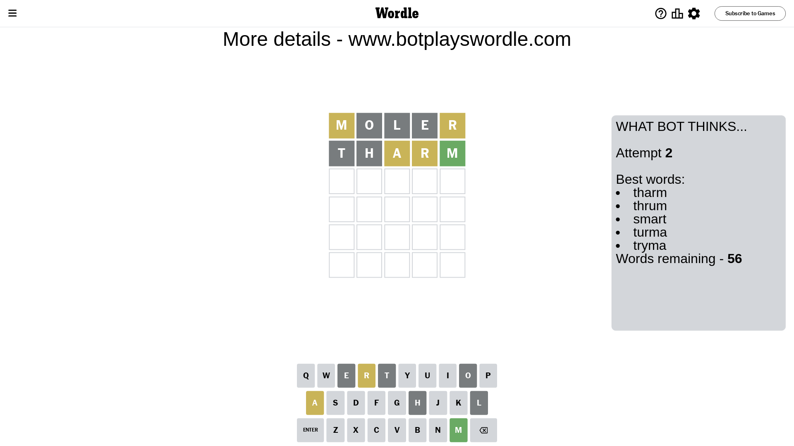
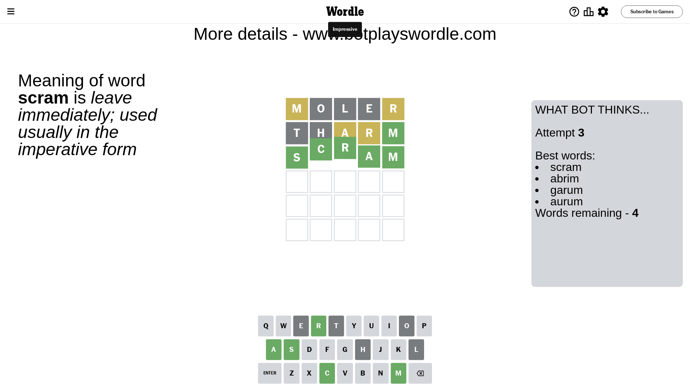

# Wordle for February 13, 2024 - \#969

## Attempt 1

This is the first attempt and we'll choose a random word to start with.

Let's start with word `moler`

Attempt for `moler` gives us 0 correct letters, 2 present letters and 3 wrong letters.

If we look into details, we can see that:

Letter `m` is on a different spot - this means that it cannot be at position 1

Letter `o` is not present in the word and we will not use it any more

Letter `l` is not present in the word and we will not use it any more

Letter `e` is not present in the word and we will not use it any more

Letter `r` is on a different spot - this means that it cannot be at position 5

Some letters are missing (like `o`, `l`, `e`) but it's also important piece of information

Word should contain letters `[m r]`

That was a great guess that limited number of remaining words

## Attempt 2

Right now we have 56 words to choose from and best of them seem to be `[tharm thrum smart turma tryma]`

So far we know that possible letters are:

At position 1: `[a b c d f g h i j k n p q r s t u v w x y z]`

At position 2: `[a b c d f g h i j k m n p q r s t u v w x y z]`

At position 3: `[a b c d f g h i j k m n p q r s t u v w x y z]`

At position 4: `[a b c d f g h i j k m n p q r s t u v w x y z]`

At position 5: `[a b c d f g h i j k m n p q s t u v w x y z]`

Next guess is `tharm`, let's see what it gives us

Attempt for `tharm` gives us 1 correct letters, 2 present letters and 2 wrong letters.

If we look into details, we can see that:

Letter `t` is not present in the word and we will not use it any more

Letter `h` is not present in the word and we will not use it any more

Letter `a` is on a different spot - this means that it cannot be at position 3

Letter `r` is on a different spot - this means that it cannot be at position 4

Letter `m` should be at position 5

We got information about the correct letters and it should make next attempt easier

Some letters are missing (like `t`, `h`) but it's also important piece of information

Word should contain letters `[m r a]`

That was a great guess that limited number of remaining words

## Attempt 3

Right now we have 4 words to choose from and best of them seem to be `[scram abrim garum aurum]`

So far we know that possible letters are:

At position 1: `[a b c d f g i j k n p q r s u v w x y z]`

At position 2: `[a b c d f g i j k m n p q r s u v w x y z]`

At position 3: `[b c d f g i j k m n p q r s u v w x y z]`

At position 4: `[a b c d f g i j k m n p q s u v w x y z]`

At position 5: `[m]`

Next guess is `scram`, let's see what it gives us

That's the correct answer! The word is `scram`!

## Conclusion

Today's word is `scram` and it took 3 attempts to guess it

