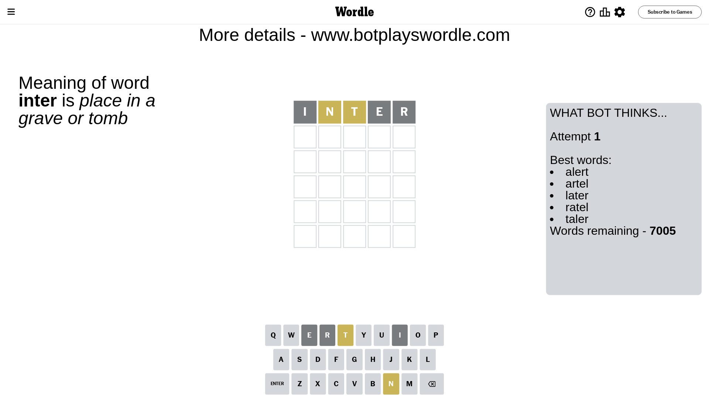
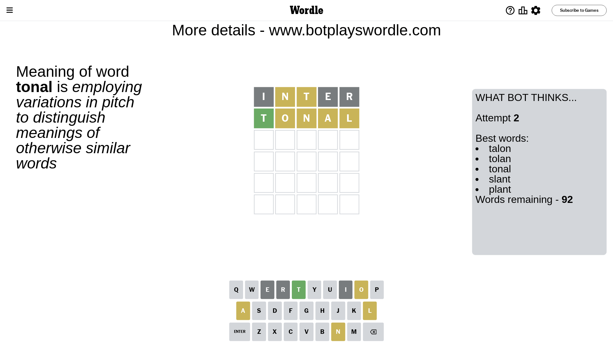
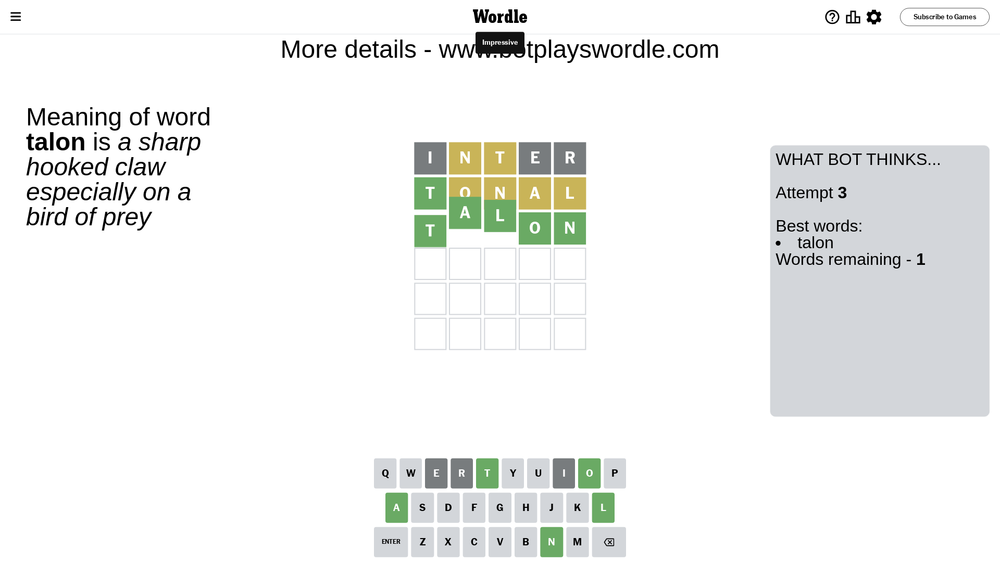

# Wordle for February 14, 2024 - \#970

## Attempt 1

This is the first attempt and we'll choose a random word to start with.

Let's start with word `inter`

Attempt for `inter` gives us 0 correct letters, 2 present letters and 3 wrong letters.

If we look into details, we can see that:

Letter `i` is not present in the word and we will not use it any more

Letter `n` is on a different spot - this means that it cannot be at position 2

Letter `t` is on a different spot - this means that it cannot be at position 3

Letter `e` is not present in the word and we will not use it any more

Letter `r` is not present in the word and we will not use it any more

Some letters are missing (like `i`, `e`, `r`) but it's also important piece of information

Word should contain letters `[n t]`

That was a great guess that limited number of remaining words

## Attempt 2

Right now we have 92 words to choose from and best of them seem to be `[talon tolan tonal slant plant]`

So far we know that possible letters are:

At position 1: `[a b c d f g h j k l m n o p q s t u v w x y z]`

At position 2: `[a b c d f g h j k l m o p q s t u v w x y z]`

At position 3: `[a b c d f g h j k l m n o p q s u v w x y z]`

At position 4: `[a b c d f g h j k l m n o p q s t u v w x y z]`

At position 5: `[a b c d f g h j k l m n o p q s t u v w x y z]`

Next guess is `tonal`, let's see what it gives us

Attempt for `tonal` gives us 1 correct letters, 4 present letters and 0 wrong letters.

If we look into details, we can see that:

Letter `t` should be at position 1

Letter `o` is on a different spot - this means that it cannot be at position 2

Letter `n` is on a different spot - this means that it cannot be at position 3

Letter `a` is on a different spot - this means that it cannot be at position 4

Letter `l` is on a different spot - this means that it cannot be at position 5

We got information about the correct letters and it should make next attempt easier

Word should contain letters `[n t o a l]`

That was a great guess that limited number of remaining words

## Attempt 3

Right now we have 1 words to choose from and best of them seem to be `[talon]`

So far we know that possible letters are:

At position 1: `[t]`

At position 2: `[a b c d f g h j k l m p q s t u v w x y z]`

At position 3: `[a b c d f g h j k l m o p q s u v w x y z]`

At position 4: `[b c d f g h j k l m n o p q s t u v w x y z]`

At position 5: `[a b c d f g h j k m n o p q s t u v w x y z]`

It must be `talon`

That's the correct answer! The word is `talon`!

## Conclusion

Today's word is `talon` and it took 3 attempts to guess it

